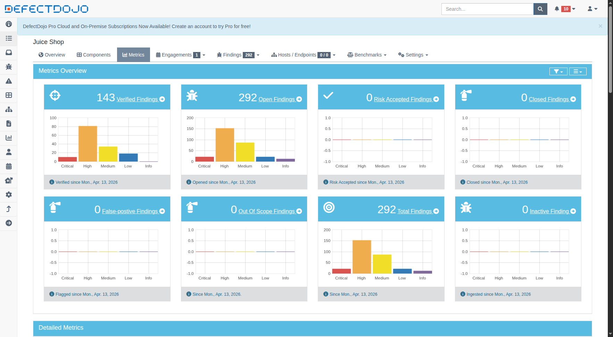

# Metrics Snapshot — Lab 10

- Date captured: April 13, 2026
- Active findings:
  - Critical: 21
  - High: 152
  - Medium: 86
  - Low: 21
  - Informational: 12
- Verified vs. Mitigated notes: We have 292 total security issues across the stack. 143 findings (approx. 49%) have been automatically verified upon import, while 149 findings remain in "unverified" status requiring manual triaging. There are currently 0 mitigated findings, meaning no security patches have been verified in the platform yet.

Metrics Screenshot from UI:

