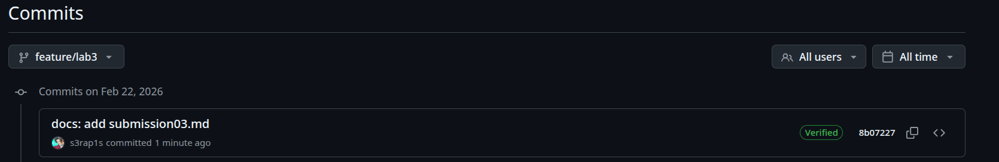

## SSH Commit Signature Verification

### Benefits of commit signing
- Authenticity: proves the commit was created by me (holder of the private key).
- Integrity: any modification after signing invalidates the signature.
- Trust: "Verified" badge on GitHub increases confidence in the repository.
- Security: prevents impersonation and commit forgery.

### Configuration steps
1. Generated SSH key:
```bash
ssh-keygen -t ed25519 -C "sup.mar001@example.com" -f ~/.ssh/id_ed25519_lab3
```
2. Add public key to GitHub as **Signing key**
3. Configure git
```bash
git config --global user.signingkey ~/.ssh/id_ed25519_lab3
git config --global commit.gpgSign true
git config --global gpg.format ssh
```
4. Create signed commit:
```bash
git commit -S -m "docs: add submisson03.md"
```


### Analysis: Why is commit signing critical in DevSecOps workflows?
In DevSecOps, every code change must be traceable and authentic. Signed commits ensure that:
* Only trusted developers can introduce code.
* The audit trail is reliable (non-repudiation).
* Automated CI/CD pipelines can optionally verify signatures before deployment, preventing tampered code from reaching production.

## Pre-commit secre scanning
### Setup
* Created pre-commit hook at .git/hooks/pre-commit with the provided script.
* Made it executable: chmod +x .git/hooks/pre-commit.
* The hook uses Docker containers for TruffleHog and Gitleaks, so Docker must be running.
### Results
I created a file labs/secret.txt with the content *I have to replace it to be able to commit this file* and staged it:
```bash
s3rap1s in ~/devsecops/DevSecOps-Intro on feature/lab3 ● ● λ git add labs/secret.txt
s3rap1s in ~/devsecops/DevSecOps-Intro on feature/lab3 ● ● ● λ git commit -S -m "wip: add secret"
[pre-commit] scanning staged files for secrets…
[pre-commit] Files to scan: labs/secret.txt
[pre-commit] Non-lectures files: labs/secret.txt
[pre-commit] Lectures files: none
[pre-commit] TruffleHog scan on non-lectures files…
🐷🔑🐷  TruffleHog. Unearth your secrets. 🐷🔑🐷

2026-02-22T19:51:23Z    info-0  trufflehog      running source  {"source_manager_worker_id": "rWFPV", "with_units": true}
Found unverified result 🐷🔑❓
Detector Type: Stripe
Decoder Type: PLAIN
Raw result: *I have to replace it to be able to commit this file*
Rotation_guide: https://howtorotate.com/docs/tutorials/stripe/
File: labs/secret.txt
Line: 1

2026-02-22T19:51:24Z    info-0  trufflehog      finished scanning       {"chunks": 1, "bytes": 32, "verified_secrets": 0, "unverified_secrets": 1, "scan_duration": "1.020502882s", "trufflehog_version": "3.93.4", "verification_caching": {"Hits":0,"Misses":1,"HitsWasted":0,"AttemptsSaved":0,"VerificationTimeSpentMS":1017}}
[pre-commit] ✓ TruffleHog found no secrets in non-lectures files
[pre-commit] Gitleaks scan on staged files…
[pre-commit] Scanning labs/secret.txt with Gitleaks...
Gitleaks found secrets in labs/secret.txt:
Finding:     *I have to replace it to be able to commit this file*
Secret:      *I have to replace it to be able to commit this file*
RuleID:      stripe-access-token
Entropy:     4.750000
File:        labs/secret.txt
Line:        1
Fingerprint: labs/secret.txt:stripe-access-token:1

7:51PM INF scanned ~32 bytes (32 bytes) in 24.3ms
7:51PM WRN leaks found: 1
---
✖ Secrets found in non-excluded file: labs/secret.txt

[pre-commit] === SCAN SUMMARY ===
TruffleHog found secrets in non-lectures files: false
Gitleaks found secrets in non-lectures files: true
Gitleaks found secrets in lectures files: false

✖ COMMIT BLOCKED: Secrets detected in non-excluded files.
Fix or unstage the offending files and try again.
```
Commit was blocked as expected.
Then I removed secret.txt and commited changes again.
```bash
s3rap1s in ~/devsecops/DevSecOps-Intro on feature/lab3 ● ● λ rm labs/secret.txt
s3rap1s in ~/devsecops/DevSecOps-Intro on feature/lab3 ● ● λ git add .
s3rap1s in ~/devsecops/DevSecOps-Intro on feature/lab3 ● ● λ git commit -S -m "docs: add verified commit screenshot"
[pre-commit] scanning staged files for secrets…
[pre-commit] Files to scan: labs/screenshots/verified-commit.png
[pre-commit] Non-lectures files: labs/screenshots/verified-commit.png
[pre-commit] Lectures files: none
[pre-commit] TruffleHog scan on non-lectures files…
🐷🔑🐷  TruffleHog. Unearth your secrets. 🐷🔑🐷

2026-02-22T20:34:25Z    info-0  trufflehog      running source  {"source_manager_worker_id": "lvmIc", "with_units": true}
2026-02-22T20:34:25Z    info-0  trufflehog      finished scanning       {"chunks": 0, "bytes": 0, "verified_secrets": 0, "unverified_secrets": 0, "scan_duration": "747.088µs", "trufflehog_version": "3.93.4", "verification_caching": {"Hits":0,"Misses":0,"HitsWasted":0,"AttemptsSaved":0,"VerificationTimeSpentMS":0}}
[pre-commit] ✓ TruffleHog found no secrets in non-lectures files
[pre-commit] Gitleaks scan on staged files…
[pre-commit] Scanning labs/screenshots/verified-commit.png with Gitleaks...
[pre-commit] No secrets found in labs/screenshots/verified-commit.png

[pre-commit] === SCAN SUMMARY ===
TruffleHog found secrets in non-lectures files: false
Gitleaks found secrets in non-lectures files: false
Gitleaks found secrets in lectures files: false

✓ No secrets detected in non-excluded files; proceeding with commit.
[feature/lab3 d3c6c47] docs: add verified commit screenshot
 1 file changed, 0 insertions(+), 0 deletions(-)
 create mode 100644 labs/screenshots/verified-commit.png
```
Commit succeeded as expected.
### Analysis: How automated secret scanning prevents security incidents
Automated secret scanning prevents accidental exposure of credentials, tokens, and other sensitive data. By integrating these checks into the pre-commit hook, secrets are caught before they ever reach the remote repository, reducing the risk of data breaches. This is a critical DevSecOps practice that shifts security left.