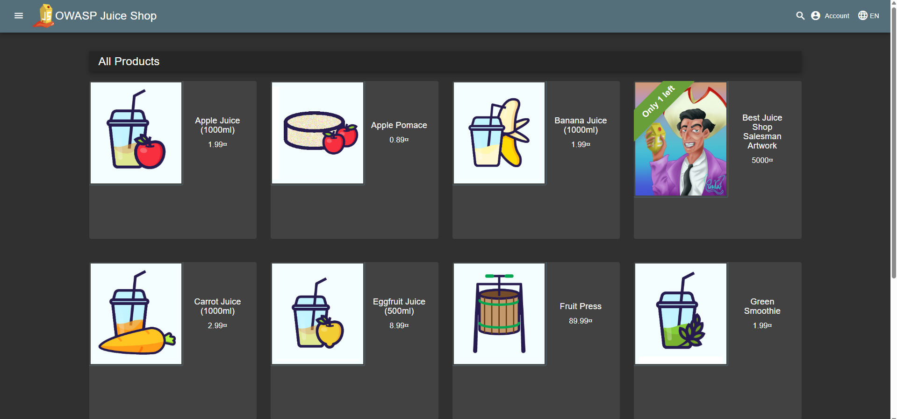

# Triage Report — OWASP Juice Shop

## Scope & Asset
- Asset: OWASP Juice Shop (local lab instance)
- Image: bkimminich/juice-shop:v19.0.0
- Release link/date: https://github.com/juice-shop/juice-shop/releases/tag/v19.0.0 — Sep 4, 2025
- Image digest (optional): sha256:2765a26de7647609099a338d5b7f61085d95903c8703bb70f03fcc4b12f0818d

## Environment
- Host OS: Windows 11
- Docker: 27.4.0

## Deployment Details
- Run command used: `docker run -d --name juice-shop -p 127.0.0.1:3000:3000 bkimminich/juice-shop:v19.0.0`
- Access URL: http://127.0.0.1:3000
- Network exposure: 127.0.0.1 only [x] Yes  [ ] No  (explain if No)

## Health Check

```json
{
  "status": "success",
  "data": [
    {
      "id": 1,
      "name": "Apple Juice (1000ml)",
      "description": "The all-time classic.",
      "price": 1.99,
      "deluxePrice": 0.99,
      "image": "apple_juice.jpg",
      "createdAt": "2026-02-07 16:40:02.169 +00:00",
      "updatedAt": "2026-02-07 16:40:02.169 +00:00",
      "deletedAt": null
    }
  ]
}
```
## Surface Snapshot (Triage)
- Login/Registration visible: [x] Yes  [ ] No — notes: Login and registration pages are accessible from the home page.
- Product listing/search present: [x] Yes  [ ] No — notes: All products load successfully. Search function works.
- Admin or account area discoverable: [ ] Yes  [x] No — Admin panel is not visible without login
- Client-side errors in console: [ ] Yes  [x] No — No errors in console
- Security headers (quick look — optional): `curl -I http://127.0.0.1:3000` → CSP/HSTS present? notes: Some security headers are present, but CSP and HSTS are missing.
```bash
HTTP/1.1 200 OK
Access-Control-Allow-Origin: *
X-Content-Type-Options: nosniff
X-Frame-Options: SAMEORIGIN
Feature-Policy: payment 'self'
X-Recruiting: /#/jobs
Accept-Ranges: bytes
Cache-Control: public, max-age=0
Last-Modified: Sat, 07 Feb 2026 16:40:02 GMT
ETag: W/"124fa-19c38f985d2"
Content-Type: text/html; charset=UTF-8
Content-Length: 75002
Vary: Accept-Encoding
Date: Sat, 07 Feb 2026 17:28:36 GMT
Connection: keep-alive
Keep-Alive: timeout=5
```

## Risks Observed (Top 3)
1) **SQL Injection** - The authentication endpoint is vulnerable to SQL injection, allowing attackers to bypass login.
2) **XXS** - The search functionality does not properly sanitize user input, leading to potential cross-site scripting attacks.
3) **Directory exposure** - The application exposes http://127.0.0.1:3000/ftp/ which allows access to sensitive files without authentication.

## Challenges & Solutions
- Challenge: Identifying directory exposure was not straightforward.
- Solution: Running `gobuster` helped discover hidden directories and files, revealing the exposed FTP directory.

## GitHub Community
Starring repositories helps open-source projects gain visibility and attract contributors.
Following developer helps in professional growth and staying updated with their work because they often share insights, updates, and new projects that can be valuable for learning and networking.