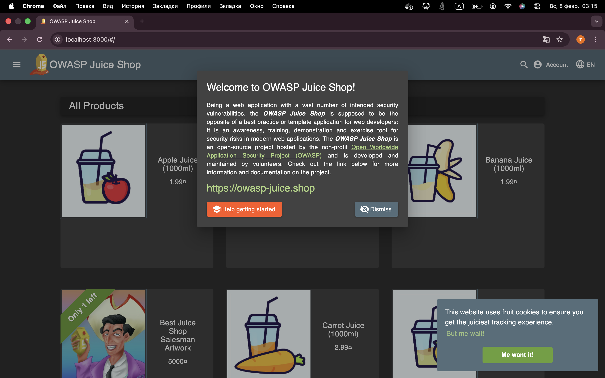

# Triage Report — OWASP Juice Shop

## Scope & Asset
- Asset: OWASP Juice Shop (local lab instance)
- Image: bkimminich/juice-shop:v19.0.0
- Release link/date: https://github.com/juice-shop/juice-shop/releases/tag/v19.0.0 — 2023-06-20
- Image digest (optional): sha256:5862d4956672dcc586a7848b1c3077755ea4c6873af8f9d2fd00999edf32c78f

## Environment
- Host OS: macOS Tahoe 26.2
- Docker: 27.4.0

## Deployment Details
- Run command used: `docker run -d --name juice-shop -p 127.0.0.1:3000:3000 bkimminich/juice-shop:v19.0.0`
- Access URL: http://127.0.0.1:3000
- Network exposure: 127.0.0.1 only [x] Yes  [ ] No

## Health Check
- Page load: 



- API check: 

```bash
curl -s http://127.0.0.1:3000/#/about | head
```

```html
<!--
  ~ Copyright (c) 2014-2025 Bjoern Kimminich & the OWASP Juice Shop contributors.
  ~ SPDX-License-Identifier: MIT
  -->

<!doctype html>
<html lang="en" data-beasties-container>
<head>
  <meta charset="utf-8">
  <title>OWASP Juice Shop</title>
```

## Surface Snapshot (Triage)
- Login/Registration visible: [x] Yes [ ] No

    Login and registration buttons are clearly visible on the main page.

- Product listing/search present: [x] Yes [ ] No

    Product catalog and search bar are available to unauthenticated users.

- Admin or account area discoverable: [x] Yes [ ] No

    Account menu appears after login; admin functionality is hinted in challenges.

- Client-side errors in console: [ ] Yes [x] No

    No visible JavaScript errors on initial load.

- Security headers: 

    ```
    curl -I http://127.0.0.1:3000
    ``` 

    Missing or weak CSP and HSTS headers observed, which is expected for a vulnerable training app.

## Risks Observed (Top 3)
1) Injection vulnerabilities — Juice Shop intentionally contains SQL/NoSQL injection risks in search and login features.
2) Broken authentication — Weak password policies and account enumeration are possible.
3) Security misconfiguration — Missing security headers and verbose error handling increase attack surface.

# PR Template Setup

## Creation Process

A pull request template was created at `.github/pull_request_template.md` on the `main` branch to standardize all future lab submissions.

## Verification

When opening a PR from `feature/lab1` to `main`, the PR description auto-filled with predefined sections and a checklist, confirming correct template loading.

## Workflow Improvement Analysis

PR templates improve collaboration by enforcing consistent structure, ensuring required information is provided, and reducing review time for maintainers.

# GitHub Community

Starring repositories helps support open-source maintainers and makes it easier to bookmark useful projects for future reference.

Following developers and classmates improves collaboration, visibility into ongoing work, and supports professional networking and learning within the developer community.