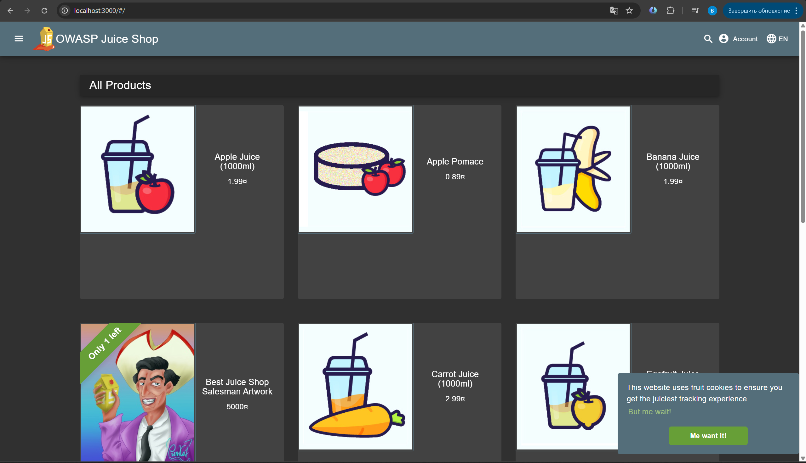
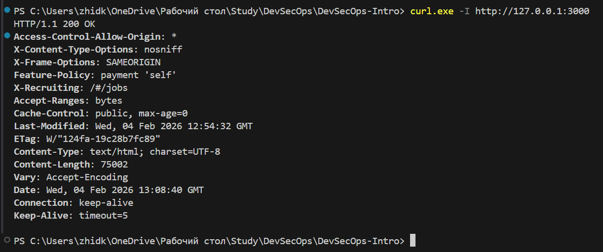
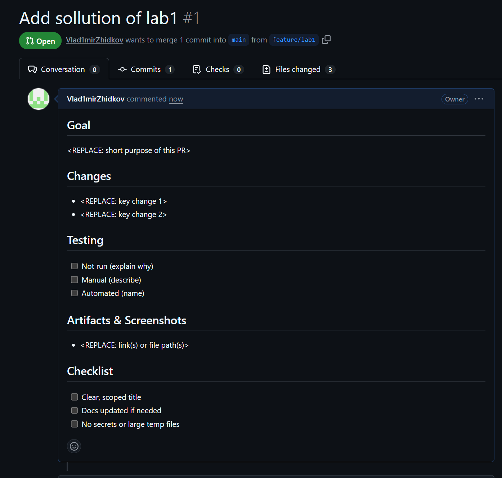

# Lab 1 Submission

## Task 1 — OWASP Juice Shop Deployment

### Triage Report — OWASP Juice Shop

#### Scope & Asset
- Asset: OWASP Juice Shop (local lab instance)
- Image: `bkimminich/juice-shop:v19.0.0`
- Release link/date: https://github.com/juice-shop/juice-shop/releases/tag/v19.0.0 — Sep 4, 2025
- Image digest: bkimminich/juice-shop@sha256:2765a26de7647609099a338d5b7f61085d95903c8703bb70f03fcc4b12f0818d

#### Environment
- Host OS: Windows 11
- Docker: 26.1.4

#### Deployment Details
- Run command used: `docker run -d --name juice-shop -p 127.0.0.1:3000:3000 bkimminich/juice-shop:v19.0.0`
- Access URL: `http://127.0.0.1:3000`
- Network exposure: 127.0.0.1 only [+] Yes  [ ] No

#### Health Check
- Page load: screenshot of home page
  - `../screenshots/lab1/juice-shop.png`
  - 
- API endpoint: `http://127.0.0.1:3000/rest/products/search?q=`
- API check (first 5–10 lines):

```text
{
    "status":  "success",
    "data":  [
                 {
                     "id":  1,
                     "name":  "Apple Juice (1000ml)",
                     "description":  "The all-time classic.",
                     "price":  1.99,
                     "deluxePrice":  0.99,
                     "image":  "apple_juice.jpg"
                     ...
```

#### Surface Snapshot (Triage)
- Login/Registration visible: [+] Yes  [ ] No 
- Product listing/search present: [+] Yes  [ ] No
- Admin or account area discoverable: [ ] Yes  [+] No 
- Client-side errors in console: [ ] Yes  [+] No 
- Security headers (optional quick look): `curl -I http://127.0.0.1:3000`
  - CSP/HSTS present? No. notes: CSP is absent, HSTS is absent (HTTP)
  - Screenshot: `../screenshots/lab1/Security.png`
  - 

#### Risks Observed (Top 3)
1) Weak/absent CSP and HSTS headers — increases exposure to XSS/clickjacking and leaves transport security unenforced on HTTP.
2) Public unauthenticated API surface — product endpoints are accessible without auth, expanding attack surface for scraping or enumeration.
3) Client-side input surfaces (search, login) — user input flows into backend logic and is a typical injection/XSS risk area.

#### Evidence
- Screenshot(s): `../screenshots/lab1/juice-shop.png`, `../screenshots/lab1/Security.png`
- Command outputs:
  - API snippet:
    ```text
    {
        "status":  "success",
        "data":  [
                     {
                         "id":  1,
                         "name":  "Apple Juice (1000ml)",
                         "description":  "The all-time classic.",
                         "price":  1.99,
                         "deluxePrice":  0.99,
                         "image":  "apple_juice.jpg"
                         ...
    ```
  - Headers snippet:
    ```text
    HTTP/1.1 200 OK
    Access-Control-Allow-Origin: *
    X-Content-Type-Options: nosniff
    X-Frame-Options: SAMEORIGIN
    Feature-Policy: payment 'self'
    ```

---

## Task 2 — PR Template Setup

### What I Added
- Created `.github/pull_request_template.md` on the default branch (`main`).
- Sections: Goal, Changes, Testing, Artifacts & Screenshots.
- Checklist: clear title, docs updated if needed, no secrets/large temp files.

### Verification
- Opened a PR from `feature/lab1` and confirmed the template auto-filled.
- Filled in Goal/Changes/Testing/Artifacts and checked the checklist boxes.
- Added artifacts and API snippet in `labs/submission1.md`.

#### Evidence
- PR URL: https://github.com/Vlad1mirZhidkov/DevSecOps-Intro/pull/1
- Screenshot or note: 

### Why This Helps
- The template standardizes context (goal, changes, tests), so reviewers can scan PRs quickly.
- The checklist reduces mistakes like missing docs or accidental secret commits.

---

## Task 3 — GitHub Community Engagement

### GitHub Community
Starring repositories helps with discovery and bookmarking and signals project quality to the community.
Following developers makes it easier to track work, learn from peers, and build collaboration networks.

---

## Challenges & Solutions
- `/rest/products` returned `Unexpected path` in v19.0.0. Switched to `/rest/products/search?q=` which returned JSON and confirmed API health.

---

## Notes
- Docker container bound to `127.0.0.1` to avoid external exposure.
- Only lab artifacts were added to the repo (no Juice Shop source code).
