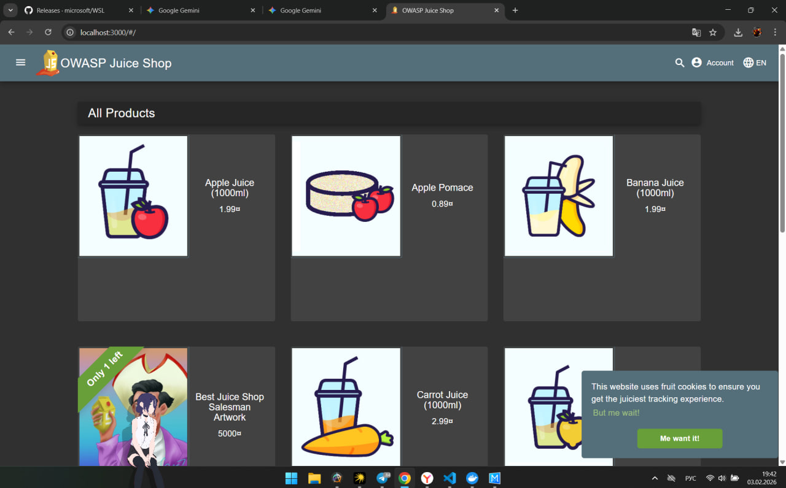

# Triage Report — OWASP Juice Shop

## Scope & Asset
- Asset: OWASP Juice Shop (local lab instance)
- Image: bkimminich/juice-shop:v19.0.0
- Release link/date: https://github.com/juice-shop/juice-shop/releases — Jan 2025
- Image digest: sha256:2765a26de7647609099a338d5b7f61085d95903c8703bb70f03fcc4b12f0818d

## Environment
- Host OS: Windows (PowerShell)
- Docker: <твоя версия, например 24.0.x>

## Deployment Details
- Run command used: `docker run -d --name juice-shop -p 127.0.0.1:3000:3000 bkimminich/juice-shop:v19.0.0`
- Access URL: http://127.0.0.1:3000
- Network exposure: 127.0.0.1 only [x] Yes  [ ] No

## Health Check
- Page load: 
- API check: 
```json
[
  {
    "id": 1,
    "name": "Apple Juice (1000ml)",
    "description": "The all-time classic.",
    "price": 1.99,
    "image": "apple_juice.jpg"
  },
  {
    "id": 2,
    "name": "Orange Juice (1000ml)",
    "description": "Made from world-famous Oranges.",
    "price": 2.99,
    "image": "orange_juice.jpg"
  }
]

```

Surface Snapshot (Triage)
Login/Registration visible: [x] Yes — Accessible via the navbar.

Product listing/search present: [x] Yes — Main page shows various products.

Admin or account area discoverable: [x] Yes — Potential routes like /admin are often discoverable in such apps.

Client-side errors in console: [ ] Yes [x] No

Risks Observed (Top 3)
Injection Vulnerabilities: High risk due to input fields like search and login that may lack sanitization.

Broken Access Control: Potential for unauthorized access to administrative functions.

Sensitive Data Exposure: Risk of leaking internal API data or logs to unauthenticated users.

GitHub Community
Starring repositories helps promote open-source projects and signals their value to the developer community.

Following developers fosters professional networking and enables staying up-to-date with industry trends and collaborative work.