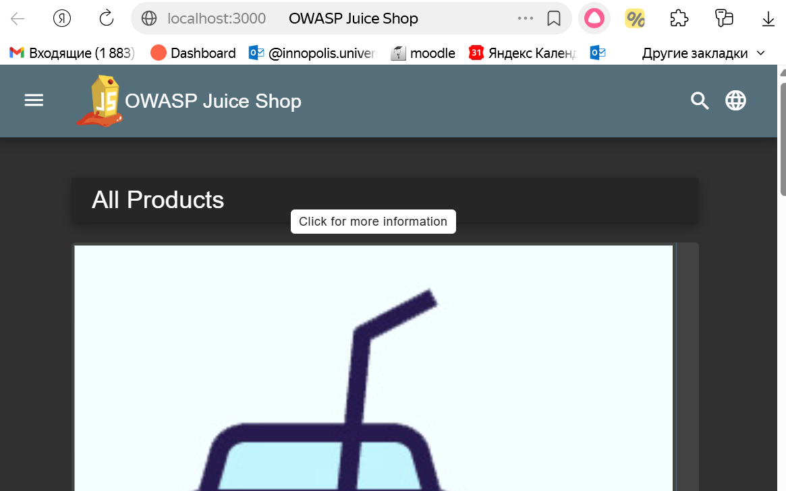
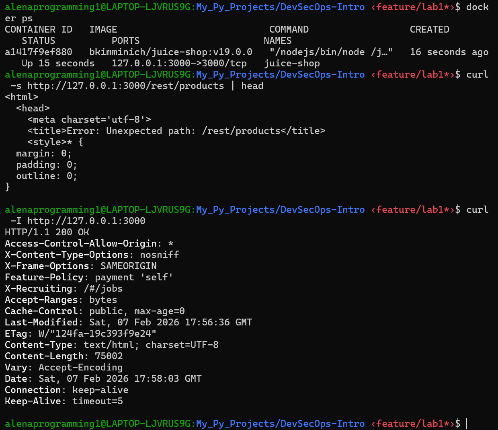
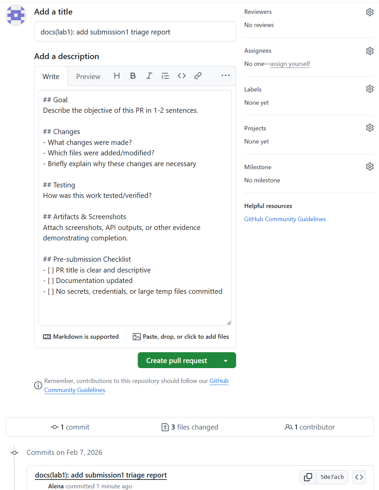

# Triage Report - OWASP Juice Shop

## Scope & Asset
- Asset: OWASP Juice Shop (local lab instance)
- Image: bkimminich/juice-shop:v19.0.0
- Release link/date: https://github.com/juice-shop/juice-shop/releases/tag/v19.0.0 - Sep 4, 2025
- Image digest (optional): sha256:2765a26de7647609099a338d5b7f61085d95903c8703bb70f03fcc4b12f0818d

## Environment
- Host OS: Ubuntu 22.04 (WSL2)
- Docker: 27.3.1

## Deployment Details
- Run command used: `docker run -d --name juice-shop -p 127.0.0.1:3000:3000 bkimminich/juice-shop:v19.0.0`
- Access URL: http://127.0.0.1:3000
- Network exposure: 127.0.0.1 only [x] Yes [ ] No - Local access only, not exposed to network

## Health Check
- Page load:
  
- API check:
  ```bash
  curl -s http://127.0.0.1:3000/rest/products | head
  <html>
  <head>
    <meta charset='utf-8'>
    <title>Error: Unexpected path: /rest/products</title>
    <style>* {
  margin: 0;
  padding: 0;
  outline: 0;
  }
  ```
  

## Surface Snapshot (Triage)
- Login/Registration visible: [x] Yes [ ] No - Login form is accessible from the menu
- Product listing/search present: [x] Yes [ ] No - Product catalog is visible with filtering and search functionality
- Admin or account area discoverable: [] Yes [x] No - No admin area present or may require authentication
- Client-side errors in console: [ ] Yes [x] No - Browser console is clean, no JavaScript errors detected
- Security headers (quick look - optional): `curl -I http://127.0.0.1:3000` → CSP/HSTS do not present - potential security risk
  ```bash
  curl -I http://127.0.0.1:3000
  HTTP/1.1 200 OK
  Access-Control-Allow-Origin: *
  X-Content-Type-Options: nosniff
  X-Frame-Options: SAMEORIGIN
  Feature-Policy: payment 'self'
  X-Recruiting: /#/jobs
  Accept-Ranges: bytes
  Cache-Control: public, max-age=0
  Last-Modified: Sat, 07 Feb 2026 17:56:36 GMT
  ETag: W/"124fa-19c393f9e24"
  Content-Type: text/html; charset=UTF-8
  Content-Length: 75002
  Vary: Accept-Encoding
  Date: Sat, 07 Feb 2026 17:58:03 GMT
  Connection: keep-alive
  Keep-Alive: timeout=5
  ```

## Risks Observed (Top 3)
1) **Missing Content Security Policy (CSP) Header**  
The application does not send a Content-Security-Policy header, which allows potential injection of malicious JavaScript code and increases the risk of Cross-Site Scripting (XSS) attacks.
2) **Weak Authentication & SQL Injection Vulnerabilities**  
OWASP Juice Shop is known to contain SQL Injection vulnerabilities in the login form and search functionality, which can be exploited to bypass authentication and access unauthorized data.
3) **Sensitive Data Exposure in Client-Side Code**  
API keys and configuration data may be exposed in the JavaScript source code. These can be discovered by opening Developer Tools (`Ctrl+Shift+I` → Sources tab), allowing attackers to understand application logic and API structure.

## PR Template Setup & Verification

### PR Template Creation Process
A standardized PR template file `.github/pull_request_template.md` was created in the main branch of the repository to ensure consistent submission format across all lab PRs.

### Template Application Verification
When opening a PR from the `feature/lab1` branch, the template automatically populates the following sections:


### How Templates Improve Collaboration Workflow
**Standardization:**  
All PRs follow a uniform format, making code review faster and more efficient.  
**Quality Assurance:**  
Developers are reminded to include documentation updates, testing evidence, and to exclude secrets or large temporary files.  
**Traceability:**  
It's easier to verify that all acceptance criteria are met before merging changes into the main branch.

## GitHub Community

**Why Starring Repositories Matters:**  
Stars serve as social currency in open source - they bookmark quality projects, signal appreciation to maintainers, and help other developers discover proven tools. A high star count indicates community trust and code quality.

**How Following Developers Helps:**  
Following colleagues and mentors enables visibility into their work, facilitates collaboration, and builds a professional network. Seeing how experienced developers approach problems provides valuable learning opportunities.

**Starred repositories:**
- Course repository
- [simple-container-com/api](https://github.com/simple-container-com/api)

**Following developers:**
- [@Cre-eD](https://github.com/Cre-eD) - Professor
- [@marat-biriushev](https://github.com/marat-biriushev) - TA
- [@pierrepicaud](https://github.com/pierrepicaud) - TA
- 3+ classmates from the course:
  - [@Aleliya](https://github.com/Aleliya)
  - [@sayfetik](https://github.com/sayfetik)
  - [@idio4](https://github.com/idio4)
