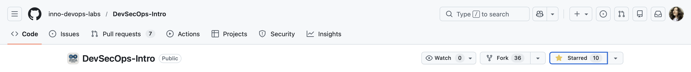
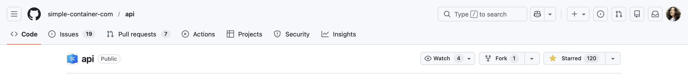
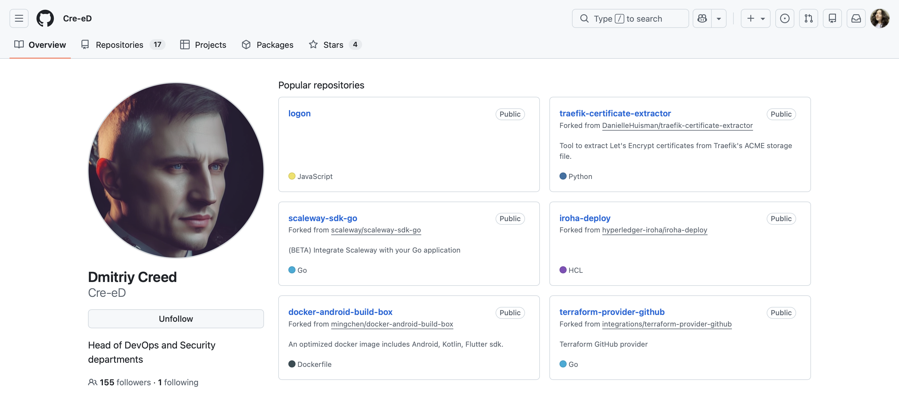
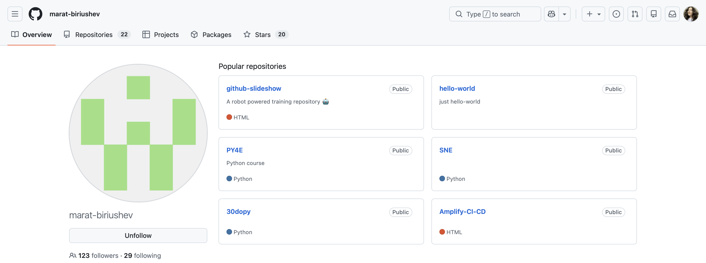
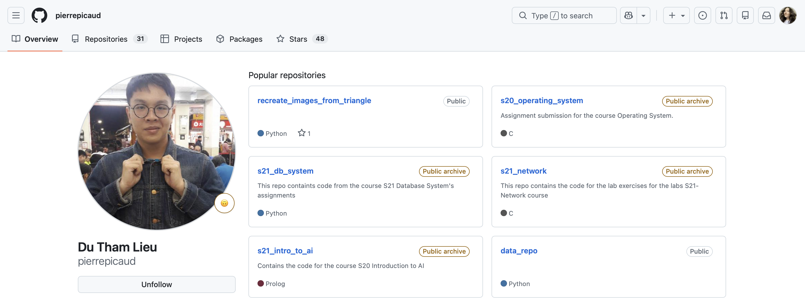

# Triage Report — OWASP Juice Shop

## Scope & Asset
- Asset: OWASP Juice Shop (local lab instance)
- Image: bkimminich/juice-shop:v19.0.0
- Release link/date: https://github.com/juice-shop/juice-shop/releases/tag/v19.0.0 — 04.09.2025
- Image digest : sha256:2a95df217ff812f173a6ee032816172e401f641d2a9cf526011d62b9734b503c

## Environment
- Host OS: macOS 26.2
- Docker: 28.0.4
## Deployment Details
- Run command used: `docker run -d --name juice-shop -p 127.0.0.1:3000:3000 bkimminich/juice-shop:v19.0.0`
- Access URL: http://127.0.0.1:3000
- Network exposure: 127.0.0.1 only [x ] Yes  [ ] No 

## Health Check
- Page load: attach screenshot of home page (path or embed)

- API check: first 5–10 lines from `curl -s http://127.0.0.1:3000/rest/products | head`
```
<html>
  <head>
    <meta charset='utf-8'> 
    <title>Error: Unexpected path: /rest/products</title>
    <style>* {
  margin: 0;
  padding: 0;
  outline: 0;
}
```
There is no such handler, so we get error, but exists other handlers, which work. For example:
```
curl -s 'http://127.0.0.1:3000/rest/products/search?q=apple' | head
```
```
{"status":"success","data":[{"id":1,"name":"Apple Juice (1000ml)","description":"The all-time classic.","price":1.99,"deluxePrice":0.99,"image":"apple_juice.jpg","createdAt":"2025-09-15 17:48:03.570 +00:00","updatedAt":"2025-09-15 17:48:03.570 +00:00","deletedAt":null},{"id":24,"name":"Apple Pomace","description":"Finest pressings of apples. Allergy disclaimer: Might contain traces of worms. Can be <a href=\"/#recycle\">sent back to us</a> for recycling.","price":0.89,"deluxePrice":0.89,"image":"apple_pressings.jpg","createdAt":"2025-09-15 17:48:03.575 +00:00","updatedAt":"2025-09-15 17:48:03.575 +00:00","deletedAt":null}]}%   
```


## Surface Snapshot (Triage)
- Login/Registration visible: [x] Yes — notes:  
Hidden by "Account" word, and actually Register page hard to find by first view (need to click on small text below page, which even not contain word "Register") 
- Product listing/search present: [x] Yes — notes:   Visible, seacrh work (checked by "Juice" word)
- Admin or account area discoverable: [x] No — notes:  
There is no panel/button with Admin access
- Client-side errors in console: [x] No — notes:  
There is no error on client side in console
- Security headers (quick look — optional): `curl -I http://127.0.0.1:3000` → CSP/HSTS present? 
```
HTTP/1.1 200 OK
Access-Control-Allow-Origin: *
X-Content-Type-Options: nosniff
X-Frame-Options: SAMEORIGIN
Feature-Policy: payment 'self'
X-Recruiting: /#/jobs
Accept-Ranges: bytes
Cache-Control: public, max-age=0
Last-Modified: Mon, 15 Sep 2025 17:48:03 GMT
ETag: W/"124fa-1994e7dafdf"
Content-Type: text/html; charset=UTF-8
Content-Length: 75002
Vary: Accept-Encoding
Date: Mon, 15 Sep 2025 18:14:22 GMT
Connection: keep-alive
```
We do not have a header ```Strict-Transport-Security:```, so there is no HSTS and the webpage is unsafe.  
Also we do not have a header ```Content-Security-Policy: default-src 'self'; script-src 'self' https://cdn.example.com```, so there is no CSP and in comments hackers could left blocks of code with malicious behavior.

## Risks Observed (Top 3)

1) **XSS Vulnerability.** Lack of CSP with extensive user input handling (search, forms) enables arbitrary JavaScript execution

2) **Information Leakage via Error Messages.** Authentication endpoints return overly detailed error responses 

3) **Missing Security Headers.** Absence of CSP and HTTP HSTS headers increases client-side attacks and man-in-the-middle exploits

## GitHub Community
1. Star the course repository

2. Star the simple-container-com/api project — a promising open-source tool for container management

3. Follow your professor and TAs on GitHub:
Professor: @Cre-eD

TA: @marat-biriushev

TA: @pierrepicaud


**Why starring repositories matters in open source? How following developers helps in team projects and professional growth**

Starring repositories helps support open-source projects by increasing their visibility and signaling that the work is valuable to the community. Following developers allows you to learn from their work, stay updated on their projects, and build professional connections that are useful for collaboration and long-term career growth.