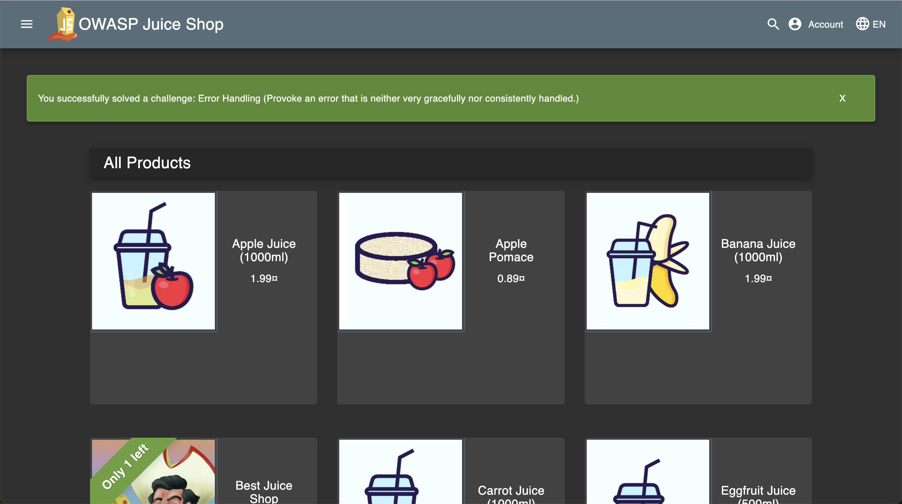

# Triage Report — OWASP Juice Shop

## Scope & Asset
- Asset: OWASP Juice Shop (local lab instance)
- Image: bkimminich/juice-shop:v19.0.0
- Release link/date: https://owasp.org/www-project-juice-shop/ (Latest Releases list, v19.0.0) — 2025-09-04T05:50:12Z
- Image digest (optional): sha256:2765a26de7647609099a338d5b7f61085d95903c8703bb70f03fcc4b12f0818d

## Environment
- Host OS: macOS 15.7.1
- Docker: 28.5.1

## Deployment Details
- Run command used: `docker run -d --name juice-shop -p 127.0.0.1:3000:3000 bkimminich/juice-shop:v19.0.0`
- Access URL: http://127.0.0.1:3000
- Network exposure: 127.0.0.1 only [x] Yes  [ ] No  (explain if No)

## Health Check
- Page load: screenshot of home page (path or embed)
  - Screenshot: `labs/assets/lab1-juice-shop.png`
  - Embed: 
- API check: first 5–10 lines from `curl -s http://127.0.0.1:3000/rest/products | head`

```text
<html>
  <head>
    <meta charset='utf-8'>
    <title>Error: Unexpected path: /rest/products</title>
    <style>* {
  margin: 0;
  padding: 0;
  outline: 0;
}
```

Note: `/rest/products` returned an error response. Verified the API via `/api/Products` as an alternative:

```text
{
  "status": "success",
  "data": [
    {
      "id": 1,
      "name": "Apple Juice (1000ml)",
      "description": "The all-time classic.",
      "price": 1.99,
      "deluxePrice": 0.99,
      "image": "apple_juice.jpg",
```

## Surface Snapshot (Triage)
- Login/Registration visible: [x] Yes  [ ] No — notes: visible on home page
- Product listing/search present: [x] Yes  [ ] No — notes: product cards + search bar
- Admin or account area discoverable: [x] Yes  [ ] No — notes: account menu present
- Client-side errors in console: [ ] Yes  [x] No — notes: none observed
- Security headers (quick look — optional): `curl -I http://127.0.0.1:3000` → CSP/HSTS present? notes: CSP/HSTS not present; `X-Content-Type-Options: nosniff`, `X-Frame-Options: SAMEORIGIN`

## Risks Observed (Top 3)
1) Error handling leak: the `/rest/products` request returned a detailed error page, which can expose internal routing or error behavior.
2) Input validation risk: search and login inputs are exposed on the UI and are common vectors for XSS/SQLi in training apps; requires testing.
3) Authentication/authorization risk: account/admin areas are discoverable; improper access control would be high impact.

# Task 2 — PR Template Setup

## Template File
- Path: `.github/pull_request_template.md`
- Sections: Goal, Changes, Testing, Artifacts & Screenshots
- Checklist items: clear title, docs updated if needed, no secrets/large temp files

## Process
- Created template file on `main` so GitHub auto-loads it for PRs.
- Open PR from `feature/lab1` → course repo `main`.
- Verify the PR description auto-fills with the template.

## Verification Evidence
- Screenshot or link to PR description showing auto-filled template: <path or link>

## Collaboration Analysis
Using a PR template standardizes the information reviewers need, reduces back-and-forth on missing context, and encourages basic hygiene checks (docs updates, no secrets) before review.

# Challenges & Solutions
- `/rest/products` returned an "Unexpected path" error; captured output for triage and verified products via `/api/Products`.

# GitHub Community
Starring repositories helps bookmark useful projects and signals community interest, which improves discoverability. Following developers keeps you aware of their work and makes collaboration easier over time.
