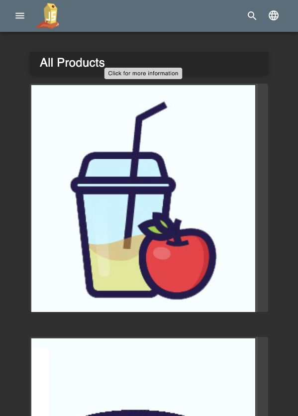

# Triage Report — OWASP Juice Shop

**Date completed:** 2026-05-12  
**Workspace note:** all artifacts for this lab were generated locally under `labs/lab1/`.  
**Git note:** no commits, pushes, or PR creation were performed, per request.

## Task 1 — OWASP Juice Shop Deployment

### Scope & Asset

- Asset: OWASP Juice Shop (local lab instance)
- Image: `bkimminich/juice-shop:v19.0.0`
- Release link/date: [v19.0.0 release](https://github.com/juice-shop/juice-shop/releases/tag/v19.0.0) — 2025-09-04
- Image digest: `sha256:2765a26de7647609099a338d5b7f61085d95903c8703bb70f03fcc4b12f0818d`

### Environment

- Host OS: `macOS 26.3` (`Darwin 25.3.0`, arm64)
- Docker: `29.4.0` client / `29.4.0` server
- Container runtime: OrbStack

### Deployment Details

- Run command used:

```bash
docker run -d --name juice-shop \
  -p 127.0.0.1:3000:3000 \
  bkimminich/juice-shop:v19.0.0
```

- Access URL: `http://127.0.0.1:3000`
- Network exposure: `127.0.0.1` only
  - Verified by `docker ps`: `127.0.0.1:3000->3000/tcp`
- Deployment evidence:
  - `labs/lab1/docker-ps.txt`
  - `labs/lab1/docker-version.txt`
  - `labs/lab1/image-digest.txt`

### Health Check

- Page load: successful
- Screenshot:



- Screenshot artifact path: `labs/lab1/juice-shop-home.png`

- API check:
  - The lab handout suggests `curl -s http://127.0.0.1:3000/rest/products | head`, but on this `v19.0.0` image that path returned `HTTP 500` with `Error: Unexpected path: /rest/products`.
  - A working product API endpoint for this image is `http://127.0.0.1:3000/api/Products`.

```bash
curl -s http://127.0.0.1:3000/api/Products | jq '.' | head -n 10
```

```json
{
  "status": "success",
  "data": [
    {
      "id": 1,
      "name": "Apple Juice (1000ml)",
      "description": "The all-time classic.",
      "price": 1.99,
      "deluxePrice": 0.99,
      "image": "apple_juice.jpg",
```

- API artifact: `labs/lab1/api-head.txt`

### Surface Snapshot (Triage)

- Login/Registration visible: `[x] Yes`
  - Notes: the side navigation exposes `Login`, and the login page clearly links to `#/register` via `Not yet a customer?`
- Product listing/search present: `[x] Yes`
  - Notes: the home page shows a searchable product catalog with pagination and product detail buttons
- Admin or account area discoverable: `[ ] No` for admin, `[x] Yes` for account
  - Notes: an `Account` section is immediately visible in the side navigation, but no direct admin UI link was exposed during quick triage
- Client-side errors in console: `[ ] No`
  - Notes: browser console capture returned zero visible console errors
- Security headers quick look:
  - Command: `curl -I http://127.0.0.1:3000`
  - Observed:
    - `X-Content-Type-Options: nosniff`
    - `X-Frame-Options: SAMEORIGIN`
    - `Access-Control-Allow-Origin: *`
    - `Feature-Policy: payment 'self'`
  - Missing in this local HTTP setup:
    - `Content-Security-Policy`
    - `Strict-Transport-Security`
  - Header artifact: `labs/lab1/headers.txt`

### Risks Observed (Top 3)

1. **Intentional vulnerable training target**. Juice Shop is deliberately insecure by design, so any exposure beyond localhost would create immediate and unnecessary risk.
2. **Missing CSP/HSTS and HTTP-only access**. The instance is served over plain HTTP and does not advertise CSP or HSTS, so browser-side protections are limited even for a lab deployment.
3. **Broad attack surface visible at first glance**. Product browsing, login, registration, account flows, and numerous discoverable routes/APIs are exposed right away, increasing the number of places where common web issues can be exercised.

### Analysis

This deployment worked correctly as a local-only lab target once Docker was running. The most important operational control was binding to `127.0.0.1` instead of `0.0.0.0`, because Juice Shop should never be casually exposed to a wider network. I also observed a small version-specific mismatch between the lab instructions and the running app: `/rest/products` no longer behaved as expected in this image, while `/api/Products` returned the live product inventory. That is worth documenting so the submission reflects the actual behavior of the deployed version rather than blindly repeating the handout.

## Task 2 — PR Template Setup

### Template status

The repository already contains `.github/pull_request_template.md`, and its current contents match the lab requirements:

- Sections present: `Goal`, `Changes`, `Testing`, `Artifacts & Screenshots`
- Checklist present:
  - clear/descriptive PR title
  - documentation updated if needed
  - no secrets or large temporary files committed

Current template content:

```md
## Goal
## Changes
## Testing
## Artifacts & Screenshots

### Checklist
- [ ] PR title is clear and descriptive
- [ ] Documentation updated if needed
- [ ] No secrets or large temporary files committed
```

### Verification note

The lab normally asks to create `feature/lab1`, commit the submission, push it, and confirm that GitHub auto-fills the PR body from the template on the default branch. I intentionally did **not** perform those steps here because the explicit instruction for this run was to avoid any git commits.

Because of that constraint, the live GitHub verification was limited to a local structure review:

- `.github/pull_request_template.md` exists
- the required sections are present
- the required checklist items are present
- the template is already in the repository root where GitHub expects it

### Analysis

A PR template improves collaboration by making every lab submission easier to review in a consistent way. Reviewers can immediately see the goal, scope of changes, test evidence, and attached artifacts instead of hunting through commit messages or comments. The checklist also reduces simple mistakes such as vague titles, forgotten documentation updates, or accidentally committed secrets and temporary files.

## Task 6 — GitHub Community

### Execution status

This part is account-bound and could not be fully completed from the current environment:

- the `gh` CLI is not installed here
- the available browser session is not signed into GitHub
- the handles for at least 3 classmates were not available locally

For that reason, I did **not** fabricate completion of stars/follows that were not actually performed.

### Why stars and follows matter

Starring repositories is useful both as lightweight support for maintainers and as a personal bookmark list of projects worth revisiting. In practice, stars also act as a weak trust/discovery signal that helps surface useful tools and references during future work.

Following developers helps with collaboration because it makes their activity, projects, and improvements easier to notice over time. In team or course settings, that can make it easier to discover relevant work, learn from others' implementation choices, and build lightweight professional connections.

## Artifacts

- Screenshot: `labs/lab1/juice-shop-home.png`
- API snippet: `labs/lab1/api-head.txt`
- Headers: `labs/lab1/headers.txt`
- Container port binding: `labs/lab1/docker-ps.txt`
- Docker version: `labs/lab1/docker-version.txt`
- Image digest: `labs/lab1/image-digest.txt`
- Browser console capture: `labs/lab1/browser-console.json`

## Final Notes

- The local Juice Shop deployment and triage documentation are complete.
- The PR template requirement is already satisfied by the existing repository file.
- Actual git commit / push / PR creation was intentionally skipped.
- Actual GitHub starring/following actions were not completed because this environment is not authenticated and classmate handles were unavailable.
