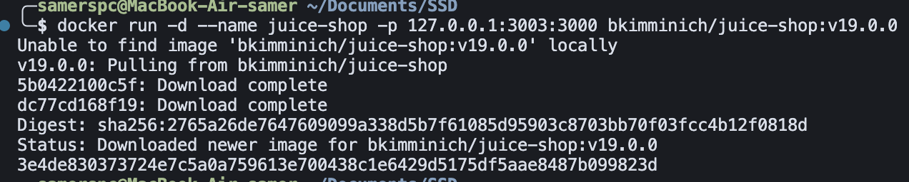
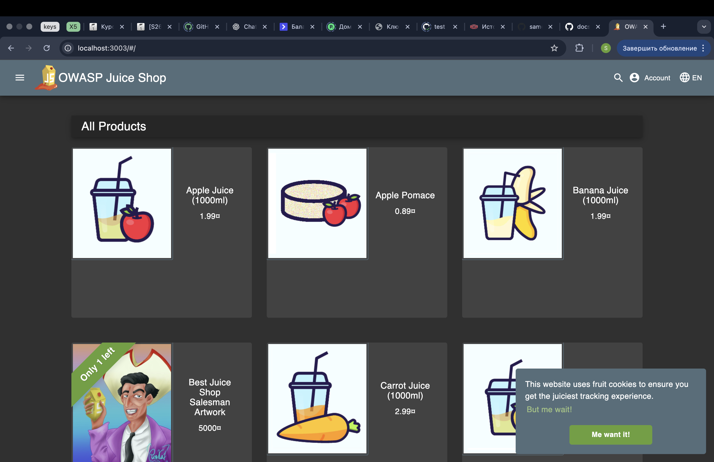
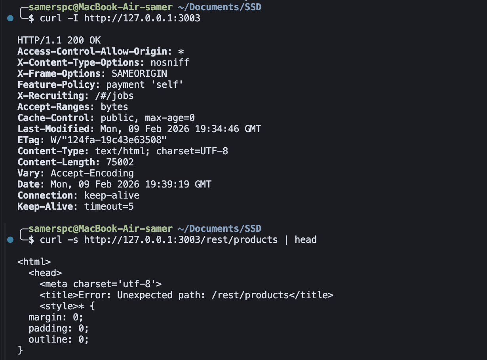

# Triage Report — OWASP Juice Shop

## Scope & Asset
- Asset: OWASP Juice Shop (local lab instance)
- Image: bkimminich/juice-shop:v19.0.0
- Release link/date: https://github.com/juice-shop/juice-shop/releases/tag/v19.0.0 — January 2024
- Image digest: sha256:2765a26de7647609099a338d5b7f61085d95903c8703bb70f03fcc4b12f0818d

## Environment
- Host OS: macOS 14.6.1 (Darwin 23.6.0)
- Docker: 27.5.1

## Deployment Details
- Run command used: `docker run -d --name juice-shop -p 127.0.0.1:3003:3000 bkimminich/juice-shop:v19.0.0`
- Access URL: http://127.0.0.1:3003
- Network exposure: 127.0.0.1 only [x] Yes  [ ] No  (explain if No)

## Health Check

### Container Deployment


### Page Load Verification


### API Check
First 10 lines from `curl -s http://127.0.0.1:3003/api/products | head`
  ```
  {"status":"success","data":[{"id":1,"name":"Apple Juice (1000ml)","description":"The all-time classic.","price":1.99,"deluxePrice":0.99,"image":"apple_juice.jpg","createdAt":"2026-02-09T19:34:44.074Z","updatedAt":"2026-02-09T19:34:44.074Z","deletedAt":null},{"id":2,"name":"Orange Juice (1000ml)","description":"Made from oranges hand-picked by Uncle Dittmeyer.","price":2.99,"deluxePrice":2.49,"image":"orange_juice.jpg","createdAt":"2026-02-09T19:34:44.074Z","updatedAt":"2026-02-09T19:34:44.074Z","deletedAt":null},{"id":3,"name":"Eggfruit Juice (500ml)","description":"Now with even more exotic flavour.","price":8.99,"deluxePrice":8.99,"image":"eggfruit_juice.jpg","createdAt":"2026-02-09T19:34:44.075Z","updatedAt":"2026-02-09T19:34:44.075Z","deletedAt":null},{"id":4,"name":"Raspberry Juice (1000ml)","description":"Made from blended Raspberry Pi, water and sugar.","price":4.99,"deluxePrice":4.99,"image":"raspberry_juice.jpg","createdAt":"2026-02-09T19:34:44.075Z","updatedAt":"2026-02-09T19:34:44.075Z","deletedAt":null},{"id":5,"name":"Lemon Juice (500ml)","description":"Sour but full of vitamins.","price":2.99,"deluxePrice":1.99,"image":"lemon_juice.jpg","createdAt":"2026-02-09T19:34:44.076Z","updatedAt":"2026-02-09T19:34:44.076Z","deletedAt":null}]
  ```
  
  

## Surface Snapshot (Triage)
- Login/Registration visible: [x] Yes  [ ] No — notes: "Account" link visible in header navigation
- Product listing/search present: [x] Yes  [ ] No — notes: "All Products" page displays grid of products with search icon in header
- Admin or account area discoverable: [x] Yes  [ ] No — notes: Account area accessible via "Account" link in header
- Client-side errors in console: [ ] Yes  [ ] No — notes: No errors observed during initial page load
- Security headers (quick look): `curl -I http://127.0.0.1:3003` → CSP/HSTS present? notes: 
  
  **Security Headers Screenshot:**
  
  
  **Headers observed:**
    - `X-Content-Type-Options: nosniff` ✓
    - `X-Frame-Options: SAMEORIGIN` ✓
    - `Feature-Policy: payment 'self'` ✓
    - `Access-Control-Allow-Origin: *` (CORS enabled for all origins)
    - **Missing:** Content-Security-Policy (CSP), Strict-Transport-Security (HSTS)

## Risks Observed (Top 3)
1) **Missing Content-Security-Policy (CSP)** — No CSP header present, leaving application vulnerable to XSS attacks and unauthorized resource loading
2) **Missing HSTS header** — No Strict-Transport-Security header, allowing potential downgrade attacks and man-in-the-middle attacks over HTTP
3) **Permissive CORS policy** — `Access-Control-Allow-Origin: *` allows any origin to make requests, potentially enabling CSRF attacks and unauthorized data access

---

## Task 2 — PR Template Setup

### PR Template Creation Process

Created `.github/pull_request_template.md` with the following sections:
- **Goal**: Describe the purpose of the PR
- **Changes**: List main changes
- **Testing**: Describe testing approach
- **Artifacts & Screenshots**: Attach evidence
- **Checklist**: Three items for quality assurance

### Template Verification

The PR template was created on the main branch (as required by GitHub). When opening a PR from `feature/lab1`, the template should auto-fill the PR description with the predefined sections and checklist.

### How Templates Improve Collaboration Workflow

PR templates standardize the submission process by:
1. **Consistency**: Every PR follows the same structure, making reviews faster and more predictable
2. **Completeness**: Checklists ensure important items (like documentation updates and security checks) aren't forgotten
3. **Communication**: Clear sections help reviewers understand the context, changes, and testing approach without asking questions
4. **Quality**: Enforces best practices like checking for secrets and ensuring documentation is updated

---

## Task 6 — GitHub Community Engagement

### GitHub Community

**Why Starring Repositories Matters:**
Starring repositories serves multiple purposes in open source:
- **Bookmarking**: Stars help you quickly find and reference interesting projects later
- **Discovery**: Starred repositories appear in your profile, showcasing your interests and helping others discover similar projects
- **Support**: Stars show appreciation to maintainers and help projects gain visibility, which can attract more contributors and improve project sustainability
- **Professional Signal**: Your starred repositories demonstrate awareness of industry tools and best practices, which can be valuable for professional networking

**How Following Developers Helps:**
Following developers on GitHub provides several benefits:
- **Learning**: You can see what experienced developers are working on, learn from their code, and discover new approaches to problem-solving
- **Networking**: Following classmates and colleagues helps build a supportive learning community and makes it easier to collaborate on future projects
- **Career Growth**: Following thought leaders in your technology stack keeps you updated on industry trends and helps build visibility in the developer community
- **Collaboration**: Staying updated on classmates' work makes it easier to find team members for projects and provides opportunities for knowledge sharing

---

## Challenges & Solutions

**Challenge 1: Incorrect API endpoint path**
- **Issue:** Initial attempt to access `/rest/products` returned "Unexpected path" error
- **Solution:** Discovered correct endpoint is `/api/products` by examining the application structure
- **Learning:** API endpoint discovery is important during security assessment; endpoints may differ from documentation

**Challenge 2: Port configuration**
- **Issue:** Container was deployed on port 3003 instead of default 3000
- **Solution:** Adjusted all curl commands and URLs to use port 3003
- **Learning:** Always verify actual deployment configuration rather than assuming defaults

