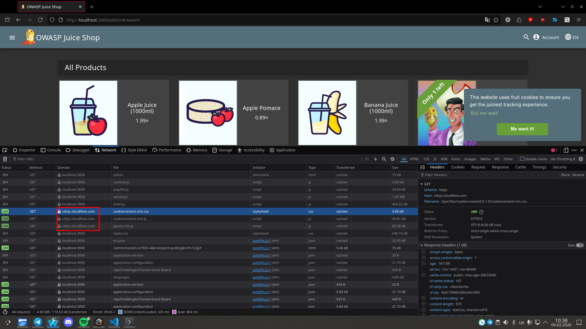
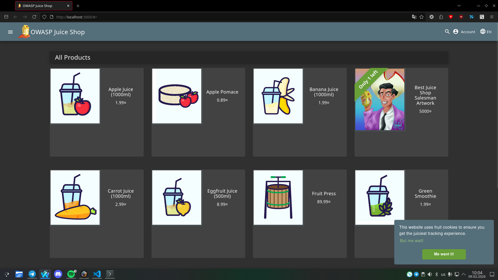

# Task 1
Note: I wasn't sure which tool to use for the report, so I defaulted to ZAP from our DevOps course
## Triage Report — OWASP Juice Shop

### Scope & Asset
- Asset: OWASP Juice Shop (local lab instance)
- Image: bkimminich/juice-shop:v19.0.0
- Release link/date: ``https://github.com/juice-shop/juice-shop`` — ``”2025-09-04T05:38:11Z”``
- Image digest (optional): ``sha256:2765a26de7647609099a338d5b7f61085d95903c8703bb70f03fcc4b12f0818d``

### Environment
- Host OS: ``EndeavourOS``
- Docker: ``29.2.1``

### Deployment Details
- Run command used: `docker run -d --name juice-shop -p 127.0.0.1:3000:3000 bkimminich/juice-shop:v19.0.0`
- Access URL: ``http://127.0.0.1:3000``
- Network exposure: 127.0.0.1 only [ ] Yes  [✅] No  (explain if No):


### Health Check
- Page load: attach screenshot of home page (path or embed)

- API check: first 5–10 lines from `curl -s http://127.0.0.1:3000/rest/products | head`:
```shell
[rightrat | ~/c/DevSecOps-Intro] curl -s http://127.0.0.1:3000/rest/products | head
<html>
  <head>
    <meta charset='utf-8'> 
    <title>Error: Unexpected path: /rest/products</title>
    <style>* {
  margin: 0;
  padding: 0;
  outline: 0;
}
```


### Surface Snapshot (Triage)
- Login/Registration visible: [✅] Yes  [ ] No — notes: prompted to save password even if not registered/logged in
- Product listing/search present: [✅] Yes  [ ] No
- Admin or account area discoverable: [ ] Yes  [✅] No
- Client-side errors in console: [✅] Yes  [ ] No
- Security headers (quick look — optional): `curl -I http://127.0.0.1:3000` → CSP/HSTS present? ❌

### Risks Observed (Top 3)
1) **Content Security Policy (CSP) Header Not Set**
2) **Cross-Domain Misconfiguration**: Web browser data loading may be possible, due to a Cross Origin Resource Sharing (CORS) misconfiguration on the web server.
3) **Timestamp Disclosure - Unix**: A timestamp was disclosed by the application/web server. - Unix


# Task 2
**Done by default by submitting first PR**