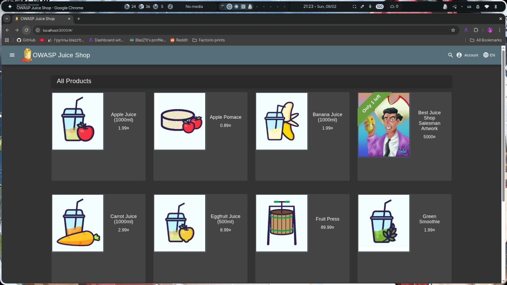

# Triage Report — OWASP Juice Shop

## Scope & Asset
- Asset: OWASP Juice Shop (local lab instance)
- Image: bkimminich/juice-shop:v19.0.0
- Release link/date: https://github.com/juice-shop/juice-shop/releases/tag/v19.0.0
- Image digest (optional): <sha256:2765a26de7647609099a338d5b7f61085d95903c8703bb70f03fcc4b12f0818d>

## Environment
- Host OS: Linux 6.18.7-arch1-1
- Docker: 29.2.1

## Deployment Details
- Run command used: `docker run -d --name juice-shop -p 127.0.0.1:3000:3000 bkimminich/juice-shop:v19.0.0`
- Access URL: http://127.0.0.1:3000
- Network exposure: 127.0.0.1 only [x] Yes  [ ] No  (explain if No)

## Health Check
- Page load: 

- API check: first 5–10 lines from `curl -s http://127.0.0.1:3000/api/products | head`

```
{"status":"success","data":[{"id":1,"name":"Apple Juice (1000ml)","description":"The all-time classic.","price":1.99,"deluxePrice":0.99,"image":"apple_juice.jpg","createdAt":"2026-02-08T18:18:38.801Z","updatedAt":"2026-02-08T18:18:38.801Z","deletedAt":null},{"id":2,"name":"Orange Juice (1000ml)","description":"Made from oranges hand-picked by Uncle Dittmeyer.","price":2.99,"deluxePrice":2.49,"image":"orange_juice.jpg","createdAt":"2026-02-08T18:18:38.801Z","updatedAt":"2026-02-08T18:18:38.801Z","deletedAt":null},{"id":3,"name":"Eggfruit Juice (500ml)","description":"Now with even more exotic flavour.","price":8.99,"deluxePrice":8.99,"image":"eggfruit_juice.jpg","createdAt":"2026-02-08T18:18:38.801Z","updatedAt":"2026-02-08T18:18:38.801Z","deletedAt":null},{"id":4,"name":"Raspberry Juice (1000ml)","description":"Made from blended Raspberry Pi, water and sugar.","price":4.99,"deluxePrice":4.99,"image":"raspberry_juice.jpg","createdAt":"2026-02-08T18:18:38.801Z","updatedAt":"2026-02-08T18:18:38.801Z","deletedAt":null}
```

## Surface Snapshot (Triage)
- Login/Registration visible: [x] Yes  [ ] No — notes: <...>
- Product listing/search present: [x] Yes  [ ] No — notes: <...>
- Admin or account area discoverable: [x] Yes  [ ] No — notes: <...>
- Client-side errors in console: [ ] Yes  [x] No — notes: <...>
- Security headers (quick look — optional): `curl -I http://127.0.0.1:3000` → CSP/HSTS present? notes: CSP/HSTS missing

## Risks Observed (Top 3)
1) Weak authentication requirements and possible to enumerate accounts
2) Not prone to SQL injections, easily could inject SQL queries in search and login requests
3) No security headers