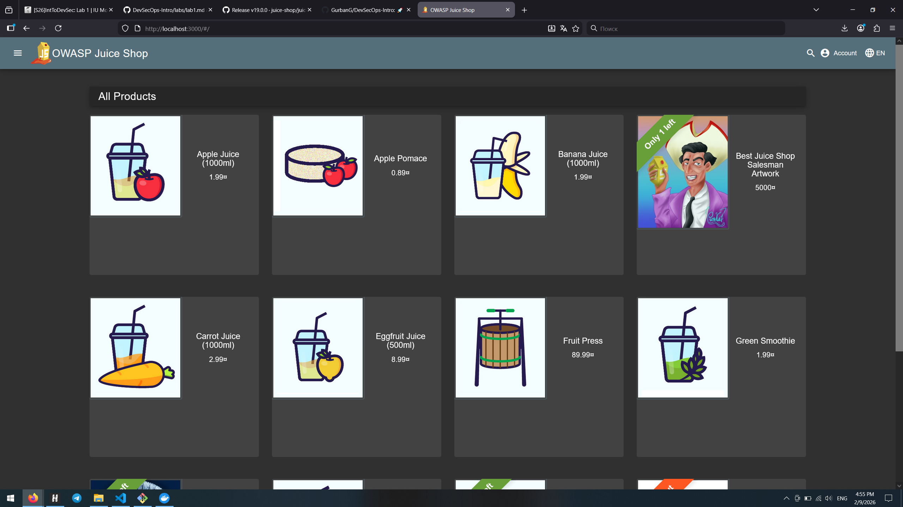

# Triage Report — OWASP Juice Shop

## Scope & Asset
- Asset: OWASP Juice Shop (local lab instance)
- Image: bkimminich/juice-shop:v19.0.0
- Release link/date: <https://github.com/juice-shop/juice-shop/releases/tag/v19.0.0> — Sep 4, 2025
- Image digest (optional): sha256:2765a26de7647609099a338d5b7f61085d95903c8703bb70f03fcc4b12f0818d

## Environment
- Host OS: Windows 10
- Docker: 29.2.0

## Deployment Details
- Run command used: `docker run -d --name juice-shop -p 127.0.0.1:3000:3000 bkimminich/juice-shop:v19.0.0`
- Access URL: http://127.0.0.1:3000
- Network exposure: 127.0.0.1 only

## Health Check
- Page load: 
- API check: first 5–10 lines from `curl -s http://127.0.0.1:3000/rest/products | head`

Error 500:
```
<html>
  <head>
    <meta charset='utf-8'>
    <title>Error: Unexpected path: /rest/products</title>
    <style>* {
  margin: 0;
  padding: 0;
  outline: 0;
}
```

## Surface Snapshot (Triage)
- Login/Registration visible: [x] Yes -- notes: under account
- Product listing/search present: [x] Yes
- Admin or account area discoverable: [x] Yes
- Client-side errors in console: [x] No
- Security headers (quick look — optional): `curl -I http://127.0.0.1:3000` → CSP/HSTS present?

```
HTTP/1.1 200 OK
Access-Control-Allow-Origin: *
X-Content-Type-Options: nosniff
X-Frame-Options: SAMEORIGIN
Feature-Policy: payment 'self'
X-Recruiting: /#/jobs
Accept-Ranges: bytes
Cache-Control: public, max-age=0
Last-Modified: Mon, 09 Feb 2026 13:20:25 GMT
ETag: W/"124fa-19c428f7bf6"
Content-Type: text/html; charset=UTF-8
Content-Length: 75002
Vary: Accept-Encoding
Date: Mon, 09 Feb 2026 14:03:03 GMT
Connection: keep-alive
Keep-Alive: timeout=5
```
CSP/HSTS are not present.

## Risks Observed (Top 3)
1) Excessive CORS Policy:
***The Access-Control-Allow-Origin: * header allows any website to make cross-origin requests***
2) Missing Content Security Policy:
***No CSP header allows unrestricted script execution, making the application highly vulnerable to XSS attacks and arbitrary code injection.***

3) Missing XSS Protection Header
***No X-XSS-Protection header removes an additional layer of protection against cross-site scripting attacks.***
