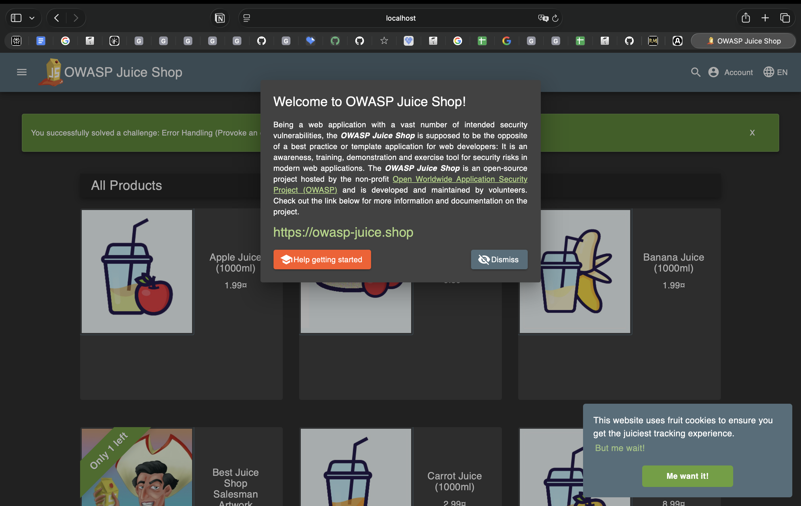

# Lab 1 Submission — OWASP Juice Shop & PR Workflow

## Task 1 — Triage Report: OWASP Juice Shop

### Scope & Asset
- **Asset:** OWASP Juice Shop (local lab instance)
- **Image:** `bkimminich/juice-shop:v19.0.0`
- **Release link/date:** [v19.0.0](https://github.com/juice-shop/juice-shop/releases/tag/v19.0.0) — 2025-09-04
- **Image digest (optional):** `sha256:2765a26de7647609099a338d5b7f61085d95903c8703bb70f03fcc4b12f0818d`

### Environment
- **Host OS:** macOS 26.2 (Darwin 25.2.0)
- **Docker:** 28.3.3

### Deployment Details
- **Run command used:**  
  `docker run -d --name juice-shop -p 127.0.0.1:3000:3000 bkimminich/juice-shop:v19.0.0`
- **Access URL:** http://127.0.0.1:3000
- **Network exposure:** 127.0.0.1 only — [x] Yes — binding to `127.0.0.1:3000` does not expose the app to the local network.

### Health Check
- **Page load:** screenshot of the home page (http://localhost:3000):

  
- **API check:** in v19 the products endpoint is `/api/Products`. Output (first lines):
  ```bash
  $ curl -s http://127.0.0.1:3000/api/Products | head -5
  ```
  ```
  {"status":"success","data":[{"id":1,"name":"Apple Juice (1000ml)","description":"The all-time classic.","price":1.99,"deluxePrice":0.99,"image":"apple_juice.jpg","createdAt":"2026-02-10T20:20:01.147Z","updatedAt":"2026-02-10T20:20:01.147Z","deletedAt":null},{"id":2,"name":"Orange Juice (1000ml)","description":"Made from oranges hand-picked by Uncle Dittmeyer.","price":2.99,...
  ```
  API returns JSON with an array of products — deployment is working.

### Surface Snapshot (Triage)
- **Login/Registration visible:** [x] Yes — home page has login and registration buttons.
- **Product listing/search present:** [x] Yes — product catalog and search are available.
- **Admin or account area discoverable:** [x] Yes — account area is available after login; admin features are present in the app (intentionally vulnerable).
- **Client-side errors in console:** [ ] Yes [x] No — *(check DevTools Console after page load and update if needed.)*
- **Security headers (quick look):** output of `curl -I http://127.0.0.1:3000`:
  ```
  HTTP/1.1 200 OK
  Access-Control-Allow-Origin: *
  X-Content-Type-Options: nosniff
  X-Frame-Options: SAMEORIGIN
  Feature-Policy: payment 'self'
  X-Recruiting: /#/jobs
  Content-Type: text/html; charset=UTF-8
  ...
  ```
  **CSP (Content-Security-Policy):** absent. **HSTS (Strict-Transport-Security):** absent. Present: X-Content-Type-Options, X-Frame-Options, Feature-Policy; header `Access-Control-Allow-Origin: *` allows cross-origin requests.

### Risks Observed (Top 3)
1. **Intentionally vulnerable application (training target)** — many known vulnerabilities (XSS, SQLi, broken auth, sensitive data exposure) for learning; such a stack is unacceptable in production.
2. **Missing strict security headers** — typically no strict Content-Security-Policy or HSTS, increasing risk of XSS and downgrade attacks when deployed without a reverse proxy.
3. **Open REST API without mandatory authentication** — endpoints such as `/api/Products` are accessible without authorization; in a real app, some data should be restricted by role.

---

## Task 2 — PR Template Setup

### 2.1 Creation Process
- File `.github/pull_request_template.md` was added to the repository.
- The template includes sections: **Goal**, **Changes**, **Testing**, **Artifacts & Screenshots**.
- A three-item checklist was added: clear PR title, documentation updated if needed, no secrets or large temporary files.

### 2.2 Verification
- The template must be committed and pushed to the **main** branch first, then create branch `feature/lab1` and open a PR to the course repo.
- When creating a PR, the description will then be auto-filled from `.github/pull_request_template.md`.
- **Evidence:** opening a new Pull Request on GitHub will show the description with all listed sections and the checklist.

### How Templates Improve Collaboration
- A consistent PR description format speeds up review: reviewers immediately see goal, changes, how it was tested, and artifacts.
- The checklist reduces the risk of forgetting to update docs or accidentally committing secrets.
- Templates set an expected quality bar and make the lab submission process predictable.

---

## Challenges & Solutions

- **In v19 the products API at `/rest/products` returns an error.** Solution: in this version the path is `/api/Products`; the report uses the correct endpoint and verification output.
- **Home page screenshot:** done manually — open http://localhost:3000, take a screenshot (Cmd+Shift+4 on macOS), save as `labs/screenshot-juice-shop.png` and add the image reference in the Health Check section.

---

## Task 6 — GitHub Community

### GitHub Community

**Why starring repositories matters:**  
Stars in open source act as both a bookmark for yourself and a signal to the community that the project is noticed and useful. They help maintainers see interest in the project and help other developers gauge popularity and topics. On your profile, stars reflect your interests and familiarity with modern tools.

**How following developers helps in teamwork and growth:**  
Following instructors, TAs, and classmates lets you see their activity, commits, and projects in your feed. That makes it easier to find common ground, learn from others’ code, and stay in touch with people you may collaborate with later. For career growth, it helps to follow people working in stacks or domains you care about.

---

## PR Submission Checklist (for Moodle)

- [x] Task 1 done — OWASP Juice Shop deployment + triage report
- [x] Task 2 done — PR template setup + verification
- [x] Task 6 done — GitHub community engagement
