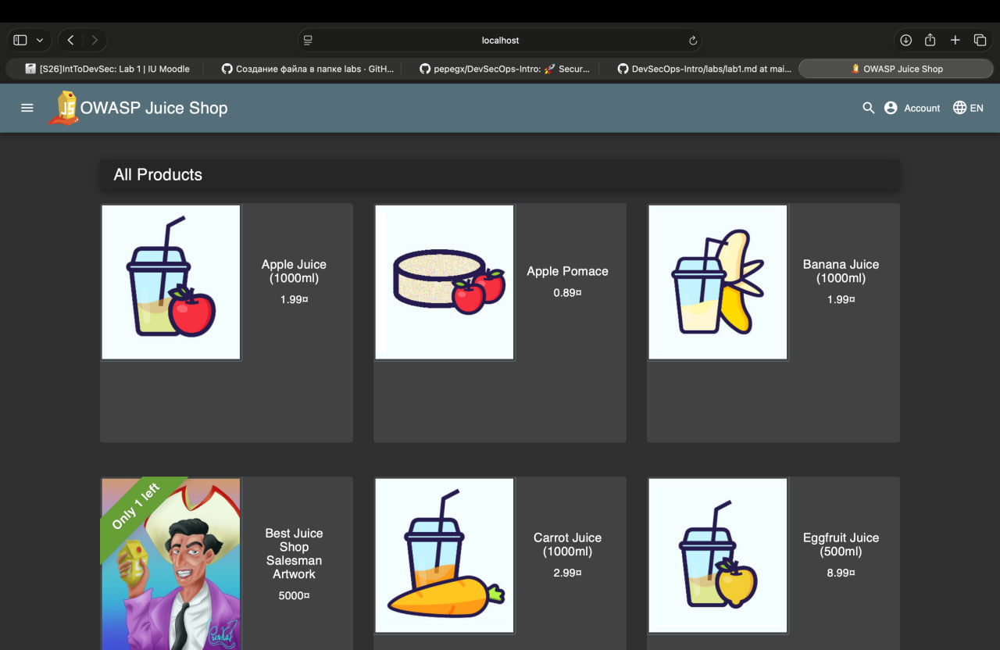
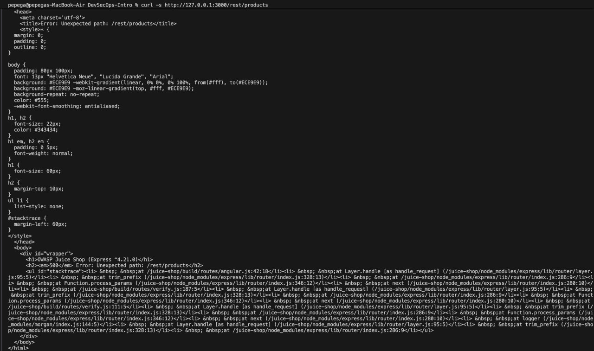

# Triage Report — OWASP Juice Shop

## Scope & Asset
- Asset: OWASP Juice Shop (local lab instance)
- Image: bkimminich/juice-shop:v19.0.0
- Release link/date: https://github.com/juice-shop/juice-shop/releases/tag/v19.0.0
- Image digest (optional): sha256:...

## Environment
- Host OS: macOS
- Docker: (check with `docker --version`)

## Deployment Details
- Run command used: `docker run -d --name juice-shop -p 127.0.0.1:3000:3000 bkimminich/juice-shop:v19.0.0`
- Access URL: http://127.0.0.1:3000
- Network exposure: 127.0.0.1 only [x] Yes  [ ] No

## Health Check
- Page load: 
- API check: 
- 

## Surface Snapshot (Triage)
- Login/Registration visible: [x] Yes  [ ] No — notes: Visible in header
- Product listing/search present: [x] Yes  [ ] No — notes: Products displayed on home page
- Admin or account area discoverable: [x] Yes  [ ] No — notes: Account menu visible
- Client-side errors in console: [ ] Yes  [x] No — notes: No major errors observed
- Security headers (quick look — optional): CSP/HSTS present? Further investigation needed

## Risks Observed (Top 3)
1) **Insecure Direct Object References (IDOR)** — API endpoints may be vulnerable to unauthorized access
2) **Broken Authentication** — Weak password requirements and default credentials could be present
3) **Sensitive Data Exposure** — Application may store and transmit sensitive user information insecurely

## PR Template & Workflow
- PR template created at `.github/pull_request_template.md`
- Template includes sections: Goal, Changes, Testing, Artifacts & Screenshots
- Checklist covers: clear title, docs updated, no secrets in code

## GitHub Community Engagement
- Starred the course repository
- Starred the simple-container-com/api project
- Followed professors and TAs on GitHub
- Followed classmates for collaboration
