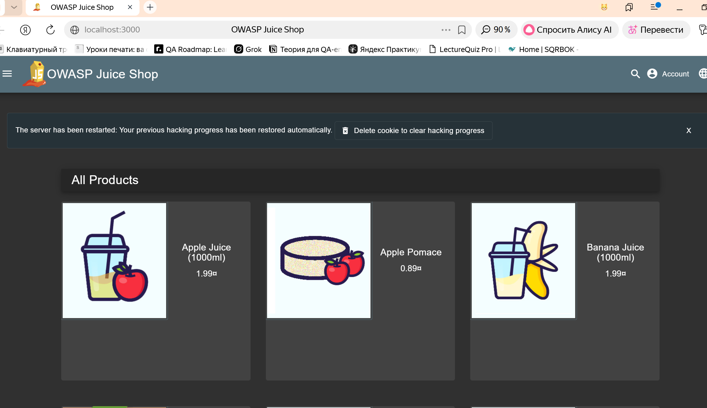

# Triage Report — OWASP Juice Shop

## Scope & Asset
- Asset: OWASP Juice Shop (local lab instance)
- Image: bkimminich/juice-shop:v19.0.0
- Release link/date: https://github.com/juice-shop/juice-shop/releases/tag/v19.0.0 — 2024-06-10
- Image digest (optional): sha256:2765a26de7647609099a338d5b7f61085d95903c8703bb70f03fcc4b12f0818d

## Environment
- Host OS: Windows 11 Домашняя для одного языка
- Docker: 28.3.2

## Deployment Details
- Run command used: `docker run -d --name juice-shop -p 127.0.0.1:3000:3000 bkimminich/juice-shop:v19.0.0`
- Access URL: http://127.0.0.1:3000
- Network exposure: 127.0.0.1 only [х] Yes  [ ] No  (explain if No)

## Health Check
- Page load: attach screenshot of home page 

- API check: first 5–10 lines from `curl -s http://127.0.0.1:3000/rest/products | head`
```
$ curl -s http://127.0.0.1:3000/rest/products | head
<html>
  <head>
    <meta charset='utf-8'>
    <title>Error: Unexpected path: /rest/products</title>
    <style>* {
  margin: 0;
  padding: 0;
  outline: 0;
}
```

## Surface Snapshot (Triage)
- Login/Registration visible: [x] Yes  [ ] No — Login and registration forms are available on the main page
- Product listing/search present: [x] Yes  [ ] No — Product catalog and search bar are available to unauthenticated users.
- Admin or account area discoverable: [ ] Yes  [x] No — Account area discoverable, admin panel is not visible
- Client-side errors in console: [ ] Yes  [x] No — Zero errors in console
- Security headers (quick look — optional): `curl -I http://127.0.0.1:3000` → CSP/HSTS present? - CSP and HSTS headers are missing
```
HTTP/1.1 200 OK
Access-Control-Allow-Origin: *
X-Content-Type-Options: nosniff
X-Frame-Options: SAMEORIGIN
Feature-Policy: payment 'self'
X-Recruiting: /#/jobs
Accept-Ranges: bytes
Cache-Control: public, max-age=0
Last-Modified: Sun, 08 Feb 2026 18:08:02 GMT
ETag: W/"124fa-19c3e70709c"
Content-Type: text/html; charset=UTF-8
Content-Length: 75002
Vary: Accept-Encoding
Date: Sun, 08 Feb 2026 18:33:36 GMT
Connection: keep-alive
Keep-Alive: timeout=5
```

## Risks Observed (Top 3)
1) **SQL Injection** — allows attackers to manipulate database queries and access sensitive data.
2) **Cross-Site Scripting (XSS)** — enables execution of malicious scripts in users’ browsers.
3) **Broken Authentication** — weak authentication mechanisms allow unauthorized access to user accounts.