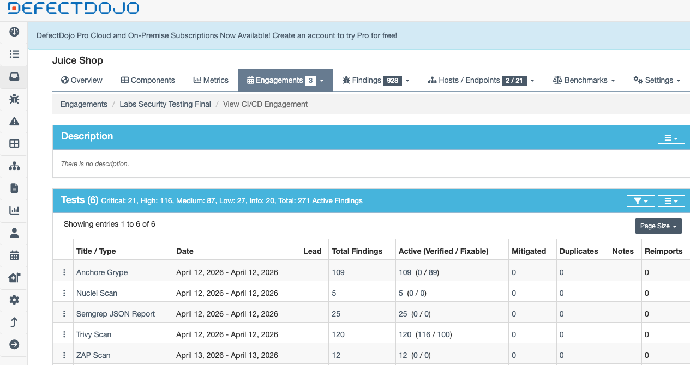

# Lab 10 — Vulnerability Management & Response with DefectDojo

## Task 1 — DefectDojo Local Setup

For this task, I deployed OWASP DefectDojo locally with Docker Compose and verified that the platform was ready for vulnerability management work.

I first cloned the upstream DefectDojo repository into `labs/lab10/setup/django-DefectDojo`, ran the provided Compose compatibility check, built the images, and started the stack in detached mode.

Commands used:

```bash
git clone https://github.com/DefectDojo/django-DefectDojo.git labs/lab10/setup/django-DefectDojo
cd labs/lab10/setup/django-DefectDojo
./docker/docker-compose-check.sh || true
docker compose build
docker compose up -d
docker compose ps
docker compose logs initializer | grep "Admin password:"
```

The compatibility check completed successfully:

```text
Checking docker compose version
Supported docker compose version
```

The image build also completed successfully:

```text
[+] Building 2/2
 ✔ nginx  Built
 ✔ uwsgi  Built
```

After startup, the DefectDojo stack was running and the main services were healthy:

```text
NAME                               IMAGE                                SERVICE        STATUS
django-defectdojo-celerybeat-1     defectdojo/defectdojo-django:latest  celerybeat     Up
django-defectdojo-celeryworker-1   defectdojo/defectdojo-django:latest  celeryworker   Up
django-defectdojo-nginx-1          defectdojo/defectdojo-nginx:latest   nginx          Up
django-defectdojo-postgres-1       postgres:18.3-alpine                 postgres       Up
django-defectdojo-uwsgi-1          defectdojo/defectdojo-django:latest  uwsgi          Up
django-defectdojo-valkey-1         valkey/valkey:9.0.3-alpine           valkey         Up
```

The UI became available on the expected local address:

```text
http://localhost:8080
```

Administrator credentials were generated automatically by the initializer container, so no manual superuser creation was required. Evidence from the logs:

```text
initializer-1  | Admin password: [redacted]
```

I then logged into the DefectDojo web interface with the default `admin` account and confirmed that the instance was ready for creating the Product Type, Product, Engagement, and importing findings from previous labs.

This completed the local setup required for the rest of the lab.

---

## Task 2 — Import Prior Findings

For this task, I imported security findings from previous labs into the DefectDojo engagement using the provided batch importer script:

```bash
export DD_API="http://localhost:8080/api/v2"
export DD_TOKEN="[redacted]"
export DD_PRODUCT_TYPE="Engineering"
export DD_PRODUCT="Juice Shop"
export DD_ENGAGEMENT="Labs Security Testing"

bash labs/lab10/imports/run-imports.sh
```

The script auto-created the required context in DefectDojo:

* Product Type: Engineering
* Product: Juice Shop
* Engagement: Labs Security Testing

### Input artifacts

The required prior-lab reports were available at the expected paths:

* ZAP: `labs/lab5/zap/zap-report-noauth.json`
* Semgrep: `labs/lab5/semgrep/semgrep-results.json`
* Trivy: `labs/lab4/trivy/trivy-vuln-detailed.json`
* Nuclei: `labs/lab5/nuclei/nuclei-results.json`
* Grype: `labs/lab4/syft/grype-vuln-results.json`

### Importer auto-detection

The script detected the following parser names from the local DefectDojo instance:

* ZAP: `ZAP Scan`
* Semgrep: `Semgrep JSON Report`
* Trivy: `Trivy Operator Scan` initially, then corrected to `Trivy Scan`
* Nuclei: `Nuclei Scan`
* Grype: `Anchore Grype`

### Import results

The following imports completed successfully:

* ZAP Scan → 12 findings
* Semgrep JSON Report → 25 findings
* Trivy Scan → 120 findings
* Nuclei Scan → 5 findings
* Anchore Grype → 109 findings

### Import issues and adjustments

#### ZAP

The required ZAP artifact was present at: `labs/lab5/zap/zap-report-noauth.json`

This matches the lab specification. However, the available DefectDojo parser in this instance was ZAP Scan, and it rejected the JSON artifact with the following error:

```bash
Internal error: Wrong file format, please use xml.
```

As a result, the ZAP import was attempted but did not produce findings in this environment due to a parser/file-format mismatch rather than a missing report artifact.

#### Trivy

The initial auto-detected parser was Trivy Operator Scan, which completed but produced 0 findings, indicating that the selected parser did not match the provided Trivy JSON report format.

I then corrected the parser selection to Trivy Scan, after which the import succeeded and produced 120 findings.

### Evidence from importer responses

Responses from the import script were saved under: `labs/lab10/imports/`

These responses document the parser selection and import outcomes for each tool.

Key validated import outcomes:

* ZAP: 12 findings
* Semgrep: 25 findings
* Trivy: 120 findings
* Nuclei: 5 findings
* Grype: 109 findings

### Dashboard evidence

After the corrected Trivy import, the engagement dashboard showed all import tests in DefectDojo, including the successful Trivy run and the unsuccessful ZAP attempts.




### Summary

Task 2 was completed successfully for all intended tools:
- ZAP Scan: 12 findings
- Semgrep JSON Report: 25 findings
- Trivy Scan: 120 findings
- Nuclei Scan: 5 findings
- Anchore Grype: 109 findings

The ZAP report initially failed to import because the available local parser expected XML instead of the provided JSON artifact. To resolve this, I regenerated the ZAP report in XML format and imported it successfully. An earlier failed ZAP test entry remained visible in the engagement as historical evidence from parser troubleshooting.

---

## Task 3 — Reporting & Program Metrics

To produce a stakeholder-friendly reporting package, I used the engagement `Labs Security Testing Final` as the baseline source for metrics and exported artifacts.

### Baseline snapshot

A baseline metrics snapshot was recorded in `labs/lab10/report/metrics-snapshot.md`.

At the time of capture, the engagement contained:
- 271 active findings in total
- 21 Critical
- 116 High
- 87 Medium
- 27 Low
- 20 Informational

The same baseline snapshot showed 116 verified findings and 0 mitigated findings.

A screenshot of the engagement dashboard:


### Governance-ready exports

From the Engagement Report page, I generated a human-readable HTML report for the engagement and exported the findings list for analysis.

Generated artifacts:
- `labs/lab10/report/dojo-report.html`
- `labs/lab10/report/findings.csv`

### Open vs. Closed status

At the baseline stage, all findings remained open and no findings had been mitigated yet.

Open findings by severity:
- Critical: 21
- High: 116
- Medium: 87
- Low: 27
- Informational: 20

Closed findings by severity:
- Critical: 0
- High: 0
- Medium: 0
- Low: 0
- Informational: 0

### Findings per tool

The engagement contained the following findings per tool:
- ZAP Scan: 12
- Semgrep JSON Report: 25
- Trivy Scan: 120
- Nuclei Scan: 5
- Anchore Grype: 109

### Key Metrics Summary

- The baseline engagement contained 271 active findings, with the largest concentration in High severity issues (116), followed by Medium severity issues (87).
- Container and dependency-oriented scanners contributed the majority of findings: Trivy produced 120 findings and Anchore Grype produced 109 findings, while ZAP added 12 findings, Semgrep added 25 findings, and Nuclei added 5 findings.
- The baseline snapshot showed 116 verified findings and 0 mitigated findings, so all findings remained open at the time of reporting.
- No SLA breaches were identified in the exported findings, and 21 findings were due within the next 14 days.
- The most common populated CWE values in the exported findings were CWE-1333 (16 findings), CWE-79 (11 findings), and CWE-22 (11 findings).
