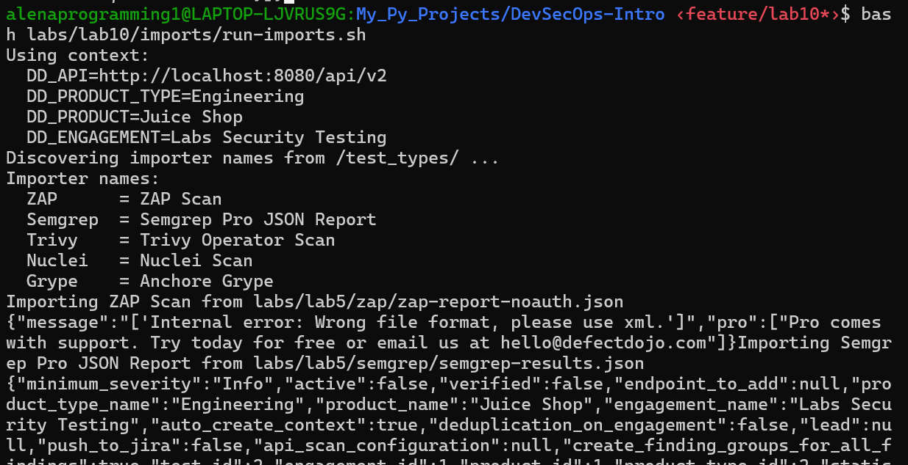
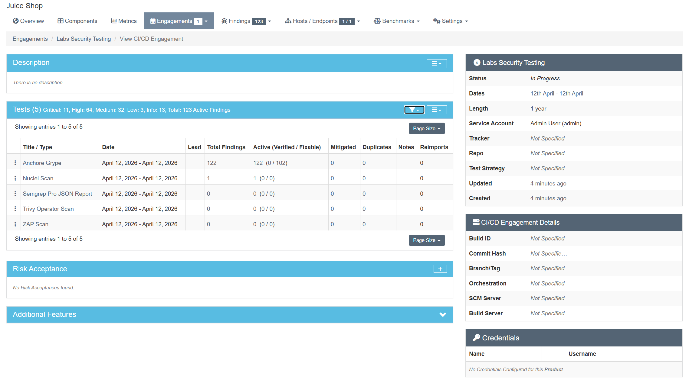
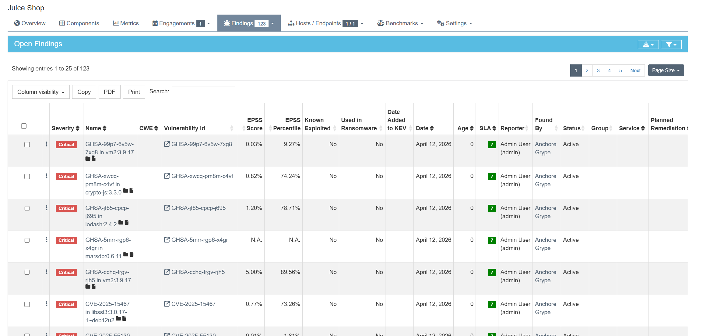

# Lab 10 - Vulnerability Management & Response with DefectDojo

## Task 1 - DefectDojo Local Setup
- DefectDojo was started locally via the lab setup instructions.
- Logged in as admin and verified the product context:
  - **Product Type:** Engineering
  - **Product:** Juice Shop
  - **Engagement:** Labs Security Testing (CI/CD engagement)
- Verified the engagement dashboard loads and shows the imported tests.

## Task 2 - Import Prior Findings
- Imports executed via `labs/lab10/imports/run-imports.sh`.
- Tests present in the engagement (5 total):
  - Anchore Grype
  - Nuclei Scan
  - Semgrep Pro JSON Report
  - Trivy Operator Scan
  - ZAP Scan

## Task 3 - Reporting & Program Metrics

### 3.1 Metrics Snapshot (from engagement dashboard / findings CSV)
**Date captured:** 2026-04-12

**Active findings by severity (all active):**
- Critical: **11**
- High: **64**
- Medium: **32**
- Low: **3**
- Informational: **13**
- **Total active:** 123

**Open vs. Closed by severity:**
- Open (Active): Critical 11, High 64, Medium 32, Low 3, Info 13
- Closed: **0 across all severities**

### 3.2 Findings per tool
- Anchore Grype: **122**
- Nuclei Scan: **1**
- Semgrep Pro JSON Report: **0**
- Trivy Operator Scan: **0**
- ZAP Scan: **0**

### 3.3 SLA / Due-Soon Items
- **SLA breaches:** 0
- **Due within next 14 days:** 11 findings (based on `sla_days_remaining <= 14` in CSV)

### 3.4 Recurring CWE / OWASP Categories
- CWE data is mostly absent in the export; only **CWE-200** appears once.
- OWASP category tags are not present in the CSV/export, so a top-OWASP breakdown is not available from this dataset.

### 3.5 Key Observations
- The engagement is dominated by **SCA vulnerabilities** from Anchore Grype (122/123 findings), indicating dependency hygiene is the primary risk driver right now.
- **All findings remain Active**, with **no mitigations recorded yet**, which indicates remediation work has not started or has not been tracked in Dojo.
- **Critical + High findings account for 75/123 (61%)** of the total, suggesting prioritization should focus on highest-severity dependency issues first.
- **No SLA breaches**, but **11 findings are due within the next 14 days**, so early triage is required to avoid upcoming SLA violations.
- **DAST/SAST tools (ZAP, Semgrep, Trivy) imported with zero findings**, which either reflects clean scans for this dataset or limited scanner coverage for the current target.
