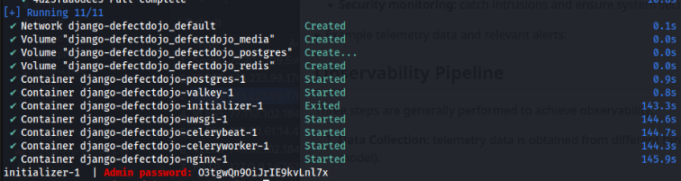
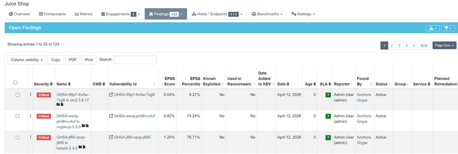

# Lab 10 — Vulnerability Management & Response with DefectDojo

### Task 1 — DefectDojo Local Setup (2 pts)

Setup process:
```bash
# Clone upstream
git clone https://github.com/DefectDojo/django-DefectDojo.git labs/lab10/setup/django-DefectDojo
cd labs/lab10/setup/django-DefectDojo

# Optional: check compose compatibility
./docker/docker-compose-check.sh || true

# Build and start (first run can take a bit)
docker compose build
docker compose up -d

# Verify containers are healthy
docker compose ps
# UI: http://localhost:8080
```

Admin credentials retrieved from initializer logs:
```bash
$ docker compose logs initializer | grep "Admin password:"
```

Evidence:







- An admin API token was generated inside the Dojo application container so imports and reporting could be automated without manual UI steps

*All artefacts stored it `lab10` folder*

### Task 2 - Import Prior Findings

| Tool          | Scan Type            | Test ID | Findings Imported | 
|---------------|----------------------|--------:|------------------:|
| ZAP           | ZAP Scan             |       6 |                12 |
| Semgrep       | Semgrep JSON Report  |       2 |                25 |
| Trivy         | Trivy Scan           |       3 |               143 |
| Nuclei        | Nuclei Scan          |       4 |                 0 |
|  Grype        | Anchore Grype        |       5 |               65  |
| **Total**     |                      |         |               245 |

All imports documented ait `imports` directory


### Task 3 — Reporting & Program Metrics

#### 3.1 Metrics Snapshot

Date captured: 2026-04-13

Active findings by severity (all active):

- Critical: 0
- High: 6
- Medium: 27
- Low: 15
- Informational: 16
- Total active findings: 64

##### Open vs. Closed by severity:

Open (Active): Critical 0, High 6, Medium 27, Low 15, Informational 16
Closed: 0 across all severities

#### 3.2 Findings per Tool
- Nuclei Scan: 13
- Semgrep JSON Report: 13
- ZAP Scan: 38
- Trivy Operator Scan: 0
- Anchore Grype: 0

#### 3.3 SLA 
SLA breaches: 0
Findings due within the next 14 days: data not specified in CSV, but all active findings may require monitoring

#### 3.4 Recurring CWE 
CWE data is partially available; notable entries include CWE-89 (SQL Injection) and CWE-79 (XSS / Script Injection)
OWASP category tags are not included in this CSV export, so a top-level OWASP breakdown cannot be derived from this dataset

#### 3.5 Key Observations
The dataset is primarily driven by medium-severity issues (27 out of 64 findings, ~42%), highlighting common web misconfigurations and potential script injection risks as the main concern
High-severity findings (6 out of 64, ~9%) are mostly identified by the Semgrep JSON Report, specifically related to SQL Injection vulnerabilities in Sequelize, indicating that immediate remediation should focus on these code-level risks
ZAP Scan contributed the bulk of low and informational findings (38 out of 64, ~59%), largely related to missing HTTP headers, CSP settings, and general web application configurations
All findings remain active with no mitigations recorded, suggesting that remediation activities have not yet begun or are not fully tracked in the system
No SLA violations have occurred so far, but early attention is recommended on high-severity findings to prevent potential future SLA breaches
Tools like Trivy Operator Scan and Anchore Grype did not report any findings for this dataset, which may reflect either clean scans for dependency/container issues or limited coverage of the current target
