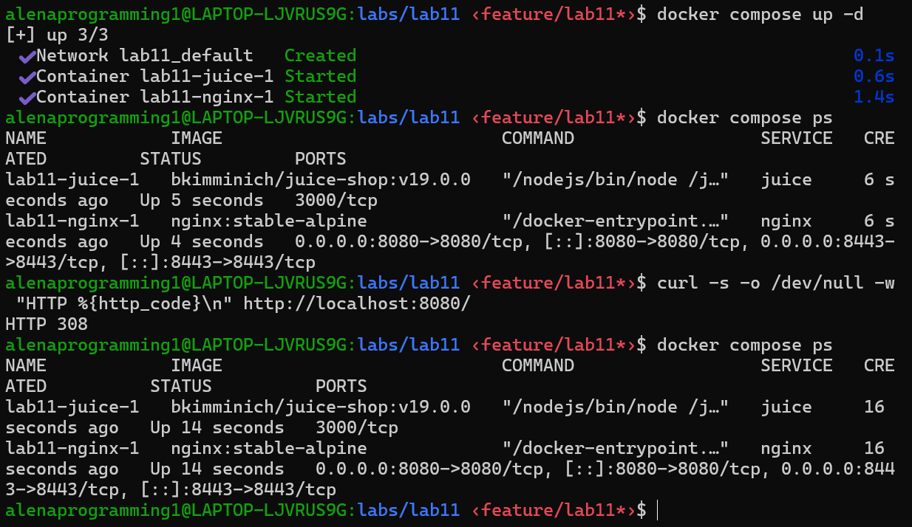
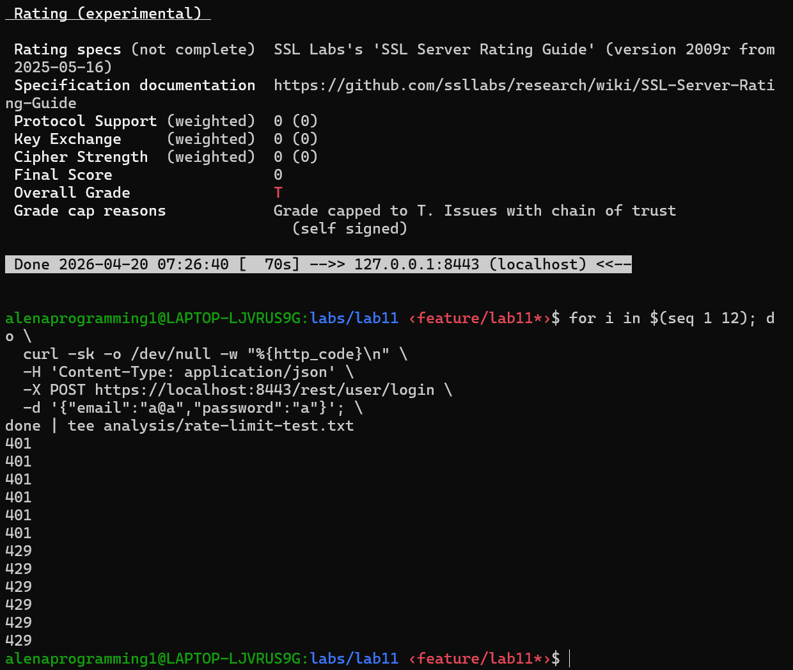

# Lab 11 - Reverse Proxy Hardening: Nginx Security Headers, TLS, and Rate Limiting

## Task 1 - Reverse Proxy Compose Setup

### 1.1 Stack status and redirect behavior
`docker compose ps`:

```text
NAME            IMAGE                           COMMAND                  SERVICE   CREATED         STATUS         PORTS
lab11-juice-1   bkimminich/juice-shop:v19.0.0   "/nodejs/bin/node /j…"   juice     6 minutes ago   Up 6 minutes   3000/tcp
lab11-nginx-1   nginx:stable-alpine             "/docker-entrypoint.…"   nginx     6 minutes ago   Up 6 minutes   0.0.0.0:8080->8080/tcp, [::]:8080->8080/tcp, 0.0.0.0:8443->8443/tcp, [::]:8443->8443/tcp
```

HTTP redirect check result: `HTTP 308` (from `http://localhost:8080/` to HTTPS).



### 1.2 Why reverse proxies improve security
- TLS termination at proxy: centralized certificate/TLS policy management.
- Security headers injection: enforce browser-side protections even if app does not set them.
- Request filtering/throttling: rate limits and connection controls before traffic reaches the app.
- Single entry point: one hardened edge instead of exposing app internals directly.

### 1.3 Why hiding direct app ports reduces attack surface
- The Juice Shop container is not published on host ports (`3000/tcp` internal only), so direct external probing of app port 3000 is blocked.
- Attackers must go through Nginx controls (TLS policy, headers, rate limiting, timeouts, logging).
- Fewer externally reachable services means fewer reachable misconfigurations and exploit paths.

## Task 2 - Security Headers Verification

### 2.1 Relevant headers from HTTPS response (`analysis/headers-https.txt`)

```text
strict-transport-security: max-age=31536000; includeSubDomains; preload
x-frame-options: DENY
x-content-type-options: nosniff
referrer-policy: strict-origin-when-cross-origin
permissions-policy: camera=(), geolocation=(), microphone=()
cross-origin-opener-policy: same-origin
cross-origin-resource-policy: same-origin
content-security-policy-report-only: default-src 'self'; img-src 'self' data:; script-src 'self' 'unsafe-inline' 'unsafe-eval'; style-src 'self' 'unsafe-inline'
```

### 2.2 Header-by-header protection summary
- **X-Frame-Options (DENY):** blocks clickjacking by preventing framing.
- **X-Content-Type-Options (nosniff):** prevents MIME-type sniffing and some content-type confusion attacks.
- **Strict-Transport-Security (HSTS):** forces future HTTPS use and helps prevent SSL stripping/downgrade attempts.
- **Referrer-Policy (strict-origin-when-cross-origin):** reduces sensitive URL leakage in `Referer`.
- **Permissions-Policy:** disables high-risk browser features (camera/geolocation/microphone) for this origin.
- **COOP/CORP:** strengthens process/origin isolation and reduces cross-origin data leakage vectors.
- **CSP-Report-Only:** monitors CSP violations without breaking current app behavior; useful for staged hardening.

## Task 3 - TLS, HSTS, Rate Limiting, and Timeouts

### 3.1 TLS/testssl summary (`analysis/testssl.txt`)
- Protocols:
  - Disabled: SSLv2, SSLv3, TLS 1.0, TLS 1.1
  - Enabled: **TLS 1.2 and TLS 1.3**
- Supported cipher suites observed:
  - TLS 1.2: `ECDHE-RSA-AES256-GCM-SHA384`, `ECDHE-RSA-AES128-GCM-SHA256`
  - TLS 1.3: `TLS_AES_256_GCM_SHA384`, `TLS_CHACHA20_POLY1305_SHA256`, `TLS_AES_128_GCM_SHA256`
- Why TLS 1.2+ is required:
  - TLS 1.0/1.1 are obsolete and weaker against modern attacks/compliance baselines.
  - TLS 1.3 reduces handshake complexity and improves security/performance.
- Warnings/findings:
  - Grade `T` due to self-signed cert chain (`Chain of trust NOT ok`) - expected for localhost lab.
  - `OCSP stapling not offered`, no CRL/OCSP URI, no CAA/CT - also expected for self-signed local cert setup.
  - No major classic TLS vulnerabilities detected (Heartbleed/POODLE/FREAK/etc. all reported not vulnerable).

### 3.2 HSTS only on HTTPS (verified)
- HTTP headers file (`analysis/headers-http.txt`) contains **no** `Strict-Transport-Security`.
- HTTPS headers file (`analysis/headers-https.txt`) contains:
  - `strict-transport-security: max-age=31536000; includeSubDomains; preload`
- Conclusion: HSTS is correctly scoped to HTTPS responses only.

### 3.3 Rate limiting results (`analysis/rate-limit-test.txt`)
Raw output:

```text
401
401
401
401
401
401
429
429
429
429
429
429
```



Counts:
- `200`: **0**
- `401`: **6** (invalid credentials reached upstream auth logic)
- `429`: **6** (requests rejected by Nginx limit)

Interpretation:
- Rate limiting is active and blocks excessive login attempts with `429`.

### 3.4 Rate-limit configuration explanation
From `reverse-proxy/nginx.conf`:
- Zone: `limit_req_zone $binary_remote_addr zone=login:10m rate=10r/m;`
- Endpoint rule: `limit_req zone=login burst=5 nodelay;`
- Status code: `limit_req_status 429;`

Security/usability trade-off:
- `rate=10r/m` slows brute-force attacks per source IP.
- `burst=5` allows short legitimate spikes (e.g., fast retries/UI behavior) before blocking.
- `nodelay` enforces immediate rejection when over limit, reducing queue buildup under abuse.

### 3.5 Timeout settings and trade-offs
From `reverse-proxy/nginx.conf`:
- `client_body_timeout 10s`
- `client_header_timeout 10s`
- `proxy_read_timeout 30s`
- `proxy_send_timeout 30s`

Why this matters:
- Short client header/body timeouts help mitigate slowloris-style resource exhaustion.
- Proxy read/send timeouts prevent hanging upstream connections.
- Trade-off: values too strict can impact slow clients/networks; values too loose increase resource exposure.

### 3.6 Access log evidence for 429 responses (`logs/access.log`)

```text
172.18.0.1 - - [20/Apr/2026:07:26:54 +0000] "POST /rest/user/login HTTP/2.0" 429 162 "-" "curl/7.81.0" rt=0.000 uct=- urt=-
172.18.0.1 - - [20/Apr/2026:07:26:54 +0000] "POST /rest/user/login HTTP/2.0" 429 162 "-" "curl/7.81.0" rt=0.000 uct=- urt=-
```
