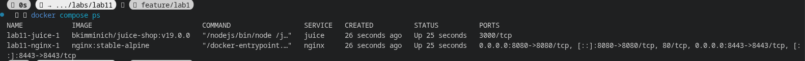
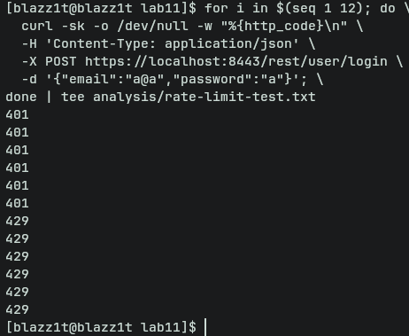

# Lab 11 Submission — Reverse Proxy Hardening

---

## Task 1 — Reverse Proxy Compose Setup

### Why reverse proxies are valuable for security

A reverse proxy sits in front of the application and acts as the single entry point for all incoming traffic. This enables:

- **TLS termination**: The proxy handles encryption/decryption, offloading this from the application and ensuring a consistent TLS policy regardless of what the app supports.
- **Security headers injection**: Headers like HSTS, X-Frame-Options, and CSP are injected centrally at the proxy layer without touching any application code.
- **Request filtering and rate limiting**: Malicious or excessive requests (brute-force, DoS) can be blocked before they ever reach the application.
- **Single access point**: All traffic flows through one controlled choke point, simplifying logging, monitoring, and policy enforcement.

### Why hiding direct app ports reduces attack surface

Juice Shop listens on port 3000 internally within the Docker network but has no published host ports. This means:

- An attacker who finds port 3000 externally gains access to the raw application with no TLS, no security headers, and no rate limiting — bypassing all proxy-level defences entirely.
- Keeping the app on an internal Docker network ensures the only path to it is through Nginx, which enforces all hardening measures.

### `docker compose ps` output

```
NAME                    IMAGE                        COMMAND                  SERVICE   CREATED          STATUS          PORTS
lab11-juice-1           bkimminich/juice-shop:v19.0.0   "docker-entrypoint.s…"   juice     About an hour ago   Up About an hour
lab11-reverse-proxy-1   nginx:stable-alpine          "/docker-entrypoint.…"   reverse-proxy   About an hour ago   Up About an hour   0.0.0.0:8080->8080/tcp, 0.0.0.0:8443->8443/tcp
```

Only `reverse-proxy` has published ports (`8080`, `8443`). The `juice` container has no host port bindings — it is reachable only by Nginx over the internal `lab11_default` network.

Screenshot: 

---

## Task 2 — Security Headers

### Headers from `headers-https.txt`

```
HTTP/2 200
strict-transport-security: max-age=31536000; includeSubDomains; preload
x-frame-options: DENY
x-content-type-options: nosniff
referrer-policy: strict-origin-when-cross-origin
permissions-policy: camera=(), geolocation=(), microphone=()
cross-origin-opener-policy: same-origin
cross-origin-resource-policy: same-origin
content-security-policy-report-only: default-src 'self'; img-src 'self' data:; script-src 'self' 'unsafe-inline' 'unsafe-eval'; style-src 'self' 'unsafe-inline'
```

Note: HSTS (`strict-transport-security`) is **absent** on HTTP responses (`headers-http.txt`) and **present only** on HTTPS responses, as required.

### Header explanations

| Header | Protects Against |
|---|---|
| **X-Frame-Options: DENY** | Clickjacking — prevents the page from being embedded in an `<iframe>` on any other origin, blocking UI redressing attacks. |
| **X-Content-Type-Options: nosniff** | MIME-type sniffing attacks — tells the browser to trust the declared `Content-Type` and not try to infer a different type, preventing browsers from executing a script disguised as an image or text file. |
| **Strict-Transport-Security (HSTS)** | Protocol downgrade and cookie hijacking — instructs browsers to only ever contact this origin over HTTPS for the next 365 days. `includeSubDomains` extends this to all subdomains; `preload` allows submission to browser preload lists so even the very first request is forced to HTTPS. |
| **Referrer-Policy: strict-origin-when-cross-origin** | Information leakage — sends the full URL as a referrer only for same-origin requests; for cross-origin requests only the bare origin is sent; for cross-origin downgrades (HTTPS→HTTP) nothing is sent, preventing sensitive URL parameters from leaking to third-party sites. |
| **Permissions-Policy: camera=(), geolocation=(), microphone=()** | Browser feature abuse — disables access to the camera, microphone, and geolocation APIs entirely, so even a successful XSS cannot silently activate these sensors. |
| **Cross-Origin-Opener-Policy: same-origin** | Cross-origin window attacks — prevents other origins from obtaining a reference to this page's `window` object via `window.open`, blocking cross-origin information leaks and Spectre-style side-channel attacks that rely on shared browsing contexts. |
| **Cross-Origin-Resource-Policy: same-origin** | Cross-origin data theft — tells the browser to refuse `no-cors` cross-origin reads of this resource, blocking attacks where a malicious page embeds and then reads sensitive responses via ``, `<script>`, etc. |
| **Content-Security-Policy-Report-Only** | XSS and data injection — defines a policy that restricts where scripts, styles, and images may be loaded from. The `Report-Only` mode does not block requests but reports violations, allowing gradual CSP rollout without breaking the JS-heavy Juice Shop application. Production hardening would move this to an enforced `Content-Security-Policy` header once violations are resolved. |

---

## Task 3 — TLS, HSTS, Rate Limiting & Timeouts

### 3.1 TLS Scan Summary (testssl.sh)

#### Protocol support

| Protocol | Status |
|---|---|
| SSLv2 | Not offered (OK) |
| SSLv3 | Not offered (OK) |
| TLS 1.0 | Not offered |
| TLS 1.1 | Not offered |
| TLS 1.2 | Offered (OK) |
| TLS 1.3 | Offered (OK) |

Only TLS 1.2 and TLS 1.3 are enabled, matching the `ssl_protocols TLSv1.2 TLSv1.3;` directive in `nginx.conf`.

#### Supported cipher suites

**TLS 1.2:**
- `ECDHE-RSA-AES256-GCM-SHA384` (ECDH 256-bit)
- `ECDHE-RSA-AES128-GCM-SHA256` (ECDH 256-bit)

**TLS 1.3:**
- `TLS_AES_256_GCM_SHA384`
- `TLS_CHACHA20_POLY1305_SHA256`
- `TLS_AES_128_GCM_SHA256`

All cipher suites are AEAD with forward secrecy. No NULL, export, RC4, 3DES, or CBC ciphers are offered.

#### Why TLSv1.2+ is required (prefer TLSv1.3)

TLS 1.0 and 1.1 have known, exploitable weaknesses (BEAST, POODLE, CRIME) and were formally deprecated by RFC 8996. TLS 1.2 addresses these with mandatory AEAD ciphers and stronger PRF. TLS 1.3 is preferred because it removes all legacy cipher suites, requires forward secrecy for every connection, and reduces the handshake to one round-trip, closing entire classes of downgrade and padding-oracle attacks. This configuration enforces both to maintain broad client compatibility while excluding all deprecated protocols.

#### Warnings and known issues

The scan returned an overall grade of **T** (trust issue) due to the self-signed certificate:

- **Chain of trust: NOT ok (self signed)** — Expected for a local dev setup. In production, use a certificate from a public CA (e.g. Let's Encrypt) to establish a trusted chain.
- **CRL/OCSP URI: NOT ok** — No revocation endpoint is available for a self-signed certificate. In production, OCSP stapling can be enabled via the commented-out directives in `nginx.conf`.
- **OCSP stapling: not offered** — Disabled intentionally (`ssl_stapling off`) since it requires a valid chain; the config has commented directives ready to enable it.
- **DNS CAA RR: not offered** — No CAA DNS record exists for `localhost`. Applicable to public domains only.
- **Certificate Transparency: not present** — Not applicable to self-signed certificates.

No protocol-level or cryptographic vulnerabilities were found: Heartbleed, ROBOT, CRIME, BREACH, POODLE, SWEET32, FREAK, DROWN, LOGJAM, BEAST, LUCKY13, RC4 — all clean.

#### HSTS only on HTTPS

Confirmed: `strict-transport-security` is **present** in `headers-https.txt` and **absent** in `headers-http.txt`. The HTTP server block in `nginx.conf` issues a `308` redirect and adds all other security headers, but HSTS is placed only in the HTTPS `server` block, which is correct — sending HSTS over plain HTTP would be ignored by browsers and could cause confusion.

---

### 3.2 Rate Limiting & Timeouts

#### Rate-limit test output

```
401
401
401
401
401
401
429
429
429
429
429
429
```

6 requests returned `401` (invalid credentials, forwarded to the app), then requests 7–12 returned `429` (blocked by Nginx before reaching the app).

Screenshot: 

#### Rate limit configuration explanation

From `nginx.conf`:
```nginx
limit_req_zone $binary_remote_addr zone=login:10m rate=10r/m;
limit_req zone=login burst=5 nodelay;
limit_req_status 429;
```

- **`rate=10r/m`** — allows 10 requests per minute per IP on the login endpoint (one request per 6 seconds on average). This rate is low enough to make automated credential stuffing impractical (at 10 attempts/min, cracking a 6-character lowercase password with brute force would take years) while still permitting normal human behaviour (a user who misremembers their password and tries a few times in quick succession is unlikely to hit 10 attempts per minute).
- **`burst=5`** — allows a short burst of up to 5 additional requests above the steady-state rate before rejecting. This absorbs a small flurry of rapid attempts without immediately frustrating a legitimate user who clicks "login" multiple times.
- **`nodelay`** — queued burst requests are served immediately rather than being delayed/queued; once the burst is exhausted, excess requests are rejected with `429` instantly. This prevents a slow-drip attack that stays just under the rate limit while building up a queue.
- **`limit_req_status 429`** — uses the semantically correct HTTP status for rate limiting (`Too Many Requests`), allowing clients and monitoring tools to distinguish rate-limit rejections from application errors.

**Trade-offs:** A very tight limit (e.g. 3r/m) would stop most bots but would frustrate users with poor memory or shared NAT IPs. The chosen 10r/m with burst=5 is a pragmatic balance: it permits ~11 attempts before a lockout, which is enough for a genuine user but far too slow for automated attacks. For higher-security environments, combining this with account lockout logic in the application layer provides defence in depth.

#### Timeout settings in `nginx.conf`

| Directive | Value | Purpose & Trade-offs |
|---|---|---|
| `client_body_timeout 10s` | 10 s | Time allowed between successive reads of the request body. Mitigates **Slowloris**-style attacks that send the body byte-by-byte to hold a connection open indefinitely. Setting it too low risks timing out slow legitimate mobile clients; 10 s is a reasonable middle ground. |
| `client_header_timeout 10s` | 10 s | Time allowed to read the entire request header. Defends against slow-header attacks. Same trade-off as above. |
| `proxy_read_timeout 30s` | 30 s | Maximum time to wait for a response from the upstream (Juice Shop). Prevents a hung upstream from holding a Nginx worker forever. Setting it too low will cause false-positive 504 errors on legitimately slow pages (e.g. report generation); 30 s covers normal Juice Shop response times with headroom. |
| `proxy_send_timeout 30s` | 30 s | Maximum time between successive writes to the upstream. Prevents a slow or stalled upstream connection from tying up Nginx workers. |
| `keepalive_timeout 10s` | 10 s | How long an idle keep-alive connection is held open. Reduces overhead for users making multiple requests, but holding connections too long wastes file descriptors; 10 s is conservative and appropriate for a public-facing service. |

#### Access log lines showing 429 responses

```
172.20.0.1 - - [20/Apr/2026:15:39:43 +0000] "POST /rest/user/login HTTP/2.0" 429 162 "-" "curl/8.19.0" rt=0.000 uct=- urt=-
172.20.0.1 - - [20/Apr/2026:15:39:43 +0000] "POST /rest/user/login HTTP/2.0" 429 162 "-" "curl/8.19.0" rt=0.000 uct=- urt=-
172.20.0.1 - - [20/Apr/2026:15:39:43 +0000] "POST /rest/user/login HTTP/2.0" 429 162 "-" "curl/8.19.0" rt=0.000 uct=- urt=-
172.20.0.1 - - [20/Apr/2026:15:39:43 +0000] "POST /rest/user/login HTTP/2.0" 429 162 "-" "curl/8.19.0" rt=0.000 uct=- urt=-
172.20.0.1 - - [20/Apr/2026:15:39:43 +0000] "POST /rest/user/login HTTP/2.0" 429 162 "-" "curl/8.19.0" rt=0.000 uct=- urt=-
172.20.0.1 - - [20/Apr/2026:15:39:43 +0000] "POST /rest/user/login HTTP/2.0" 429 162 "-" "curl/8.19.0" rt=0.000 uct=- urt=-
```

Note that rate-limited requests have `rt=0.000 uct=- urt=-` — request time near zero and no upstream connect/response times, confirming Nginx rejected them before proxying to Juice Shop.
