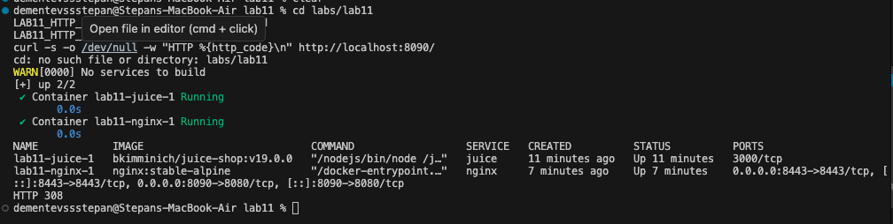
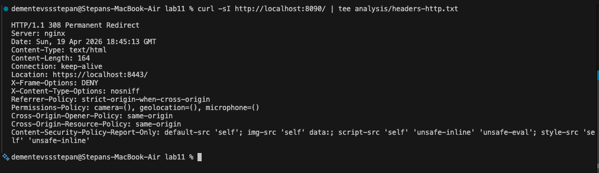
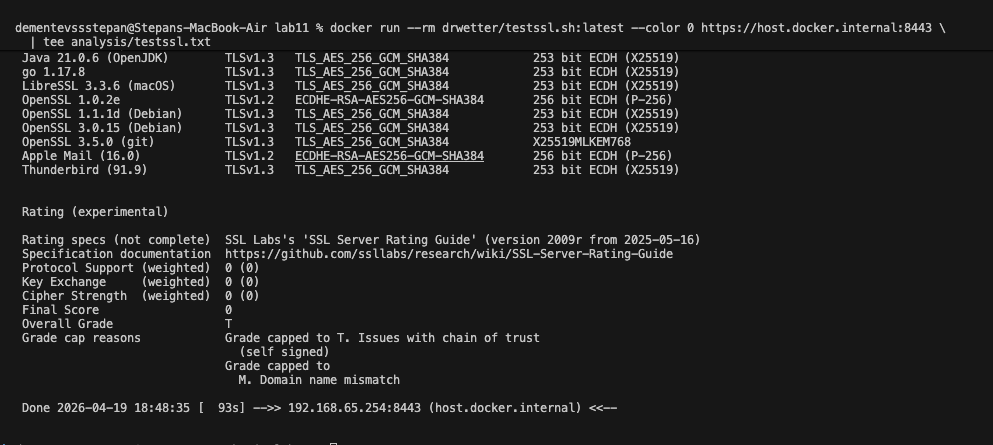

# Lab 11 — Submission: Reverse Proxy Hardening with Nginx

## Environment Note


## Task 1 — Reverse Proxy Compose Setup

### 1.1 Start the stack and verify redirect behavior

```bash
cd labs/lab11
LAB11_HTTP_PORT=8090 docker compose up -d
LAB11_HTTP_PORT=8090 docker compose ps
curl -s -o /dev/null -w "HTTP %{http_code}\n" http://localhost:8090/
```

Redirect check result:


### 1.2 Why the reverse proxy improves security

Reverse proxies are valuable because they centralize security controls in front of the application. In this lab, Nginx terminates TLS, injects consistent browser security headers, enforces request filtering and rate limiting, and provides a single place for access/error logging. That means the Juice Shop container can stay unchanged while the edge behavior becomes significantly harder to abuse.

Keeping the application container off the host network reduces attack surface because clients cannot reach Juice Shop directly on port `3000`. Attackers must go through Nginx first, so they cannot bypass TLS, security headers, request limits, or timeout controls. The Compose output shows that only Nginx publishes host ports, while Juice Shop is exposed only internally as `3000/tcp` on the Docker network.

---

## Task 2 — Security Headers

### 2.1 HTTP response headers

```bash
curl -sI http://localhost:8090/ | tee analysis/headers-http.txt
```


### 2.2 HTTPS response headers

```bash
curl -skI https://localhost:8443/ | tee analysis/headers-https.txt
```


### 2.3 Header-by-header analysis

| Header | Configured Value | Protection Provided |
| --- | --- | --- |
| `X-Frame-Options` | `DENY` | Prevents clickjacking by blocking the site from being embedded in frames or iframes. |
| `X-Content-Type-Options` | `nosniff` | Prevents MIME sniffing, so browsers do not reinterpret files as executable scripts or other unsafe content types. |
| `Strict-Transport-Security` | `max-age=31536000; includeSubDomains; preload` | Forces browsers to use HTTPS for future requests, reducing SSL stripping and accidental downgrade-to-HTTP behavior. |
| `Referrer-Policy` | `strict-origin-when-cross-origin` | Reduces leakage of full URLs and sensitive path/query data to external origins while still keeping same-origin referrers useful. |
| `Permissions-Policy` | `camera=(), geolocation=(), microphone=()` | Disables high-risk browser capabilities that Juice Shop does not need, shrinking the browser-exposed attack surface. |
| `Cross-Origin-Opener-Policy` and `Cross-Origin-Resource-Policy` | `same-origin` | Improve origin isolation and make cross-origin data sharing harder, reducing XS-Leaks and cross-origin interaction risks. |
| `Content-Security-Policy-Report-Only` | `default-src 'self'; ...` | Defines an intended script/style/resource policy without enforcing it yet, so violations can be observed without breaking this JavaScript-heavy app. |

---

## Task 3 — TLS, HSTS, Rate Limiting, and Timeouts

### 3.1 TLS and HSTS verification

```bash
docker run --rm drwetter/testssl.sh:latest --color 0 https://host.docker.internal:8443 \
  | tee analysis/testssl.txt
```



TLS summary from `testssl.sh`:

- Enabled protocols: `TLS 1.2`, `TLS 1.3`
- Disabled protocols: `SSLv2`, `SSLv3`, `TLS 1.0`, `TLS 1.1`
- ALPN: `h2`, `http/1.1`
- HSTS detected: `Strict Transport Security    365 days=31536000 s, includeSubDomains, preload`

Supported cipher suites:

- `TLS_AES_256_GCM_SHA384`
- `TLS_CHACHA20_POLY1305_SHA256`
- `TLS_AES_128_GCM_SHA256`
- `ECDHE-RSA-AES256-GCM-SHA384`
- `ECDHE-RSA-AES128-GCM-SHA256`

Using only TLSv1.2+ is important because older protocols have well-known cryptographic weaknesses and downgrade risks. TLSv1.3 is preferred because it removes obsolete handshake/cipher behavior, reduces negotiation complexity, and gives better performance and safer defaults. TLSv1.2 remains enabled for compatibility with older but still acceptable clients.

`testssl.sh` reported the server as not vulnerable to the common TLS issues it checked, including Heartbleed, CCS injection, POODLE, CRIME, BREACH, SWEET32, FREAK, DROWN, LOGJAM, BEAST, LUCKY13, and RC4 usage.

Warnings and expected development-certificate limitations:

- Chain of trust was `NOT ok (self signed)` because the certificate was generated locally.
- The grade was capped because the scan target was `host.docker.internal` while the certificate CN/SAN was `localhost`, causing a hostname mismatch during the Docker Desktop-based test.
- No CRL or OCSP URI was present.
- OCSP stapling was not offered.
- Certificate Transparency information was not present.
- `testssl.sh` gave an overall grade of `T`, capped by the self-signed certificate and the hostname mismatch.

This matches the lab expectation for a local self-signed setup. In a production deployment, these issues would be removed by using a publicly trusted certificate (or a trusted local CA such as `mkcert` for development), matching the certificate subject to the scanned hostname, and enabling OCSP stapling.

### 3.2 Rate limiting on login

```bash
for i in $(seq 1 12); do \
  curl -sk -o /dev/null -w "%{http_code}\n" \
    -H 'Content-Type: application/json' \
    -X POST https://localhost:8443/rest/user/login \
    -d '{"email":"a@a","password":"a"}'; \
done | tee analysis/rate-limit-test.txt
```


Summary: `6` requests reached the application and failed with `401 Unauthorized` because the credentials were invalid, and the next `6` requests were blocked by Nginx with `429 Too Many Requests`.

The login endpoint uses:

```nginx
limit_req_zone $binary_remote_addr zone=login:10m rate=10r/m;
limit_req_status 429;

location = /rest/user/login {
  limit_req zone=login burst=5 nodelay;
  limit_req_log_level warn;
  proxy_pass http://juice;
}
```

Trade-off analysis for the chosen values:

- `rate=10r/m` limits each client IP to roughly ten login attempts per minute, which is low enough to slow credential stuffing and brute-force attacks.
- `burst=5` gives a small allowance for legitimate short spikes, such as impatient resubmits or browser retries, instead of immediately throttling a user after one or two quick mistakes.
- `nodelay` allows those burst requests to pass immediately until the burst budget is exhausted, which improves usability for normal users while still blocking sustained rapid abuse.
- Returning `429` at the proxy keeps unnecessary load away from the application container.

### 3.3 Timeout hardening and trade-offs

Relevant timeout settings from `nginx.conf`:

```nginx
client_body_timeout 10s;
client_header_timeout 10s;
proxy_read_timeout 30s;
proxy_send_timeout 30s;
proxy_connect_timeout 5s;
send_timeout 10s;
keepalive_timeout 10s;
```

Why these matter:

- `client_body_timeout 10s`: closes slow clients that drip request bodies too slowly, helping reduce slow POST/slowloris-style abuse.
- `client_header_timeout 10s`: closes connections that take too long to send headers, which directly helps against slow header attacks.
- `proxy_read_timeout 30s`: prevents Nginx from waiting indefinitely for the upstream application to respond.
- `proxy_send_timeout 30s`: prevents long stalls while Nginx is sending a request to the upstream.

Trade-offs:

- Shorter timeouts reduce resource exhaustion risk and free worker connections sooner during abusive or broken sessions.
- If the values are too aggressive, slow networks or legitimately long-running upstream responses could be cut off.
- The chosen values are a reasonable middle ground for Juice Shop because the application is interactive and expected to respond quickly; it does not need long-lived request bodies or multi-minute proxy waits.

### 3.4 Access-log evidence for 429 responses

Relevant lines from `logs/access.log`:

```text
192.168.65.1 - - [19/Apr/2026:17:58:37 +0000] "POST /rest/user/login HTTP/2.0" 429 162 "-" "curl/8.7.1" rt=0.000 uct=- urt=-
192.168.65.1 - - [19/Apr/2026:17:58:37 +0000] "POST /rest/user/login HTTP/2.0" 429 162 "-" "curl/8.7.1" rt=0.000 uct=- urt=-
192.168.65.1 - - [19/Apr/2026:17:58:37 +0000] "POST /rest/user/login HTTP/2.0" 429 162 "-" "curl/8.7.1" rt=0.000 uct=- urt=-
192.168.65.1 - - [19/Apr/2026:17:58:37 +0000] "POST /rest/user/login HTTP/2.0" 429 162 "-" "curl/8.7.1" rt=0.000 uct=- urt=-
192.168.65.1 - - [19/Apr/2026:17:58:37 +0000] "POST /rest/user/login HTTP/2.0" 429 162 "-" "curl/8.7.1" rt=0.000 uct=- urt=-
192.168.65.1 - - [19/Apr/2026:17:58:37 +0000] "POST /rest/user/login HTTP/2.0" 429 162 "-" "curl/8.7.1" rt=0.000 uct=- urt=-
```

The matching `429` entries confirm that the rate limit was enforced by Nginx before the requests were proxied upstream.

---

## Short Conclusion

Placing Juice Shop behind Nginx meaningfully improved the deployment without touching application code. TLS is enforced, browsers receive defensive headers, the login route is rate-limited, and timeout settings reduce exposure to slow-client resource exhaustion. The main remaining gaps are expected for a local self-signed environment: certificate trust, hostname mismatch during test scanning, and absent OCSP/CT ecosystem features.