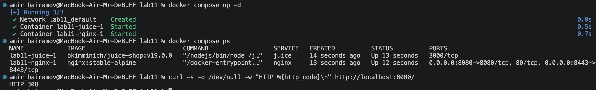
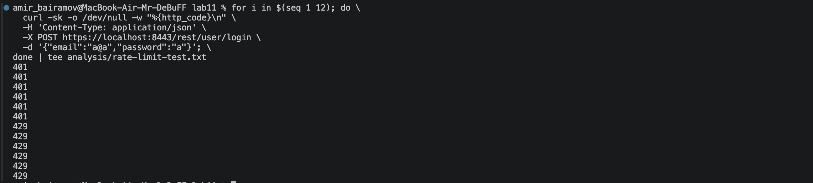
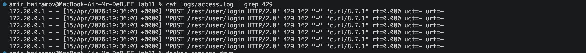

# Lab 11 — Reverse Proxy Hardening: Nginx Security Headers, TLS, and Rate Limiting

---

## Task 1 — Reverse Proxy Compose Setup

### Explanation

A reverse proxy (Nginx) improves security by acting as a single entry point between users and the application:

* **TLS termination** — HTTPS is handled by Nginx instead of the application
* **Security headers injection** — headers can be added without modifying application code
* **Request filtering** — enables rate limiting and traffic control
* **Infrastructure hiding** — backend service (Juice Shop) is not directly exposed
* **Centralized access control** — all traffic passes through a hardened layer

---

### Why hiding app ports is important

* Reduces the **attack surface**
* Prevents direct access to the application (bypassing protections)
* Blocks attackers from targeting backend services directly

---

### docker compose ps

```bash
NAME            IMAGE                           COMMAND                  SERVICE   CREATED          STATUS          PORTS
lab11-juice-1   bkimminich/juice-shop:v19.0.0   "/nodejs/bin/node /j…"   juice     14 seconds ago   Up 13 seconds   3000/tcp
lab11-nginx-1   nginx:stable-alpine             "/docker-entrypoint.…"   nginx     13 seconds ago   Up 12 seconds   0.0.0.0:8080->8080/tcp, 80/tcp, 0.0.0.0:8443->8443/tcp
```

Juice Shop has no published ports → it is only accessible via Nginx.

---

### HTTP → HTTPS redirect check

```bash
curl -s -o /dev/null -w "HTTP %{http_code}\n" http://localhost:8080/
```

Output:

```bash
HTTP 308
```

 HTTP is correctly redirected to HTTPS.

---



## Task 2 — Security Headers

### Headers (HTTP)

```http
HTTP/1.1 308 Permanent Redirect
X-Frame-Options: DENY
X-Content-Type-Options: nosniff
Referrer-Policy: strict-origin-when-cross-origin
Permissions-Policy: camera=(), geolocation=(), microphone=()
Cross-Origin-Opener-Policy: same-origin
Cross-Origin-Resource-Policy: same-origin
Content-Security-Policy-Report-Only: default-src 'self'; img-src 'self' data:; script-src 'self' 'unsafe-inline' 'unsafe-eval'; style-src 'self' 'unsafe-inline'
```

---

### Headers (HTTPS)

```http
HTTP/2 200
strict-transport-security: max-age=31536000; includeSubDomains; preload
x-frame-options: DENY
x-content-type-options: nosniff
referrer-policy: strict-origin-when-cross-origin
permissions-policy: camera=(), geolocation=(), microphone=()
cross-origin-opener-policy: same-origin
cross-origin-resource-policy: same-origin
content-security-policy-report-only: default-src 'self'; img-src 'self' data:; script-src 'self' 'unsafe-inline' 'unsafe-eval'; style-src 'self' 'unsafe-inline'
```

---

### Explanation of headers

* **X-Frame-Options: DENY**
  Protects against clickjacking by preventing embedding in iframes

* **X-Content-Type-Options: nosniff**
  Prevents MIME sniffing → protects against XSS

* **Strict-Transport-Security (HSTS)**
  Forces browsers to use HTTPS → prevents SSL stripping attacks

* **Referrer-Policy**
  Controls how much referrer information is shared → improves privacy

* **Permissions-Policy**
  Restricts access to sensitive browser features (camera, microphone, geolocation)

* **Cross-Origin-Opener-Policy (COOP)**
  Isolates browsing context → protects against cross-origin attacks

* **Cross-Origin-Resource-Policy (CORP)**
  Restricts resource sharing → prevents data leaks

* **Content-Security-Policy (Report-Only)**
  Detects XSS and unsafe resources without breaking application functionality

---

## Task 3 — TLS, HSTS, Rate Limiting & Timeouts

---

### TLS Scan Summary (testssl.sh)

#### Supported protocols:

* TLS 1.2 ✅
* TLS 1.3 ✅
* SSLv2, SSLv3, TLS 1.0, TLS 1.1 ❌ (disabled)

 Older protocols are disabled because they are insecure.

---

#### Cipher suites:

Modern and secure ciphers are used:

* TLS_AES_256_GCM_SHA384
* TLS_CHACHA20_POLY1305_SHA256
* ECDHE-RSA-AES256-GCM-SHA384

They provide:

* strong encryption
* forward secrecy

---

#### Forward Secrecy:

✅ Enabled (via ECDHE)

---

#### Vulnerabilities:

All major vulnerabilities are mitigated:

* Heartbleed
* POODLE
* BEAST
* CRIME

👉 The server is not vulnerable.

---

#### Notes:

* Self-signed certificate → expected for local development
* Chain of trust NOT OK → normal for localhost
* OCSP stapling not enabled → acceptable in this setup

---

### HSTS Verification

* Present on HTTPS ✅
* Not present on HTTP ✅

Correct configuration.

---

## Rate Limiting Test

### Output

```text
401
401
401
401
401
401
429
429
429
429
429
429
```



---

### Explanation

Configuration:

```nginx
limit_req_zone $binary_remote_addr zone=login:10m rate=10r/m;
limit_req zone=login burst=5 nodelay;
```

---

* **10r/m** → 10 requests per minute
* **burst=5** → allows short bursts above the limit
* **nodelay** → excess requests are rejected immediately

This provides a balance:

* protects against brute-force attacks
* does not significantly impact normal users

---

## Logs (429 responses)

```log
172.20.0.1 - - [15/Apr/2026:19:36:03 +0000] "POST /rest/user/login HTTP/2.0" 429 162 "-" "curl/8.7.1" rt=0.000 uct=- urt=-
172.20.0.1 - - [15/Apr/2026:19:36:03 +0000] "POST /rest/user/login HTTP/2.0" 429 162 "-" "curl/8.7.1" rt=0.000 uct=- urt=-
172.20.0.1 - - [15/Apr/2026:19:36:03 +0000] "POST /rest/user/login HTTP/2.0" 429 162 "-" "curl/8.7.1" rt=0.000 uct=- urt=-
172.20.0.1 - - [15/Apr/2026:19:36:03 +0000] "POST /rest/user/login HTTP/2.0" 429 162 "-" "curl/8.7.1" rt=0.000 uct=- urt=-
172.20.0.1 - - [15/Apr/2026:19:36:03 +0000] "POST /rest/user/login HTTP/2.0" 429 162 "-" "curl/8.7.1" rt=0.000 uct=- urt=-
172.20.0.1 - - [15/Apr/2026:19:36:03 +0000] "POST /rest/user/login HTTP/2.0" 429 162 "-" "curl/8.7.1" rt=0.000 uct=- urt=-
```



---

### Error log (rate limiting)

```log
limiting requests, excess: 5.967 by zone "login"
```

Confirms that rate limiting is actively enforced.

---

## Timeout Configuration

```nginx
client_body_timeout 10s;
client_header_timeout 10s;
proxy_read_timeout 30s;
proxy_send_timeout 30s;
```

---

### Explanation

* **client_header/body_timeout**
  Protects against Slowloris attacks

* **proxy_read/send_timeout**
  Controls how long Nginx waits for backend responses

---

### Trade-offs

* Low values → may disconnect slow clients
* High values → increase risk of resource exhaustion (DoS)

A balanced configuration is used.

---

## Additional Notes

Error log entries such as:

```log
SSL_do_handshake() failed (wrong version number)
```

These are caused by TLS scanning tools and invalid handshake attempts.

They are expected and not a security issue.
