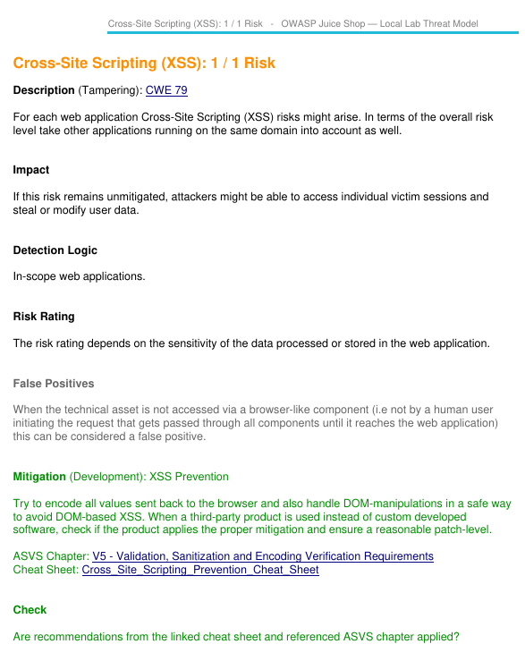
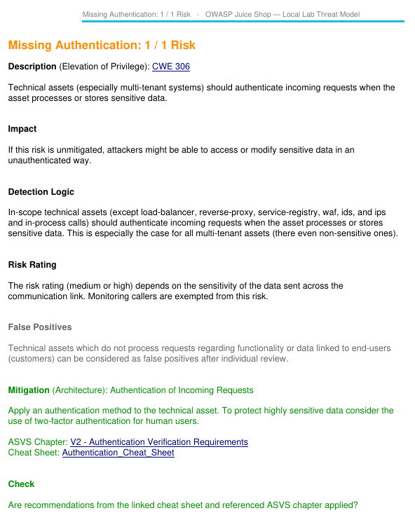
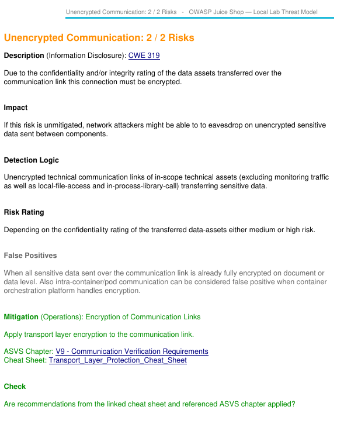
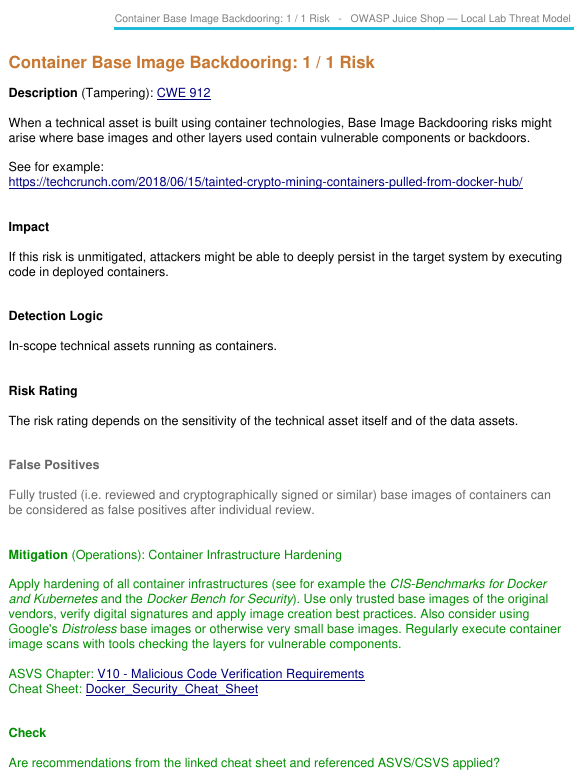
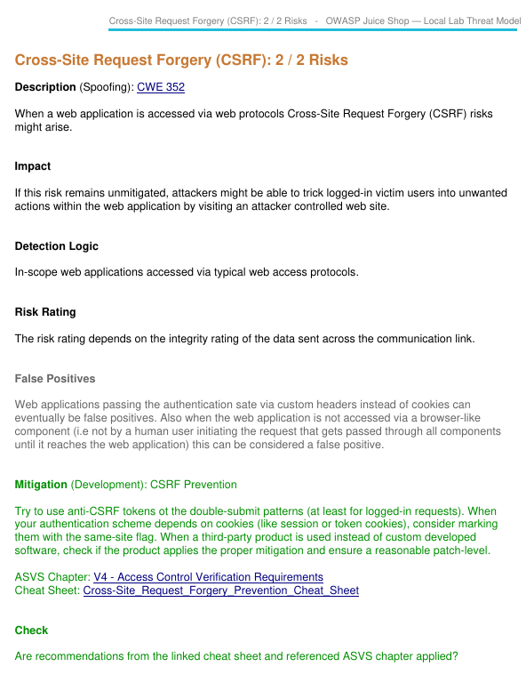
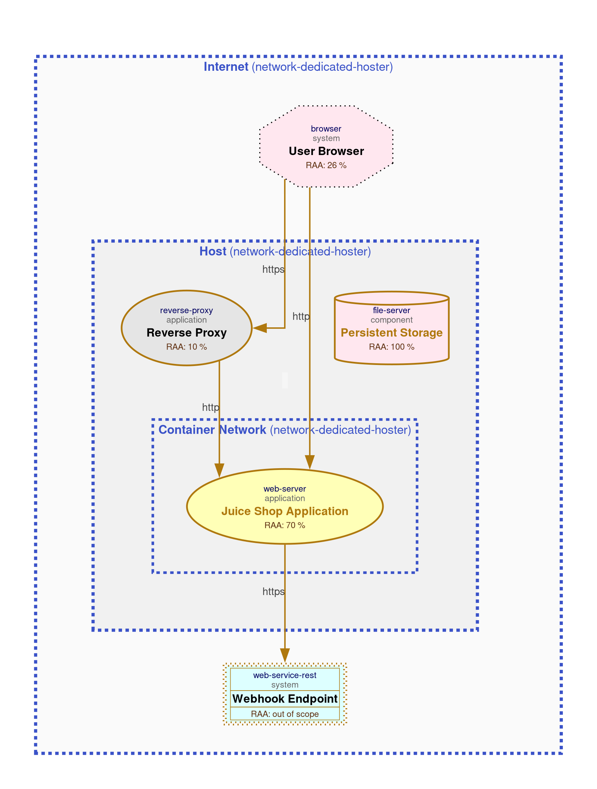

# Task 1

## Score table
**Composite score** = `Severity*100 + Likelihood*10 + Impact`
|Risk|Severity|Likelihood|Impact|Score|
|-|-|-|-|-|
|Unencrypted Communication|Elevated (4)|Likely (3)| High (3)|400 + 30 + 3 = 433|
|Missing Authentication|Elevated (4)|Likely (3)| Medium (2)|400 + 30 + 2 = 432|
|Cross-Site Scripting (XSS)|Elevated (4)|Medium (2)| Medium (2)|400 + 20 + 2 = 422|
|Cross-Site Request Forgery (CSRF)|Medium (2)|Very Likely (4)| Low (1)|200 + 40 + 1 = 241|
|Container Base Image Backdooring|Medium (2)|Unlikely (1)| Medium (2)|200 + 10 + 2 = 212|

## Risks analysis screenshots
### Cross-Site Scripting (XSS)

### Missing Authentication

### Unencrypted Communication

### Container Base Image Backdooring

### Cross-Site Request Forgery (CSRF)

## Analysis Diagrams
### Data Asset

### Data Flow

# Task 2

**Changes:**
- Changed all communication protocols from http to https
- Added encryption to persistent storage

**Result:** Risk amount *lowered* from 23 to 20
(-1 medium & -2 elevated risks)

| Category | Baseline | Secure | Δ |
|---|---:|---:|---:|
| container-baseimage-backdooring | 1 | 1 | 0 |
| cross-site-request-forgery | 2 | 2 | 0 |
| cross-site-scripting | 1 | 1 | 0 |
| missing-authentication | 1 | 1 | 0 |
| missing-authentication-second-factor | 2 | 2 | 0 |
| missing-build-infrastructure | 1 | 1 | 0 |
| missing-hardening | 2 | 2 | 0 |
| missing-identity-store | 1 | 1 | 0 |
| missing-vault | 1 | 1 | 0 |
| missing-waf | 1 | 1 | 0 |
| server-side-request-forgery | 2 | 2 | 0 |
| unencrypted-asset | 2 | 1 | -1 |
| unencrypted-communication | 2 | 0 | -2 |
| unnecessary-data-transfer | 2 | 2 | 0 |
| unnecessary-technical-asset | 2 | 2 | 0 |
