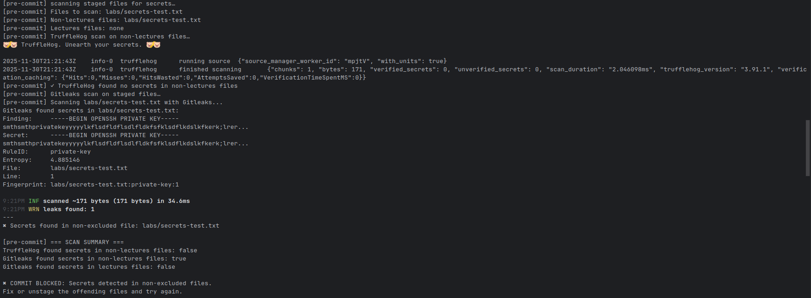

# Lab 3 submission

## Task 1

### 1. Why signing commits is useful

Signing commits helps verify the author and integrity of changes.  
It allows tools and other developers to trust that:
- the commit really comes from the expected developer;
- the commit content was not modified after it was created.

This improves the security of the software supply chain in a DevSecOps setup.

### 2. Result

I configured SSH commit signing for my Git repository and created a signed commit.  
On GitHub, this commit appears with the green **“Verified”** badge.  

### 3. Screenshot of verified commit

## Task 2

### 1. What the pre-commit hook does

I added a `pre-commit` hook that runs secret scanning tools (TruffleHog and Gitleaks) on staged changes.  
If a potential secret is detected outside allowed teaching directories, the hook blocks the commit.

### 2. How I tested it

- I created a test file with fake OpenSSH key and tried to commit it.
- The pre-commit hook detected the fake secrets and rejected the commit.
- After removing the fake secrets, a normal commit went through successfully.

### 3. Test

Output of pre-hooks:

### 4. Why this is useful

This reduces the risk of accidentally committing real credentials (API keys, tokens, passwords) and leaking them to the repository or to GitHub.
