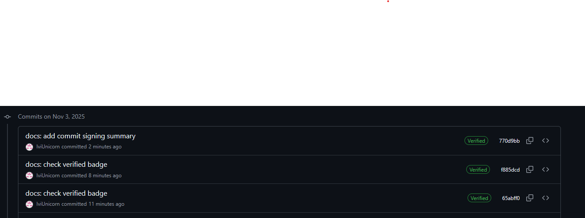
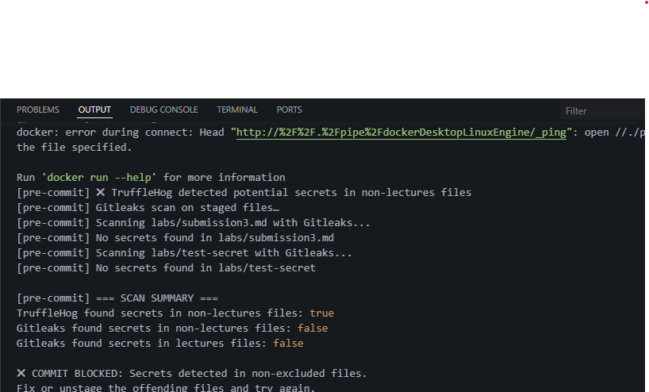

# Submission 3

## Task 1

Security benefits of commit signing:

It verifies that the author of the code is who they claim to be. This prevents malicious actors from impersonating a trusted team member and injecting vulnerable or malicious code under a false identity. It guarantees that the code has not been altered since the author signed it. Any change to the commit—whether to the code, message, or metadata—will invalidate the signature, immediately flagging the commit as tampered with. The developer cannot deny having authored and approved the code. Because the signature is created with their private key (which only they should possess), it serves as a strong, auditable proof of origin.

Successful SSH key setup:

```
...
user.email=ilvinchik05@gmail.com
user.name=IviUnicorn
user.signingkey=C:\Users\ucat\IviLabs\ivi_id
commit.gpgsign=true
gpg.format=ssh
...
```

The verification:



Why is Commit Signing Critical in DevSecOps Workflows?

DevSecOps integrates security practices directly into the DevOps lifecycle. The goal is to "shift left," embedding security from the initial lines of code rather than treating it as a final gate. In this context, commit signing is not just a "nice-to-have" but a critical control point for several key reasons.

It's the First and Most Critical Link in the Software Supply Chain
Think of your codebase as a software supply chain. The commit is the point where raw materials (code) are introduced. If you cannot trust the origin of your raw materials, the entire supply chain is compromised. Commit signing provides a verifiable "bill of lading," ensuring that every change is sourced from a trusted supplier (the developer). This is the first step in protecting against supply chain attacks.

It Directly Mitigates Insider Threat and Account Compromise
A major attack vector in modern development is compromised developer credentials. An attacker who phishes a developer's password can push code that looks legitimate because it comes from a valid account. Commit signing defends against this.

It Enforces Security Policy and Automation in the CI/CD Pipeline
In a mature DevSecOps workflow, security checks are automated. Commit signing acts as a powerful gating mechanism.

It Provides a Tamper-Proof Audit Trail for Compliance and Forensics
For organizations in regulated industries (finance, healthcare, government), demonstrating who changed what and when is a compliance requirement (e.g., SOC 2, ISO 27001). Signed commits create an immutable audit trail. If a security incident occurs, forensic teams can trace the vulnerable code back to a specific, verified individual with high confidence, drastically speeding up root cause analysis and remediation.

Integrating commit signing is a low-friction, high-impact security control. It directly addresses the "I" in the CIA Triad (Integrity) for your development process and is a pragmatic implementation of the Zero-Trust principle applied to code. By verifying every single change, it moves security from a reactive, scanning-based model to a proactive, identity-centric one, making it an indispensable component of a robust and resilient DevSecOps workflow.

## Task 2

Setup config hook by creating the hook file:

```
vim .git/hooks/pre-commit
chmod +x .git/hooks/pre-commit
```

Evidence of detected commit:


Analysis:
Automated secret scanning transforms a reactive security problem (responding to a leak after it's discovered in the wild) into a proactive, preventative control. It systematically eliminates the most common vector for credential-based attacks by ensuring secrets never make it to a public-facing environment in the first place.