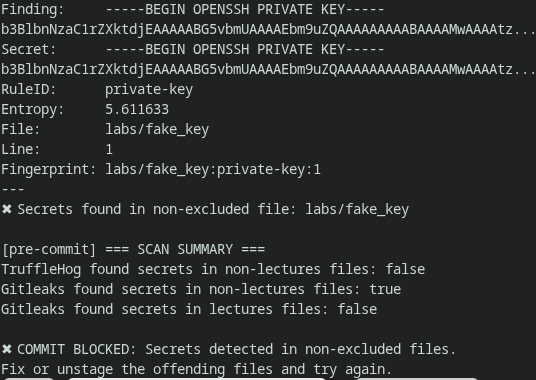

# Lab 3 — Secure Git

## Student Information

* **Lab:** Lab 3 — Secure Git
* **Branch:** `feature/lab3`
* **Submission File:** `labs/submission3.md`

---

# Task 1 — SSH Commit Signature Verification

## Objective

The goal of this task was to configure SSH-based commit signing in Git in order to verify the authenticity and integrity of commits.

---

## Research Summary — Benefits of Commit Signing

Commit signing is an important security mechanism in modern software development workflows. By signing commits with SSH keys, developers can cryptographically prove that:

* The commit was created by the expected author
* The commit contents were not modified after creation
* The repository history can be trusted
* Attackers cannot easily impersonate developers

Signed commits help prevent multiple security risks, including:

* Unauthorized code injection
* Identity spoofing
* Supply-chain attacks
* Malicious commit rewriting
* Insider threats in collaborative environments

Platforms such as GitHub display a **Verified** badge for signed commits, making it easier for teams to audit repository history and validate trusted contributions.

---

## SSH Commit Signing Configuration

### SSH Key Generation

An SSH key was generated and added to GitHub for commit signing.

Example command used:

```bash
ssh-keygen -t ed25519 -C "your_email@example.com"
```

---

### Git Configuration

Git was configured globally for SSH commit signing using the following commands:

```bash
git config --global user.signingkey <YOUR_SSH_KEY>
git config --global commit.gpgSign true
git config --global gpg.format ssh
```

These settings ensure that all future commits are automatically signed using the configured SSH key.

---

## Creating a Signed Commit

A signed commit was created using:

```bash
git commit -S -m "docs: add commit signing summary"
```

GitHub successfully verified the commit signature and displayed the **Verified** badge.

---

## Evidence — Verified Commit

### Verified Commit Screenshot


The screenshot above demonstrates that GitHub successfully verified the SSH-signed commit.

---

## Analysis — Why Commit Signing is Critical in DevSecOps

Commit signing is a critical component of DevSecOps workflows because it establishes trust throughout the software delivery pipeline.

In modern CI/CD systems, code is automatically built, tested, and deployed after commits are pushed to repositories. Without commit verification, attackers could impersonate developers or inject malicious code into the pipeline.

SSH commit signing provides several important DevSecOps security benefits:

### 1. Identity Verification

Signed commits prove the identity of the developer who authored the changes.

### 2. Integrity Protection

Cryptographic signatures ensure that commits were not altered after creation.

### 3. Supply Chain Security

Commit signing reduces the risk of software supply-chain attacks by ensuring only trusted contributors can introduce changes.

### 4. Auditability

Security teams can trace code changes back to verified contributors during audits or incident investigations.

### 5. CI/CD Trust Enforcement

Organizations can configure CI/CD pipelines and branch protection rules to require signed commits before merging changes.

Overall, commit signing strengthens repository security and improves confidence in the software development lifecycle.

---

# Task 2 — Pre-commit Secret Scanning

## Objective

The goal of this task was to implement automated secret scanning in a local Git workflow using Dockerized TruffleHog and Gitleaks executed through a Git pre-commit hook.

---

## Pre-commit Hook Setup

A custom Git pre-commit hook was created at:

```text
.git/hooks/pre-commit
```

The hook automatically:

* Detects staged files
* Runs TruffleHog scans on non-lecture files
* Runs Gitleaks scans on all staged files
* Blocks commits if secrets are detected
* Allows educational examples inside the `lectures/` directory

---

## Hook Installation

The hook was made executable using:

```bash
chmod +x .git/hooks/pre-commit
```

Docker was used to execute both scanning tools:

* `trufflesecurity/trufflehog:latest`
* `zricethezav/gitleaks:latest`

This approach avoids local dependency installation and ensures reproducible scans across environments.

---

## Secret Detection Testing

### Test Procedure

The hook was tested using a fake secret value (for example, a simulated AWS key) added to a staged file.

Testing steps:

1. Add a fake secret to a file
2. Stage the file with `git add`
3. Attempt a commit
4. Verify the commit is blocked
5. Remove/redact the secret
6. Retry the commit successfully

---

## Evidence — Blocked Commit

### Commit Blocked by Secret Scanner



The screenshot above shows the pre-commit hook successfully detecting secrets and blocking the commit.

---

## Successful Commit After Secret Removal

After removing or redacting the detected secret, the commit completed successfully.

The hook output confirmed that:

* No secrets were detected
* The commit was allowed to proceed
* Both TruffleHog and Gitleaks scans passed

---

## Analysis — Importance of Automated Secret Scanning

Automated secret scanning is an essential DevSecOps security practice because secrets accidentally committed to repositories are one of the most common causes of security incidents.

Examples of exposed secrets include:

* AWS access keys
* API tokens
* Database passwords
* Private SSH keys
* OAuth credentials

If leaked publicly, attackers can immediately abuse these credentials to gain unauthorized access to infrastructure or services.

The implemented pre-commit hook improves security by:

### 1. Preventing Human Error

Developers may accidentally commit secrets during development. Automated scanning catches mistakes before code reaches the repository.

### 2. Enforcing Security Policies

The hook ensures all contributors follow the same security standards automatically.

### 3. Shifting Security Left

Secrets are detected locally during development rather than after deployment or exposure.

### 4. Reducing Incident Response Costs

Preventing secret exposure avoids expensive credential rotation, service outages, and security investigations.

### 5. Integrating Security into Developer Workflows

Security controls become part of the normal Git workflow instead of relying only on manual reviews.

Combining TruffleHog and Gitleaks improves detection coverage and provides stronger protection against accidental credential leaks.

---

# Conclusion

This lab demonstrated two important secure Git practices:

1. SSH commit signing for verifying commit authenticity and integrity
2. Automated pre-commit secret scanning using TruffleHog and Gitleaks

These controls strengthen repository security, improve trust in collaborative development, and help prevent supply-chain and credential exposure incidents.

---

# Checklist

* [x] SSH commit signing configured
* [x] Signed commit successfully verified on GitHub
* [x] Pre-commit hook implemented
* [x] TruffleHog integrated via Docker
* [x] Gitleaks integrated via Docker
* [x] Commit blocking successfully tested
* [x] Successful commit after secret removal confirmed
* [x] Documentation and screenshots included
