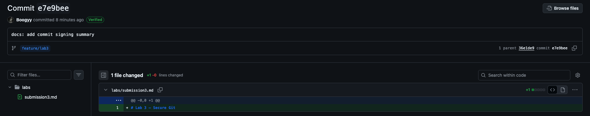
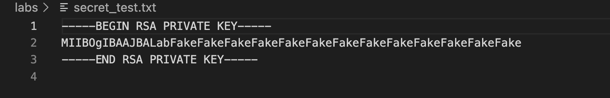
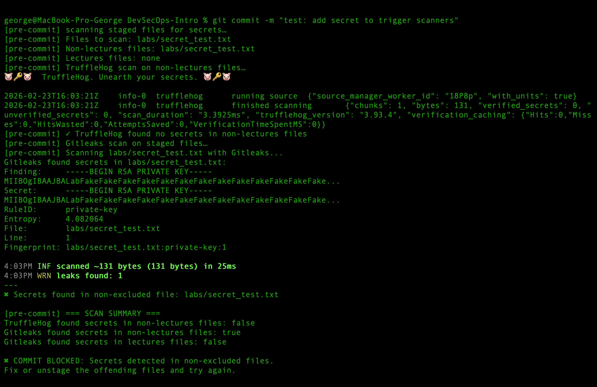

# Lab 3 — Secure Git

# Task 1 — SSH Commit Signature Verification

## 1. Summary: Benefits of Commit Signing

Commit signing provides cryptographic verification of the author and integrity of commits.
Key security benefits include:

* **Authenticity** — proves the commit was created by a trusted identity.
* **Integrity** — prevents undetected tampering with commit history.
* **Accountability** — improves traceability of changes.
* **Supply chain protection** — reduces risk of malicious or injected code.

By ensuring that each change is signed, teams can trust the provenance of code changes throughout the development lifecycle.

---

## 2. SSH Key Setup and Configuration (Evidence)

### Key generation

```bash
ssh-keygen -t ed25519 -C "<email@gmail.com>" -f ~/.ssh/id_ed25519_signing
```

### Git configuration for SSH signing

```bash
git config --global gpg.format ssh
git config --global user.signingkey ~/.ssh/id_ed25519_signing.pub
git config --global commit.gpgSign true
```

### Verification of configuration

```bash
git config --global --get gpg.format
git config --global --get user.signingkey
git config --global --get commit.gpgSign
...
ssh
path to .pub
true
```

### Signed commit verification (local)

```bash
git log -1 --show-signature
```

Output confirms a valid signature:

```
Good "git" signature for <email@gmail.com> with ED25519 key
```

### GitHub verification

Commit in branch `feature/lab3` shows a **Verified** badge on GitHub.


---

## 3. Analysis: Why Commit Signing Is Critical in DevSecOps

Commit signing is essential in DevSecOps because it strengthens trust across the entire CI/CD pipeline.

* Prevents unauthorized or spoofed commits from entering protected branches.
* Supports incident response by linking changes to verified identities.
* Provides cryptographic assurance of code provenance.
* Helps mitigate supply chain attacks and compromised developer accounts.

In automated delivery environments, signed commits complement controls like branch protection rules, ensuring that only trusted code reaches production.

---

# Task 2 — Pre-commit Secret Scanning (TruffleHog + Gitleaks)

## 1. Hook Setup and Configuration

A local Git pre-commit hook was implemented at:

```
.git/hooks/pre-commit
```

The hook:

* Collects staged files
* Runs **TruffleHog** on non-excluded files
* Runs **Gitleaks** on each staged file
* Blocks commits if secrets are detected outside `lectures/`
* Allows educational secrets inside `lectures/`

The hook was made executable:

```bash
chmod +x .git/hooks/pre-commit
```

---

## 2. Evidence: Blocked Commit When Secret Detected

A test file containing a simulated private key was created:

```bash
git add labs/secret_test.txt
git commit -m "test: add secret to trigger scanners"
```

Result:

* Secret detected by scanning tools
* Commit blocked
* Hook returned exit code 1




This confirms the hook successfully prevents committing secrets.

---

## 3. Evidence: Successful Commit After Removing Secret

After removing sensitive content:

```bash
echo "no secrets here" > labs/secret_test.txt
git add labs/secret_test.txt
git commit -S -m "test: redact secret after block"
```

Output:

```
✓ No secrets detected in non-excluded files; proceeding with commit.
[feature/lab3 620b822] test: redact secret after block
 1 file changed, 1 insertion(+)
 create mode 100644 labs/secret_test.txt
```

This demonstrates normal workflow resumes once the secret is removed.

---

## 4. Analysis: How Automated Secret Scanning Prevents Incidents

Automated pre-commit secret scanning significantly reduces security risk by shifting detection to the earliest stage — the developer workstation.

Benefits include:

* Preventing credential leaks before code reaches remote repositories
* Reducing incident response overhead (no need for key rotation or history rewriting)
* Providing immediate feedback to developers
* Enforcing secure development practices automatically
* Minimizing exposure window for sensitive data

By integrating scanning into local workflows, organizations implement a proactive “shift-left” security model.
