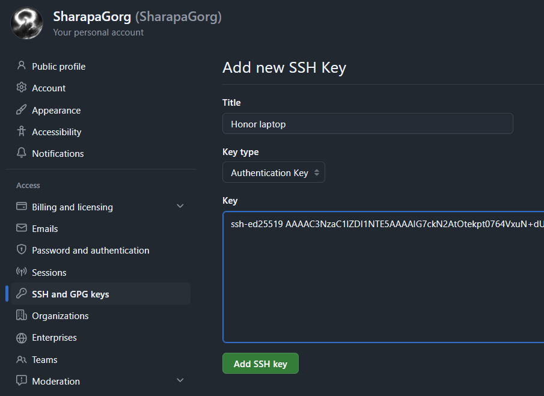
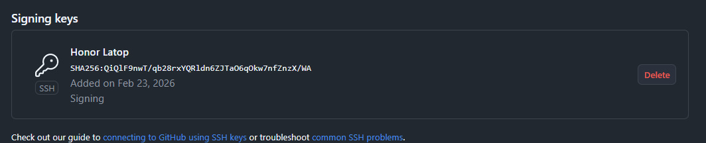
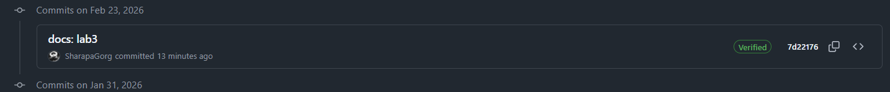
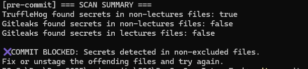
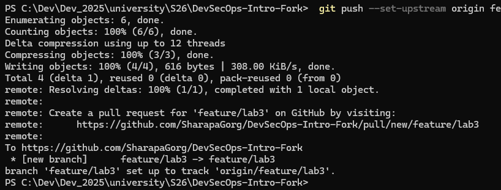

# Lab 3 — Secure Git Submission

## Task 1 — SSH Commit Signature Verification

### 1.1 Benefits of Signing Commits

SSH commit signing provides several critical security benefits:

- **Authenticity** — verifies that the commit was actually made by the claimed author, not someone who spoofed `user.name` and `user.email`
- **Integrity** — guarantees that the commit content has not been modified after signing
- **Non-repudiation** — the author cannot deny authorship of a signed commit
- **Supply chain protection** — prevents injection of malicious code on behalf of trusted developers

### 1.2 SSH Key Setup and Configuration

Git configuration for commit signing:

```bash
git config --local gpg.format ssh
git config --local user.signingkey ~/.ssh/id_ed25519.pub
git config --local commit.gpgSign true
```

SSH key was added to GitHub as a **Signing Key**:




### 1.3 Why is commit signing critical in DevSecOps workflows?

In DevSecOps, commit signing is critical for several reasons:

1. **CI/CD Pipeline Protection** — only verified commits from trusted developers can trigger production deployments
2. **Audit Trail** — cryptographic proof of authorship for compliance and security audits
3. **Account Compromise Protection** — even if an attacker gains access to a GitHub account, they cannot create verified commits without the private key
4. **Branch Protection** — GitHub can be configured to require signed commits for merging into protected branches

### 1.4 Verified Badge Evidence

After pushing the signed commit, GitHub displays the "Verified" badge confirming SSH signature validity:



---

## Task 2 — Pre-commit Secret Scanning

### 2.1 Pre-commit Hook Setup

Created `.git/hooks/pre-commit` file with a script that scans for secrets using TruffleHog and Gitleaks via Docker.

```bash
chmod +x .git/hooks/pre-commit
```

The hook performs the following:
1. Collects list of staged files
2. Excludes `lectures/` directory (educational content)
3. Runs TruffleHog scan on non-lectures files
4. Runs Gitleaks scan on each staged file
5. Blocks commit if secrets are found in non-excluded files

### 2.2 Secret Detection Test — Blocked Commit

Tested with a potential secret in a markdown file. The pre-commit hook successfully detected the secret and blocked the commit:



### 2.3 Successful Commit After Removing Secret

After removing the secret, the commit proceeded successfully:



### 2.4 How Automated Secret Scanning Prevents Security Incidents

Automated secret scanning prevents security incidents through:

1. **Shift-left Security** — issues are detected before reaching the repository, not after a leak
2. **Human Error Mitigation** — developers may accidentally commit credentials; automation prevents this
3. **Mandatory Enforcement** — pre-commit hooks run automatically on every commit attempt
4. **Multi-detector Coverage** — TruffleHog and Gitleaks use different detection patterns, increasing coverage
5. **Cost Reduction** — rotating compromised keys and incident investigation is significantly more expensive than prevention

---

## Summary

| Task | Status |
|------|--------|
| SSH commit signing configuration | Done |
| Verified badge on GitHub | Done |
| Pre-commit hook with TruffleHog + Gitleaks | Done |
| Secret detection testing | Done |
