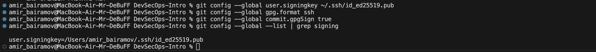
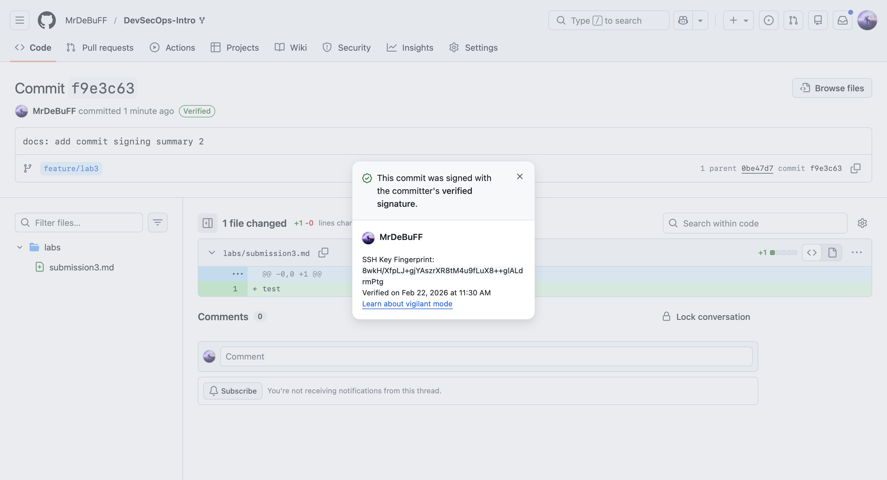
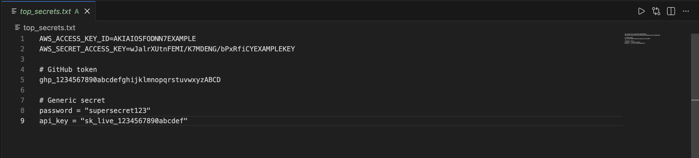
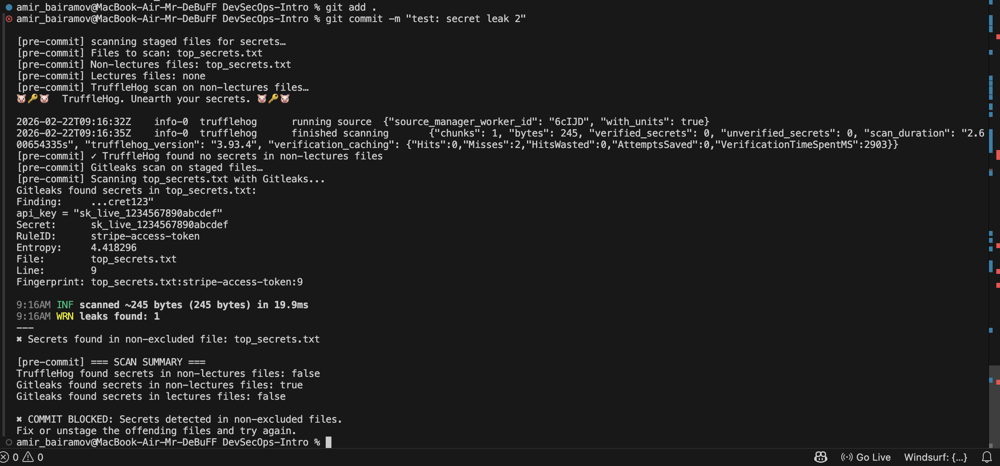
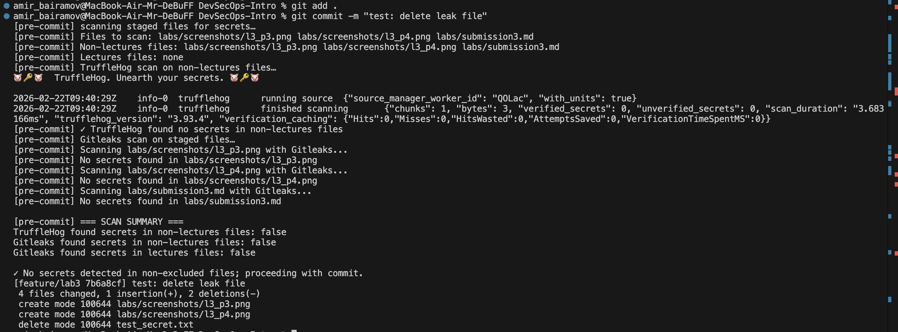

# Lab 3 — Secure Git

# Task 1 — SSH Commit Signing

## 1. Why Commit Signing Matters

Commit signing ensures:

- **Authenticity** — verifies that the commit was created by the legitimate author.
- **Integrity** — guarantees that commit contents were not modified after signing.
- **Trust in collaboration** — prevents impersonation.
- **Supply-chain protection** — protects CI/CD pipelines from malicious code injection.

## 2. SSH Key Setup

An existing `id_ed25519.pub` SSH key was used.

### Steps performed:

1. Verified existing SSH keys:
   ```bash
   ls ~/.ssh
   ```

2. Added the public key (id_ed25519.pub) to GitHub:

3. Configured Git for SSH signing:

```bash
git config --global user.signingkey ~/.ssh/id_ed25519.pub
git config --global gpg.format ssh
git config --global commit.gpgSign true
```

4. Verified configuration:



## 3. Analysis

In DevSecOps workflows, signed commits provide cryptographic proof of authorship and protect against repository compromise or identity spoofing.

Without commit signing, attackers could:
- Push malicious commits under another developer’s name.
- Inject unauthorized changes into CI/CD pipelines.
- Perform supply-chain attacks.

## 4. Creating a Signed Commit

A signed commit was created:

```bash
git commit -S -m "docs: add lab3 submission"
```

After pushing the commit to GitHub, the commit shows:

```
🟢 Verified — This commit was signed with an SSH key.
```
### Evidence



# Task 2 — Pre-commit Secret Scanning

## 2. Pre-commit Hook Setup
A pre-commit hook was created at:
```bash
.git/hooks/pre-commit
```

The hook:
- Collects staged files
- Separates lectures/ directory (educational content allowed)
- Scans non-lecture files with TruffleHog
- Scans all files with Gitleaks
- Blocks commits if secrets are detected
- Allows commits if secrets are only inside lectures/

The hook was made executable:
```bash
chmod +x .git/hooks/pre-commit
```

Docker Desktop was used to run scanning containers.

## 3. Testing Secret Detection
### Test 1 — Secret Present (Commit Blocked)
Created a test file with a fake AWS and GitHub key:



Try to commit this file:

```bash
git add .
git commit -m "test: secret leak 2"
```

Result:



### Test 2 — Secret Removed (Commit Successful)

Removed the file:

```bash
rm top_secrets.txt
git add .
git commit -m "test: clean commit"
```

Result:
- No secrets detected.
- Commit completed successfully.



## 4. Security Impact

Pre-commit secret scanning provides:

- Early detection of exposed credentials.
- Prevention of accidental leaks.
- Reduced risk of cloud account compromise.
- Protection against repository secret exposure.
- Stronger DevSecOps automation practices.

By scanning before commits are finalized, this mechanism prevents secrets from ever reaching remote repositories.