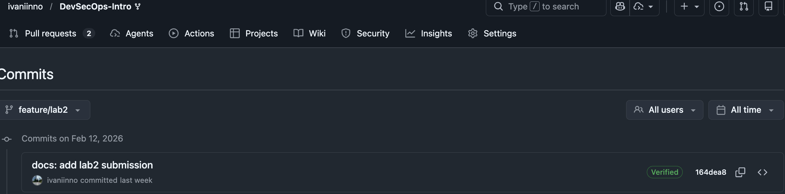

# Lab 3 Submission — Secure Git

## Task 1 — SSH Commit Signature Verification 

### 1.1 Benefits of Signing Commits

Commit signing is a cryptographic mechanism that proves the identity of the author and guarantees the commit has not been tampered with after creation. Key benefits include:

- **Authenticity**: Signed commits prove that the person listed as the author actually made the commit. Without signing, anyone can configure `user.name` and `user.email` to impersonate another developer.
- **Integrity**: The cryptographic signature covers the commit content (tree hash, parent, message, etc.). Any modification after signing — even a single byte — invalidates the signature, making tampering detectable.
- **Non-repudiation**: A valid signature ties a commit to the holder of the private key. The author cannot later deny having made the commit.
- **Supply-chain trust**: In CI/CD pipelines, enforcing signature verification ensures that only commits from trusted contributors are built and deployed, reducing the risk of malicious code injection.
- **GitHub "Verified" badge**: GitHub displays a green "Verified" badge next to signed commits, giving reviewers and maintainers instant visual confirmation of commit authenticity.

### 1.2 SSH Key Setup and Configuration

**Option used:** Existing SSH key (Option B)

I used my existing Ed25519 SSH key that is already registered with GitHub for authentication, and added it as a **signing key** as well.

**Git configuration commands (macOS):**

```bash
git config --global user.signingkey ~/.ssh/id_ed25519.pub
git config --global commit.gpgSign true
git config --global gpg.format ssh
```

**Verification of configuration:**

```bash
ivanilicev@MacBook-Pro-Ivan DevSecOps-Intro % git config --global --get commit.gpgSign
true
ivanilicev@MacBook-Pro-Ivan DevSecOps-Intro % git config --global --get gpg.format
ssh
ivanilicev@MacBook-Pro-Ivan DevSecOps-Intro % git config --global user.signingkey
/Users/ivanilicev/.ssh/id_ed25519.pub
```

**Adding the signing key to GitHub:**

1. Went to GitHub → Settings → SSH and GPG keys
2. Clicked "New SSH key"
3. Set Key type to **Signing Key**
4. Pasted the public key contents and saved

### 1.3 Creating a Signed Commit

```bash
git commit -S -m "docs: add commit signing summary"
```


### 1.4 Analysis: Why Is Commit Signing Critical in DevSecOps Workflows?

In DevSecOps, every stage of the software delivery pipeline must be verifiable and trustworthy. Commit signing plays a critical role because:

1. **Shift-left identity verification**: Signing moves authenticity checks to the earliest possible point — the moment code is committed. This aligns with the DevSecOps principle of shifting security left in the development lifecycle.

2. **CI/CD pipeline integrity**: Many organizations configure branch protection rules that require signed commits before merging. This prevents unauthorized or spoofed commits from entering the main branch and triggering automated builds and deployments.

3. **Audit trail and compliance**: Regulations (SOC 2, ISO 27001, etc.) often require provable attribution of changes. Signed commits provide a cryptographically verifiable audit trail that satisfies these requirements.

4. **Protection against insider threats**: Even within a team, commit signing ensures that no developer can create commits under another developer's identity, whether accidentally (misconfigured Git) or maliciously.

5. **Supply-chain attack mitigation**: High-profile attacks (e.g., SolarWinds, Codecov) have demonstrated that compromising the source code pipeline can have devastating downstream effects. Signed commits add a verification layer that makes injecting unauthorized code significantly harder.

### 1.5 Verified Badge on GitHub



After pushing the signed commit, the "Verified" badge is visible on GitHub next to the commit, confirming that the signature was validated against the SSH public key registered on the account.

---

## Task 2 — Pre-commit Secret Scanning 

### 2.1 Pre-commit Hook Setup

Created `.git/hooks/pre-commit` with the script from the lab instructions, then made it executable:

```bash
chmod +x .git/hooks/pre-commit
```

**Verifying the hook is in place:**

```bash
ls -la .git/hooks/pre-commit
# Output: -rwxr-xr-x@ 1 ivanilicev  staff  3428 Feb 19 21:19 .git/hooks/pre-commit
```

### 2.2 Testing Secret Detection

#### Test 1 — Commit Blocked (Secret Detected)

Created a test file containing a fake GitHub Personal Access Token and attempted to commit.

```bash
echo 'ghp_...' > test-secret.txt
git add test-secret.txt
git commit -S -m "test: add secret file"
```

Output:

```
[pre-commit] scanning staged files for secrets…
[pre-commit] Files to scan: test-secret.txt
[pre-commit] Non-lectures files: test-secret.txt
[pre-commit] Lectures files: none
[pre-commit] TruffleHog scan on non-lectures files…
🐷🔑🐷  TruffleHog. Unearth your secrets. 🐷🔑🐷

2026-02-19T18:59:47Z    info-0  trufflehog      running source  {"source_manager_worker_id": "XDCGZ", "with_units": true}
2026-02-19T18:59:47Z    info-0  trufflehog      finished scanning       {"chunks": 1, "bytes": 41, "verified_secrets": 0, "unverified_secrets": 0, "scan_duration": "1.309ms", "trufflehog_version": "3.93.3", "verification_caching": {"Hits":0,"Misses":0,"HitsWasted":0,"AttemptsSaved":0,"VerificationTimeSpentMS":0}}
[pre-commit] ✓ TruffleHog found no secrets in non-lectures files
[pre-commit] Gitleaks scan on staged files…
[pre-commit] Scanning test-secret.txt with Gitleaks...
Gitleaks found secrets in test-secret.txt:
Finding:     ghp_...
Secret:      ghp_...
RuleID:      github-pat
Entropy:     4.246439
File:        test-secret.txt
Line:        1
Fingerprint: test-secret.txt:github-pat:1

6:59PM INF scanned ~41 bytes (41 bytes) in 29.4ms
6:59PM WRN leaks found: 1
---
✖ Secrets found in non-excluded file: test-secret.txt

[pre-commit] === SCAN SUMMARY ===
TruffleHog found secrets in non-lectures files: false
Gitleaks found secrets in non-lectures files: true
Gitleaks found secrets in lectures files: false

✖ COMMIT BLOCKED: Secrets detected in non-excluded files.
Fix or unstage the offending files and try again.
```


#### Test 2 — Commit Allowed (Secret Removed)

Removed the secret file, unstaged it, and committed a clean file instead:

```bash
echo "This is a clean file with no secrets." > clean.txt
git add clean.txt
git commit -S -m "test: no secret"
```

Output:

```
[pre-commit] scanning staged files for secrets…
[pre-commit] Files to scan: clean.txt
[pre-commit] Non-lectures files: clean.txt
[pre-commit] Lectures files: none
[pre-commit] TruffleHog scan on non-lectures files…
🐷🔑🐷  TruffleHog. Unearth your secrets. 🐷🔑🐷

2026-02-19T19:06:20Z    info-0  trufflehog      running source  {"source_manager_worker_id": "M5cfW", "with_units": true}
2026-02-19T19:06:20Z    info-0  trufflehog      finished scanning       {"chunks": 1, "bytes": 39, "verified_secrets": 0, "unverified_secrets": 0, "scan_duration": "1.101125ms", "trufflehog_version": "3.93.3", "verification_caching": {"Hits":0,"Misses":0,"HitsWasted":0,"AttemptsSaved":0,"VerificationTimeSpentMS":0}}
[pre-commit] ✓ TruffleHog found no secrets in non-lectures files
[pre-commit] Gitleaks scan on staged files…
[pre-commit] Scanning clean.txt with Gitleaks...
[pre-commit] No secrets found in clean.txt

[pre-commit] === SCAN SUMMARY ===
TruffleHog found secrets in non-lectures files: false
Gitleaks found secrets in non-lectures files: false
Gitleaks found secrets in lectures files: false

✓ No secrets detected in non-excluded files; proceeding with commit.
[feature/lab3 287416b] test: no secret
 1 file changed, 1 insertion(+)
 create mode 100644 clean.txt
```

Both scanners found no secrets in the clean file and the commit proceeded successfully.

**Cleanup after testing:**

```bash
git rm clean.txt
git commit -S -m "chore: remove test file"
```

### 2.3 Analysis: How Automated Secret Scanning Prevents Security Incidents

Automated pre-commit secret scanning is a critical DevSecOps control that prevents secrets from ever entering version control. Here is why this matters:

1. **Prevention over remediation**: Once a secret is committed and pushed, it exists in Git history permanently (unless the history is rewritten). Even deleting the file in a subsequent commit does not remove it from the repository's history. Automated scanning at the pre-commit stage prevents secrets from entering the history in the first place.

2. **Defense in depth**: Using two complementary tools (TruffleHog and Gitleaks) provides layered detection. TruffleHog excels at detecting high-entropy strings and verifying credentials against live services, while Gitleaks uses regex-based pattern matching for known secret formats. Together, they cover a broader range of secret types and reduce false negatives.

3. **Developer experience**: Pre-commit hooks give developers immediate feedback before a secret reaches the remote repository. This is faster and less disruptive than discovering leaked secrets through a CI pipeline or a third-party monitoring service after the push.

4. **Real-world impact of leaked secrets**: Exposed credentials in public repositories are routinely harvested by automated bots within minutes. AWS keys, for example, can be exploited to spin up cryptocurrency mining infrastructure, exfiltrate data, or pivot deeper into an organization's cloud environment. A single leaked secret can lead to thousands of dollars in unauthorized charges or a full data breach.

5. **Compliance and policy enforcement**: Many security frameworks (NIST, SOC 2, PCI-DSS) require controls to prevent unauthorized disclosure of credentials. Automated pre-commit scanning provides an auditable, enforceable control that satisfies these requirements without relying solely on developer vigilance.
