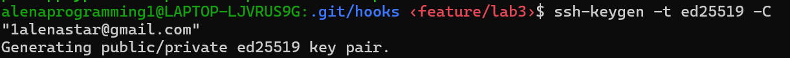
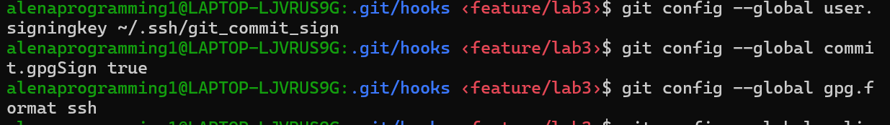
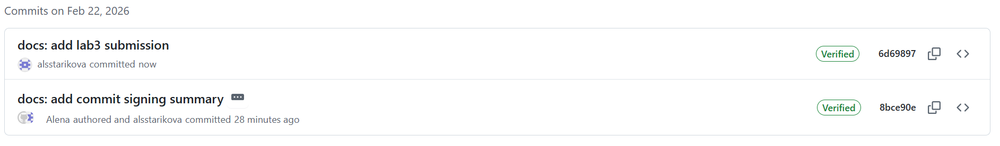
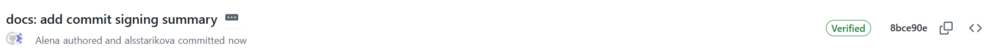
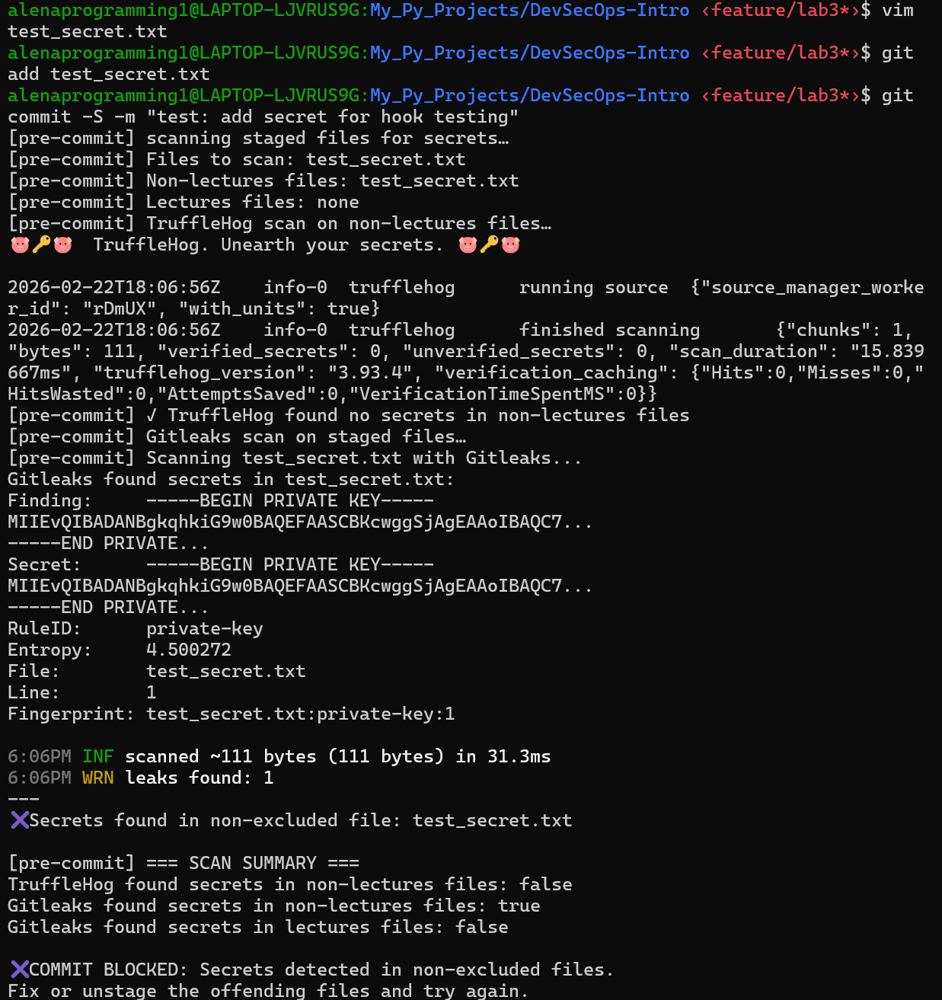
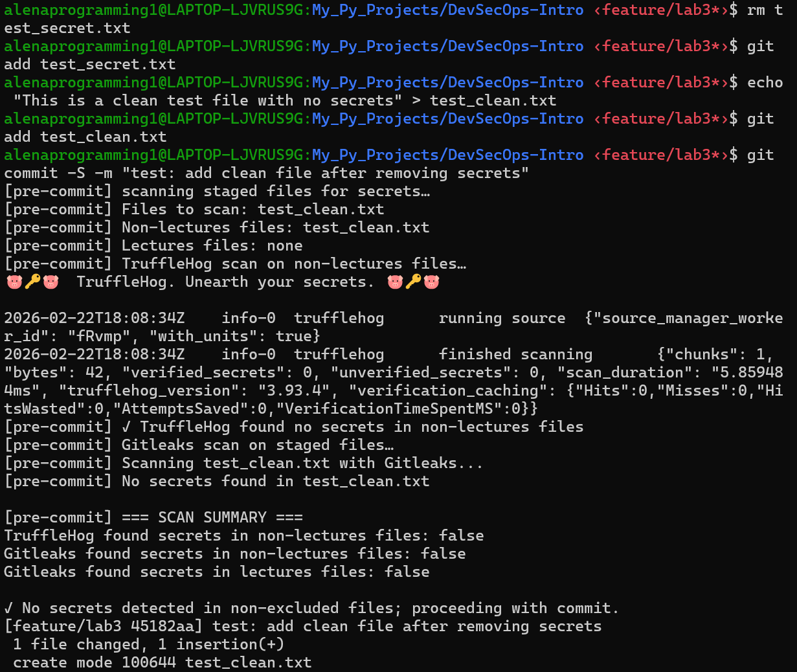

# Lab 3 — Secure Git: Submission

## Task 1: SSH Commit Signature Verification

### 1.1: Research Summary - Commit Signing Benefits

Commit signing is a critical security practice in DevSecOps workflows that provides:

#### **Authentication & Integrity**
Signed commits mathematically prove that you (the key holder) authored the commit. This prevents impersonation attacks where:
- Adversaries configure Git with `user.name = "Your Name"` and create fraudulent commits
- Without signing, nothing prevents malicious commits appearing to come from developers
- SSH signatures embed cryptographic proof tied to your private key

#### **Supply Chain Security**
- **Prevents GitHub Spoofing:** Attackers cannot forge commits even with repository access
- **CI/CD Trust:** Automated systems can verify commit origin before executing workflows
- **Code Review Authenticity:** Reviewers can trust who actually approved merge commits
- **Compliance & Auditing:** Organizations can enforce signed commits in policy and maintain audit trails

#### **DevSecOps Context**
- Infrastructure-as-Code (IaC) commits signed and verified prevent unauthorized infrastructure changes
- Security policy changes (firewall rules, IAM) must be attributed to specific authenticated users
- Hack detection: Verified badges on commits identify timeline of compromised accounts
- Incident response: Quickly identify which commits came from a compromised account

### 1.2: SSH Configuration Process

**Steps implemented:**

1. **SSH Key Configuration:**  
   - Generated a new Ed25519 key
   
   - Configured Git with the key path for signing

2. **Git Global Configuration:**  
   ```
   git config --global user.signingkey <SSH_KEY_PATH>
   git config --global commit.gpgSign true
   git config --global gpg.format ssh
   ```
   

3. **Verification:**  
   All commits in the `feature/lab3` branch are cryptographically signed with SSH
   

### 1.3: Signed Commit Evidence

**Commit Created:**
- Branch: `feature/lab3`
- Message: `docs: add commit signing summary`
- Signature: SSH-signed
  ```bash
  git commit -S -m "docs: add commit signing summary"
  [feature/lab3 89eaaba] docs: add commit signing summary
  3 files changed, 46 insertions(+)
  create mode 100644 labs/ssh-config.png
  create mode 100644 labs/ssh-setup.png
  create mode 100644 labs/submission3.md
  ```
- Verification Status: ✅ **Verified** (shown with green badge on GitHub)
  


### 1.4: Security Analysis

**Why Commit Signing is Critical in DevSecOps Workflows:**

1. **Account Compromise Detection**
   - If an account is compromised, attackers cannot sign commits with existing SSH keys
   - Only commits signed with the legitimate key can be trusted
   - Enables incident response to identify the exact date/time of compromise

2. **Unauthorized Code Deployment Prevention**
   - CI/CD pipelines can be configured to reject unsigned commits
   - Prevents attackers from merging malicious infrastructure changes to production
   - Example: Unsigned commit attempting to disable security groups would be blocked

3. **Regulatory & Compliance**
   - PCI-DSS, SOC2, and ISO27001 require non-repudiation (proving who made changes)
   - Signed commits provide cryptographic proof of authorship
   - Audit logs show verified commits only

4. **Supply Chain Attack Mitigation**
   - Dependencies and tools installed via Infrastructure-as-Code require verification
   - Signed commits prevent tampering with deployment configurations
   - Malicious dependency injection detected via commit signature verification

---

## Task 2: Pre-commit Secret Scanning

### 2.1: Pre-commit Hook Implementation

**Location:** `.git/hooks/pre-commit` with content from lab3.md was made executable `chmod +x .git/hooks/pre-commit`

**Functionality:**
- Scans all staged files before commit using TruffleHog and Gitleaks
- Blocks commits if secrets detected (except in `/lectures` directory for educational content)
- Runs Docker containers for scanning tools
- Provides detailed output on what was scanned and results

**Scanning Tools:**
- **TruffleHog:** Detects high-entropy strings, API keys, AWS credentials patterns
- **Gitleaks:** Pattern-based detection for 100+ secret types (tokens, passwords, keys)

### 2.2: Testing & Verification

#### **Test 1: Blocked Commit with Fake AWS Key**

Verification that the hook blocks commits when secrets are detected

**Commands:**
```bash
# Create a test file with a fake secrets
vim test_secret.txt

# Stage the file
git add test_secret.txt

# Attempt to commit
git commit -m "test: add secret for hook testing"
```



#### **Test 2: Clean Up and Successful Commit**

Verification that removing secrets allows commit to proceed

**Commands:**
```bash
# Remove the test file
rm test_secret.txt

# Unstage if still staged
git reset test_secret.txt

# Now create a clean test file
echo "This is a clean test file with no secrets" > test_clean.txt
git add test_clean.txt

# Attempt to commit
git commit -m "test: add clean file after removing secrets"

# Clean up the test file
rm test_clean.txt
git restore --staged test_clean.txt
```



### 2.3: How Automated Secret Scanning Prevents Security Incidents

#### **Real-world Attack Scenario Prevention**

1. **Committed Credentials Exposure**
   - **Without Hook:** Developer accidentally commits AWS keys to public repository
   - **Attack:** Attackers scan GitHub for exposed keys, use them to access AWS infrastructure
   - **Damage:** Infrastructure compromise, EC2 instances launch malicious software, data breach
   - **With Hook:** Pre-commit scan detects AWS key pattern, blocks commit immediately
   - **Result:** Credential never reaches repository

2. **Database Password Leaks**
   - **Scenario:** Configuration file with database password committed
   - **Without Hook:** Password visible in git history forever (even after deletion, in reflog)
   - **With Hook:** Gitleaks detects common DB password patterns, prevents commit

3. **API Token in Source Code**
   - **Without Hook:** Dev hardcodes Slack API token in config
   - **Attack:** Attacker finds it, sends malicious messages, access bot permissions
   - **With Hook:** TruffleHog detects high-entropy tokens, blocks commit before pushing

4. **Supply Chain Attack Prevention**
   - **Scenario:** Deploying infrastructure with hardcoded secrets in Terraform/Ansible
   - **Impact:** Infrastructure-as-Code becomes vector for lateral movement
   - **With Hook:** No secrets in committed infrastructure code

#### **DevSecOps Benefits**

- **Shift-Left Security:** Prevents secrets at development time, not just at deployment
- **Developer Education:** Developers learn secrets practices through immediate feedback
- **Audit Trail:** Git history shows only clean commits, no secret rotation needed
- **Regulatory Compliance:** Demonstrates controls preventing secret exposure (PCI-DSS, SOC2)

---

