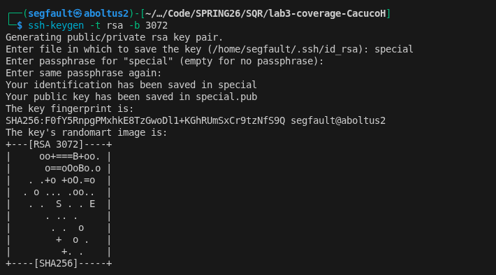
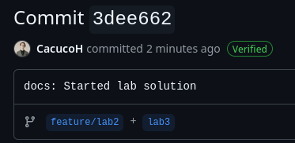
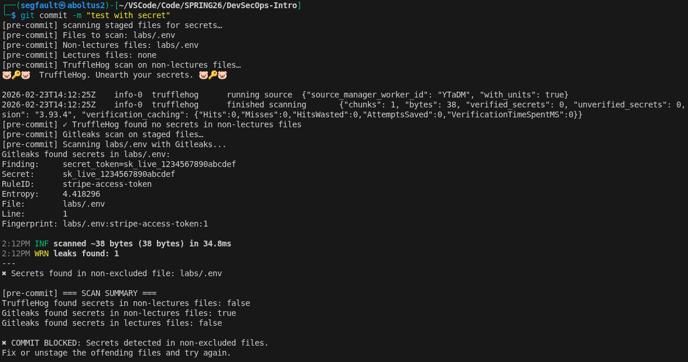
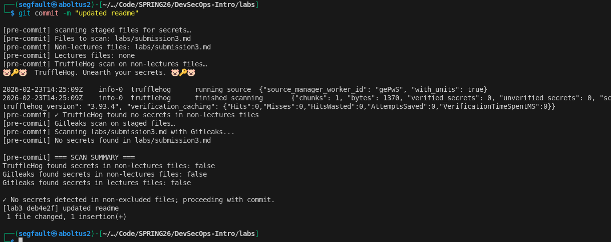

# Lab 3 — Secure Git

#### Why signing commits?
1. Signed commits authenticate the author, preventing identity spoofing, and ensure **code integrity**. Any post-signature changes invalidate it
2. Only owner of a private key can produce a valid signature that ensures **authenticity**
3. They provide **non-repudiation**, so authors can't deny contributions

Without signing, anyone can spoof user.name and user.email

#### Evidence of signed commit


Then I executed:
```bash
git config --global user.signingkey ~/.ssh/special
git config --global commit.gpgSign true
git config --global gpg.format ssh
```

And now my commits are signed:


#### Why is commit signing critical in DevSecOps workflows
It verifies that commits come from trusted developers via cryptographic signatures, blocking malicious insiders or spoofed pushes. Without it, attackers can impersonate users—e.g., a compromised CI token pushes code under any name, obscuring attribution during incidents

### Secrets detection

1. I set up pre-commit hook
2. I created `.env` file with access key inside
3. Then I tried to commit, however:



Commit was blocked because secrets are exposed!
When I added this file to `.gitignore` commit are successfully created:

