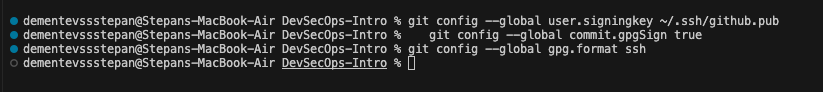
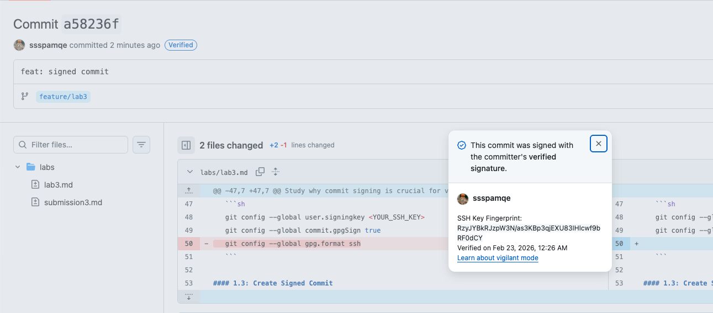
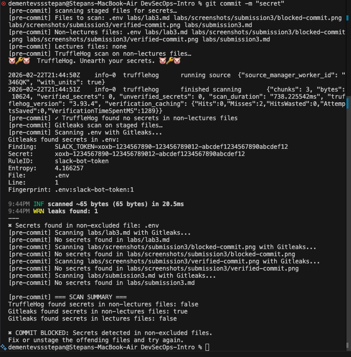
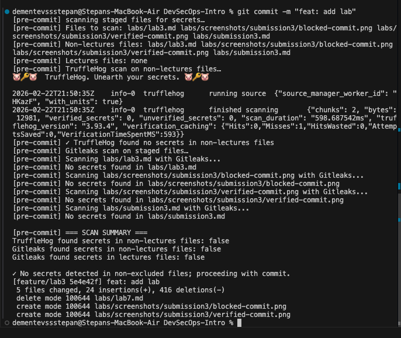

# Lab 3 Submission: Git Commit Signing

## Summary: Benefits of Signing Commits for Security
Signing commits provides cryptographic proof of the author's identity. It ensures non-repudiation, meaning the author cannot deny making the commit, and guarantees data integrity by confirming that the commit's contents have not been altered since it was signed. This prevents malicious actors from impersonating developers and injecting unauthorized code into the repository.

## Evidence of Successful SSH Key Setup and Configuration
I used already generated SSH key:

## Analysis: Why is commit signing critical in DevSecOps workflows?
In DevSecOps workflows, securing the software supply chain is paramount. The source code repository is the foundation of this chain. If an attacker gains access to a repository (e.g., via stolen credentials or a compromised CI/CD pipeline), they could silently inject vulnerabilities or backdoors. 

Commit signing is critical because it establishes a zero-trust approach to code authorship. Even if an attacker pushes code, the lack of a valid cryptographic signature will flag the commit as unverified. Automated DevSecOps pipelines can be configured to reject unsigned or improperly signed commits, effectively blocking unauthorized changes from reaching production. It ensures that every piece of code has a verified, auditable trail back to a trusted developer's private key.

## Verification

[Verified commit](https://github.com/ssspamqe/DevSecOps-Intro/commit/a58236f2a3a904d596d7fc39aa58e121d51d498e)

## Secret Scanning: Pre-commit Hook Setup and Configuration
To prevent accidental commits of sensitive information, a pre-commit hook was configured to automatically scan staged files for secrets before allowing a commit. The hook utilizes both TruffleHog and Gitleaks to analyze the files. The configuration ensures that any detected secrets in non-excluded files will block the commit process, providing an automated safety net.

## Evidence of Successful Secret Detection Blocking Commits
I've staged the .env file containing a `SLACK_TOKEN` and attempted to commit it. The pre-commit hook successfully detected the secret and blocked the commit, as shown in the output below:

## Test Results: Blocked vs. Successful Commits
- **Blocked Commit:** As shown in the output above, adding a `.env` file with a `SLACK_TOKEN` triggered Gitleaks, resulting in a `COMMIT BLOCKED` message. The commit was aborted before any sensitive data could be written to the local Git history.
- **Successful Commit:** After removing the offending `.env` file (or removing the secret from it) and staging the clean files, the pre-commit hook scans the files, finds no secrets, and allows the commit to proceed normally.

## Analysis: How Automated Secret Scanning Prevents Security Incidents
Automated secret scanning acts as a crucial preventative control in the software development lifecycle (SDLC). Developers often use real credentials during local testing and may accidentally stage them for commit. If these secrets are pushed to a remote repository (especially a public one), they can be scraped by malicious bots within seconds, leading to unauthorized access, data breaches, and compromised infrastructure.

By integrating secret scanning directly into a pre-commit hook:
1. **Shift-Left Security:** Vulnerabilities are caught at the earliest possible stage—before the code even leaves the developer's machine.
2. **History Protection:** It prevents secrets from entering the Git history. Once a secret is committed, simply deleting it in a subsequent commit is insufficient, as it remains in the repository's history and requires a complex history rewrite or immediate credential rotation.
3. **Developer Awareness:** It provides immediate, actionable feedback to developers, reinforcing secure coding practices without significantly disrupting their workflow.
