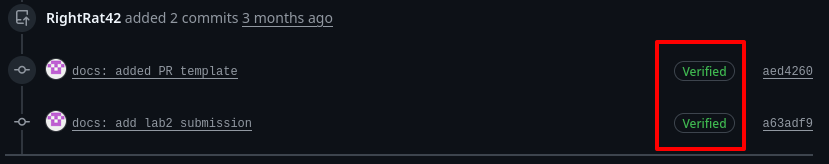

# Task 1
## Proof of already signing
I have been using SSH signing on GitHub long before the course's beginning, proofs:
- GitHub signing key in settings

- Signed commits on the previous lab
  

## Reasoning behind SSH commit signing
*(copied from the same task from the DevOps course)*

Commit signing is useful for verifying the source of the commits. If the commit was signed with the source owner's key, then the commit will be verified. If the commit is verified, then one can be sure that that commit came from the original (trusted) source.

# Task 2

