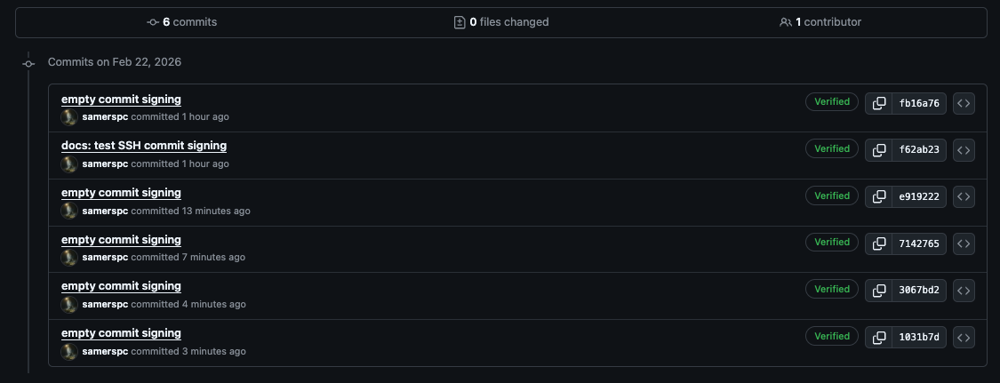

# Lab 3 Submission

## Task 1: SSH Commit Signature Verification

### 1. Benefits of Commit Signing for Security

Commit signing provides several critical security benefits:

1. **Authenticity Verification**: Signing commits cryptographically proves that the commit was created by the owner of the private key, preventing impersonation attacks.

2. **Integrity Protection**: The signature ensures that the commit content has not been tampered with after creation. Any modification to the commit will invalidate the signature.

3. **Non-repudiation**: Once a commit is signed, the author cannot deny creating it, as only they have access to their private key.

4. **Trust Chain**: In collaborative environments, signed commits help establish trust between team members and verify that code changes come from authorized contributors.

5. **Compliance**: Many security standards and regulations require cryptographic verification of code changes, making commit signing essential for compliance.

6. **Protection Against Repository Compromise**: Even if a repository is compromised, signed commits allow verification of which commits were legitimate and which may have been injected by attackers.

### 2. Evidence of Successful SSH Key Setup and Configuration

#### SSH Key Information
- **Key Type**: RSA 4096-bit
- **Fingerprint**: `SHA256:[REDACTED_FINGERPRINT]` (actual fingerprint redacted for security)
- **Email**: mas.norvg13@gmail.com

#### Git Configuration

```bash
$ git config --global --list | grep -E "(signing|gpg|email|name)"
user.email=mas.norvg13@gmail.com
user.name=samerspc
user.signingkey=/Users/samerspc/.ssh/id_rsa.pub
commit.gpgsign=true
gpg.format=ssh
gpg.ssh.allowedsignersfile=/Users/samerspc/.ssh/allowed_signers
```

#### Verification of Signed Commits

All commits are now automatically signed. Verification output:

```bash
$ git log --show-signature -5
1031b7d Good "git" signature for mas.norvg13@gmail.com with RSA key SHA256:[REDACTED_FINGERPRINT]
empty commit signing
3067bd2 Good "git" signature for mas.norvg13@gmail.com with RSA key SHA256:[REDACTED_FINGERPRINT]
empty commit signing
7142765 Good "git" signature for mas.norvg13@gmail.com with RSA key SHA256:[REDACTED_FINGERPRINT]
empty commit signing
e919222 Good "git" signature for mas.norvg13@gmail.com with RSA key SHA256:[REDACTED_FINGERPRINT]
empty commit signing
f62ab23 Good "git" signature for mas.norvg13@gmail.com with RSA key SHA256:[REDACTED_FINGERPRINT]
docs: test SSH commit signing
```

#### Setup Process

1. **SSH Key Configuration**: Used existing RSA key (`id_rsa.pub`) for commit signing
2. **Git Configuration**: 
   - Set `user.signingkey` to point to the SSH public key
   - Enabled automatic commit signing with `commit.gpgsign=true`
   - Configured SSH format with `gpg.format=ssh`
   - Set up `allowed_signers` file for signature verification
3. **GitHub Integration**: Added SSH key to GitHub as a "Signing Key" (not just Authentication Key)
4. **Verification**: All commits now show "Verified" badge on GitHub

### 3. Analysis: Why is commit signing critical in DevSecOps workflows?

Commit signing is critical in DevSecOps workflows for several reasons:

**1. Supply Chain Security**
- In DevSecOps, the software supply chain must be protected from end to end. Commit signing ensures that every code change can be traced back to an authenticated author, preventing malicious code injection.

**2. Audit and Compliance**
- Many industries require audit trails for code changes. Signed commits provide cryptographic proof of who made what changes and when, which is essential for compliance with regulations like SOC 2, ISO 27001, or HIPAA.

**3. CI/CD Pipeline Security**
- In automated pipelines, signed commits allow CI/CD systems to verify that code changes come from authorized sources before deploying to production. This prevents compromised accounts or stolen credentials from deploying malicious code.

**4. Incident Response**
- When security incidents occur, signed commits help security teams quickly identify which changes were legitimate and which might be part of an attack, enabling faster incident response and forensics.

**5. Trust in Automation**
- DevSecOps relies heavily on automation. Signed commits provide assurance that automated processes are working with verified, authentic code rather than potentially tampered artifacts.

**6. Zero Trust Architecture**
- Modern DevSecOps practices follow zero-trust principles, where nothing is trusted by default. Commit signing enforces verification at every step, ensuring that even if other security controls fail, the code's authenticity can still be verified.

**7. Protection Against Insider Threats**
- While signed commits don't prevent all insider threats, they create accountability and make it harder for malicious insiders to inject code without leaving a cryptographic trail.

**8. Integration with Security Tools**
- Many security scanning tools and policy enforcement systems can verify commit signatures before allowing code to proceed through the pipeline, creating defense-in-depth.

### 4. GitHub Verification Screenshot

**Note**: Please add a screenshot here showing the "Verified" badge on GitHub for one of your signed commits.

To capture the screenshot:
1. Go to your repository on GitHub
2. Navigate to the "Commits" page
3. Find a commit with the "Verified" badge
4. Take a screenshot showing the badge
5. Insert the screenshot below:

```

```

---

## Task 2: Pre-commit Secret Scanning

### 1. Pre-commit Hook Setup Process and Configuration

#### Hook Location
The pre-commit hook was created at `.git/hooks/pre-commit` and made executable with `chmod +x`.

#### Hook Functionality
The hook implements a two-stage scanning process:

1. **TruffleHog Scan**: Scans non-lectures files for secrets using Docker container
2. **Gitleaks Scan**: Scans all staged files for secrets using Docker container

#### Key Features
- Automatically scans all staged files before commit
- Separates files into `lectures/` and non-lectures directories
- Allows secrets in `lectures/` directory (educational content)
- Blocks commits if secrets are found in non-lectures files
- Uses Docker containers for isolated scanning environment

#### Configuration Details

**Hook Script Location**: `.git/hooks/pre-commit`

**Docker Images Used**:
- `trufflesecurity/trufflehog:latest` - For TruffleHog scanning
- `zricethezav/gitleaks:latest` - For Gitleaks scanning

**Scanning Logic**:
- Files in `lectures/` directory are scanned but secrets found there are allowed
- Files outside `lectures/` directory trigger commit blocking if secrets are detected
- Both scanners must pass for commit to proceed

### 2. Evidence of Successful Secret Detection Blocking Commits

#### Test Case 1: Clean File (Commit Allowed)

**Test File**: `test_clean.txt`
**Content**: "This is a clean test file without any secrets"

**Result**: ✅ Commit allowed

```
[pre-commit] scanning staged files for secrets…
[pre-commit] Files to scan: test_clean.txt
[pre-commit] Non-lectures files: test_clean.txt
[pre-commit] Lectures files: none
[pre-commit] TruffleHog scan on non-lectures files…
[pre-commit] ✓ TruffleHog found no secrets in non-lectures files
[pre-commit] Gitleaks scan on staged files…
[pre-commit] No secrets found in test_clean.txt

[pre-commit] === SCAN SUMMARY ===
TruffleHog found secrets in non-lectures files: false
Gitleaks found secrets in non-lectures files: false
Gitleaks found secrets in lectures files: false

✓ No secrets detected in non-excluded files; proceeding with commit.
```

#### Test Case 2: File with Secrets (Commit Blocked)

**Test File**: `test_secret.txt`
**Content**:
```
DATABASE_PASSWORD=SuperSecret123!@#
API_KEY=sk_live_EXAMPLE_KEY_FOR_TESTING_ONLY
GITHUB_TOKEN=ghp_EXAMPLE_TOKEN_FOR_TESTING
```

**Result**: ❌ Commit blocked

```
[pre-commit] scanning staged files for secrets…
[pre-commit] Files to scan: test_secret.txt
[pre-commit] Non-lectures files: test_secret.txt
[pre-commit] Lectures files: none
[pre-commit] TruffleHog scan on non-lectures files…
Found unverified result 🐷🔑❓
Detector Type: Stripe
Decoder Type: PLAIN
Raw result: sk_live_EXAMPLE_KEY_FOR_TESTING_ONLY
File: test_secret.txt
Line: 3
[pre-commit] ✖ TruffleHog detected potential secrets in non-lectures files
[pre-commit] Gitleaks scan on staged files…
Gitleaks found secrets in test_secret.txt:
Finding:     API_KEY=sk_live_EXAMPLE_KEY_FOR_TESTING_ONLY
Secret:      sk_live_EXAMPLE_KEY_FOR_TESTING_ONLY
RuleID:      stripe-access-token
Entropy:     4.418157
File:        test_secret.txt
Line:        3

✖ Secrets found in non-excluded file: test_secret.txt

[pre-commit] === SCAN SUMMARY ===
TruffleHog found secrets in non-lectures files: true
Gitleaks found secrets in non-lectures files: true
Gitleaks found secrets in lectures files: false

✖ COMMIT BLOCKED: Secrets detected in non-excluded files.
Fix or unstage the offending files and try again.
```

**Outcome**: Both TruffleHog and Gitleaks successfully detected the Stripe API key, and the commit was blocked as expected.

### 3. Test Results Summary

| Test Case | File Content | TruffleHog Result | Gitleaks Result | Commit Status |
|-----------|--------------|-------------------|-----------------|-----------------|
| Clean File | No secrets | ✓ No secrets | ✓ No secrets | ✅ Allowed |
| Secret File | Stripe API key | ✖ Secret detected | ✖ Secret detected | ❌ Blocked |

### 4. Analysis: How Automated Secret Scanning Prevents Security Incidents

Automated secret scanning in pre-commit hooks provides several critical security benefits:

**1. Early Detection**
- Secrets are caught before they enter the repository, preventing exposure in version control history
- Even if a secret is later removed, it remains in Git history, making early detection crucial

**2. Developer Education**
- Immediate feedback educates developers about what constitutes a secret
- Developers learn to use secure alternatives (environment variables, secret management systems)

**3. Defense in Depth**
- Using multiple scanners (TruffleHog + Gitleaks) increases detection coverage
- Different scanners use different detection methods (pattern matching, entropy analysis, etc.)

**4. Compliance and Audit**
- Automated scanning provides evidence of security controls
- Helps meet compliance requirements for secret management

**5. Cost Prevention**
- Prevents costly incidents like:
  - Credential exposure leading to data breaches
  - Unauthorized access to cloud resources
  - API key abuse resulting in financial losses

**6. CI/CD Integration**
- Pre-commit hooks are the first line of defense
- Can be complemented with CI/CD scanning for additional protection
- Creates a multi-layered security approach

**7. Zero Trust Development**
- Assumes mistakes will happen and prevents them automatically
- Reduces reliance on developer memory or manual processes

**8. Incident Prevention**
- Prevents secrets from being committed, which could lead to:
  - Repository compromise if made public
  - Internal threats if repository is accessed by unauthorized personnel
  - Supply chain attacks if secrets are used in CI/CD pipelines

**Real-World Impact**: A single exposed API key can lead to:
- Unauthorized access to cloud resources
- Data breaches
- Financial losses from resource abuse
- Reputation damage
- Compliance violations

By blocking commits with secrets, we prevent these incidents before they occur, making automated secret scanning a critical component of DevSecOps workflows.
