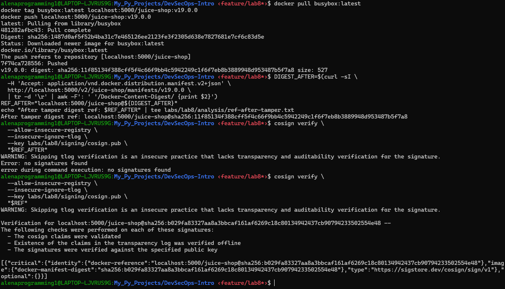
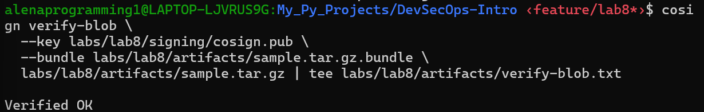

# Lab 8 — Software Supply Chain Security: Signing, Verification, and Attestations

## Task 1 — Local Registry, Signing & Verification

### 1.1 Image push to local registry (digest reference)
- Original digest ref (from `labs/lab8/analysis/ref.txt`): `localhost:5000/juice-shop@sha256:b029fa83327aa8a3bbcaf161af6269c18c80134942437cb90794233502554e48`
- Tampered digest ref after overwriting the tag (from `labs/lab8/analysis/ref-after-tamper.txt`): `localhost:5000/juice-shop@sha256:11f85134f388cff5f4c66f9bb4c5942249c1f6f7eb8b3889948d953487b5f7a8`

### 1.2 Cosign key pair
- Key pair generated with `cosign generate-key-pair` and stored locally in `labs/lab8/signing/` (`cosign.key`, `cosign.pub`).

### 1.3 Signature creation and verification evidence
- The image was signed with the private key and verified with the public key using digest reference and insecure local registry flags.

### 1.4 Tamper demonstration and analysis
- After retagging the repository with `busybox:latest`, the tag `localhost:5000/juice-shop:v19.0.0` now resolves to a **different digest** (`sha256:11f85134...`).
- **Expected behavior:** `cosign verify` fail for the tampered digest because the signature was created for the original subject digest (`sha256:b029fa...`).
- **Sanity check principle:** verification for the original digest still succeed even if the tag was overwritten.

  

**How signing protects against tag tampering:**
- Tags are mutable pointers. A signed **digest** binds the signature to the exact image content. If the tag is overwritten, its digest changes and the signature no longer matches.
- This prevents “tag substitution” attacks: verification fails when the content (digest) changes, even if the tag name stays the same.

**What “subject digest” means:**
- It is the cryptographic hash of the image **content** referenced in the signature/attestation. It uniquely identifies the immutable image and is what Cosign actually verifies.

---

## Task 2 — Attestations: SBOM (reuse) & Provenance

### 2.1 SBOM (CycloneDX) attestation evidence
Verification output saved in `labs/lab8/attest/verify-sbom-attestation.txt` (in-toto statement envelope). Extracted summary from the payload:
- `payloadType`: `application/vnd.in-toto+json`
- `predicateType`: `https://cyclonedx.org/bom`
- `subject`: `localhost:5000/juice-shop@sha256:b029fa83327aa8a3bbcaf161af6269c18c80134942437cb90794233502554e48`
- SBOM metadata component: `name=localhost:5000/juice-shop`, `type=container`, `version=sha256:b029fa...`
- SBOM generation timestamp: `2026-03-29T09:47:34Z`
- Tooling recorded: `syft` `1.42.3` (author: `anchore`)  

Payload inspection was performed by decoding the in-toto envelope payload and parsing the JSON fields above (equivalent to `jq -r .payload | base64 -d | jq`).

**What information the SBOM attestation contains:**
- A CycloneDX BOM describing the components inside the image (packages, versions, licenses, hashes, dependencies).
- The attestation ties that BOM to the specific image digest, giving a verifiable inventory for the exact image build.

### 2.2 Provenance attestation evidence
Verification output saved in `labs/lab8/attest/verify-provenance.txt`. Extracted summary from the payload:
- `predicateType`: `https://slsa.dev/provenance/v0.2`
- `subject`: `localhost:5000/juice-shop@sha256:b029fa83327aa8a3bbcaf161af6269c18c80134942437cb90794233502554e48`
- `builder.id`: `student@local`
- `buildType`: `manual-local-demo`
- `invocation.parameters.image`: `localhost:5000/juice-shop@sha256:b029fa...`
- `buildStartedOn`: `2026-03-29T09:48:34Z`
- `completeness`: parameters=true, environment=false, materials=false  

Payload inspection was performed by decoding the in-toto envelope payload and parsing the JSON fields above (equivalent to `jq -r .payload | base64 -d | jq`).

**What provenance attestations provide:**
- A signed, verifiable record of **how** the artifact was produced (builder identity, build type, parameters, timestamps).
- This increases supply-chain trust by enabling consumers to confirm that the image was built in an expected way.

### 2.3 How attestations differ from signatures
- **Signatures** prove **integrity and authenticity** of the image content (who signed this exact digest).
- **Attestations** prove **claims about the image** (SBOM, provenance, policy results) and are themselves signed statements bound to the digest.

---

## Task 3 — Artifact (Blob/Tarball) Signing

### 3.1 Artifact evidence
- Artifact created: `labs/lab8/artifacts/sample.tar.gz` (from `sample.txt`).
- Bundle file created: `labs/lab8/artifacts/sample.tar.gz.bundle`.

  

**Use cases for signing non-container artifacts:**
- Release binaries, CLI tools, installers, configuration bundles, SBOM files, Helm charts, or IaC packages.

**How blob signing differs from container image signing:**
- Blob signing signs a **standalone file** and verifies it using a bundle or signature file.
- Container signing attaches signatures/attestations to an **OCI image digest** in a registry and uses registry references during verification.

---

## Files Produced (Evidence)
- `labs/lab8/analysis/ref.txt`
- `labs/lab8/analysis/ref-after-tamper.txt`
- `labs/lab8/attest/verify-sbom-attestation.txt`
- `labs/lab8/attest/verify-provenance.txt`
- `labs/lab8/attest/juice-shop.cdx.json`
- `labs/lab8/attest/provenance.json`
- `labs/lab8/artifacts/sample.tar.gz`
- `labs/lab8/artifacts/sample.tar.gz.bundle`
- `labs/lab8/artifacts/verify-blob.txt`
