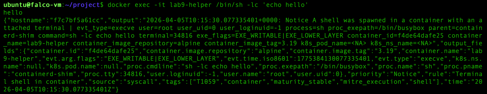
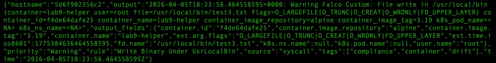
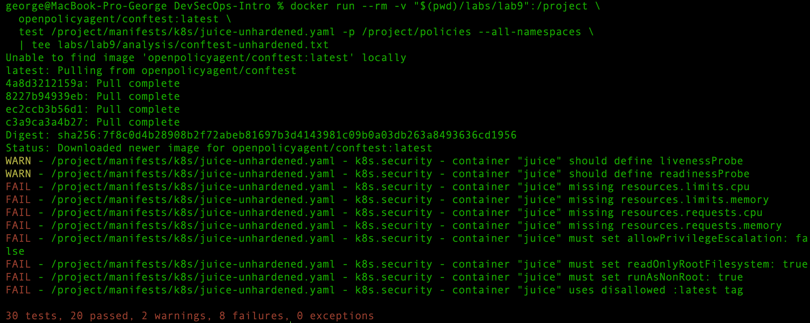
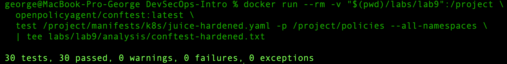
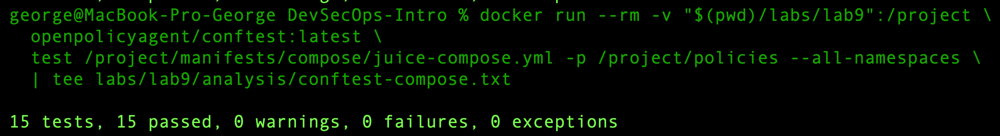

# Lab 9 — Monitoring & Compliance: Falco Runtime Detection + Conftest Policies

## Task 1 — Runtime Security Detection with Falco

### Environment
- Helper container: `alpine:3.19`
- Falco was executed in a privileged container using the modern eBPF engine inside a Linux VM (Multipass)
- Falco output format: JSON
- Custom rule file: `labs/lab9/falco/rules/custom-rules.yaml`

### Baseline alert observed

I started a shell inside the helper container with:

```bash
docker exec -it lab9-helper /bin/sh -lc 'echo hello'
```

(log extract):
```json
"rule":"Terminal shell in container"
```

Falco generated a baseline runtime alert for an interactive shell running in a container.

Evidence:



Analysis:
This alert matters because application containers normally should not expose interactive shells during normal operation. A shell in a container may indicate live debugging, operational drift, or attacker activity after compromise.

### Custom Falco rule

File: `labs/lab9/falco/rules/custom-rules.yaml`

```yaml
- rule: Write Binary Under UsrLocalBin
  desc: Detects writes under /usr/local/bin inside any container
  condition: evt.type in (open, openat, openat2, creat) and evt.is_open_write=true and fd.name startswith /usr/local/bin/ and container.id != host
  output: >
    Falco Custom: File write in /usr/local/bin (container=%container.name user=%user.name file=%fd.name flags=%evt.arg.flags)
  priority: WARNING
  tags: [container, compliance, drift]
```

Purpose:
This custom rule detects file creation or modification under `/usr/local/bin` inside a container. This path is sensitive because it typically stores executables or scripts. Writes there may indicate container drift, dropped binaries, or unauthorized runtime modification.

When it should fire:

* when a process inside a container creates or writes a file under `/usr/local/bin`

When it should not fire:

* when files are only read
* when writes happen outside `/usr/local/bin`
* when activity occurs on the host rather than inside a container

Basic tuning notes:

* the rule is limited to container activity using `container.id != host`
* the rule is limited to write/create syscalls only
* it could be narrowed further by container name, image, or process name if noise reduction is needed

### Custom rule validation

I triggered the custom rule with:

```bash
docker exec --user 0 lab9-helper /bin/sh -lc 'echo test3 > /usr/local/bin/test3.txt'
```

(log extract):
```json
"rule":"Write Binary Under UsrLocalBin"
```

Falco generated the following custom alert:




Analysis:
This proves the custom rule works as intended. The event shows a root process inside the `lab9-helper` container creating a file under `/usr/local/bin`, which is a realistic example of runtime filesystem drift.

### Notes

Falco also printed several startup messages about tracepoint attachment and TOCTOU mitigation. These messages did not prevent runtime detection, because the actual security alerts were still generated successfully.

---

## Task 2 — Policy-as-Code with Conftest (Rego)

### Reviewed manifests

* `labs/lab9/manifests/k8s/juice-unhardened.yaml`
* `labs/lab9/manifests/k8s/juice-hardened.yaml`
* `labs/lab9/manifests/compose/juice-compose.yml`

### Reviewed policies

* `labs/lab9/policies/k8s-security.rego`
* `labs/lab9/policies/compose-security.rego`

The policies enforce deployment hardening requirements such as:

* no mutable `:latest` tag
* non-root execution
* disabled privilege escalation
* read-only root filesystem
* dropping all Linux capabilities
* CPU and memory requests/limits
* readiness and liveness probes
* safer Docker Compose runtime settings

### Conftest results — unhardened Kubernetes manifest

Command:

```bash
docker run --rm -v "$(pwd)/labs/lab9":/project \
  openpolicyagent/conftest:latest \
  test /project/manifests/k8s/juice-unhardened.yaml -p /project/policies --all-namespaces
```

Output:



Result:

* 30 tests
* 20 passed
* 2 warnings
* 8 failures

Warnings:

* container "juice" should define livenessProbe
* container "juice" should define readinessProbe

Failures:

* container "juice" missing resources.limits.cpu
* container "juice" missing resources.limits.memory
* container "juice" missing resources.requests.cpu
* container "juice" missing resources.requests.memory
* container "juice" must set allowPrivilegeEscalation: false
* container "juice" must set readOnlyRootFilesystem: true
* container "juice" must set runAsNonRoot: true
* container "juice" uses disallowed :latest tag

Analysis:
The unhardened manifest violates multiple baseline deployment security requirements. It uses the mutable `:latest` tag, which makes deployments non-reproducible and harder to audit. The container also lacks a `securityContext`, which means it does not explicitly enforce non-root execution, disable privilege escalation, or protect the root filesystem as read-only. Missing resource requests and limits reduce workload isolation and can negatively affect cluster stability. The absence of readiness and liveness probes also weakens operational reliability because Kubernetes cannot accurately determine when the application is ready or unhealthy.

### Conftest results — hardened Kubernetes manifest

Command:

```bash
docker run --rm -v "$(pwd)/labs/lab9":/project \
  openpolicyagent/conftest:latest \
  test /project/manifests/k8s/juice-hardened.yaml -p /project/policies --all-namespaces
```

Output:


Result:

* 30 tests
* 30 passed
* 0 warnings
* 0 failures

Analysis:
The hardened manifest satisfies all provided Kubernetes security policies. It replaces the mutable `:latest` tag with a fixed version (`v19.0.0`), enables `runAsNonRoot: true`, sets `allowPrivilegeEscalation: false`, configures `readOnlyRootFilesystem: true`, and drops all Linux capabilities. It also defines CPU and memory requests/limits, plus both readiness and liveness probes. Together, these changes implement a practical production-style hardening baseline.

### Specific hardening changes in the hardened manifest

Compared to the unhardened deployment, the hardened manifest adds:

* pinned image tag `bkimminich/juice-shop:v19.0.0`
* `runAsNonRoot: true`
* `allowPrivilegeEscalation: false`
* `readOnlyRootFilesystem: true`
* `capabilities.drop: ["ALL"]`
* CPU requests and limits
* memory requests and limits
* readiness probe
* liveness probe

Why these changes matter:

* pinned versions improve reproducibility and traceability
* non-root execution reduces impact if the application is compromised
* disabling privilege escalation prevents gaining extra privileges
* read-only root filesystem reduces runtime tampering and persistence
* dropping all capabilities minimizes kernel-level attack surface
* resource controls improve scheduling safety and stability
* probes improve resilience and recovery behavior

### Conftest results — Docker Compose manifest

Command:

```bash
docker run --rm -v "$(pwd)/labs/lab9":/project \
  openpolicyagent/conftest:latest \
  test /project/manifests/compose/juice-compose.yml -p /project/policies --all-namespaces
```

Output:


Result:

* 15 tests
* 15 passed
* 0 warnings
* 0 failures

Analysis:
The Docker Compose manifest already complies with the provided Compose security policy. It defines an explicit non-root user (`10001:10001`), sets `read_only: true`, drops all capabilities with `cap_drop: ["ALL"]`, and enables `no-new-privileges:true`. These controls reduce privilege abuse risk and help enforce a safer runtime configuration even outside Kubernetes.

---

## Conclusion

This lab demonstrated both runtime detection and policy-as-code enforcement.

Falco results:

* detected an interactive shell running inside a container
* detected a custom runtime drift event for file writes under `/usr/local/bin`

Conftest results:

* `juice-unhardened.yaml` failed with 8 policy violations and 2 warnings
* `juice-hardened.yaml` passed all 30 tests
* `juice-compose.yml` passed all 15 tests

Overall, the lab shows how runtime monitoring and pre-deployment policy checks complement each other: Falco detects suspicious behavior during execution, while Conftest prevents insecure manifests from being deployed in the first place.
