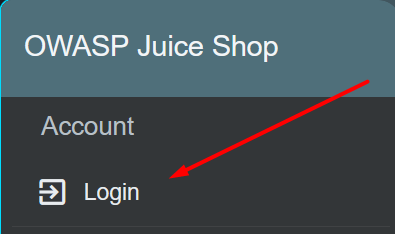
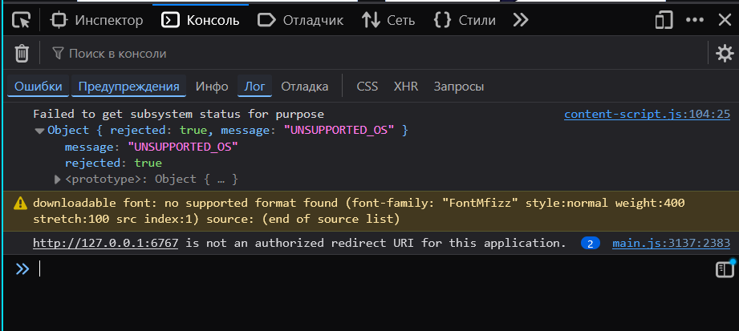
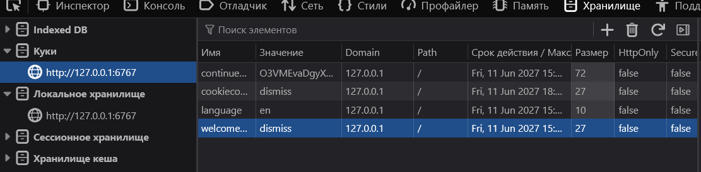

## Triage Report: OWASP Juice Shop

### Scope & Asset
- Asset: OWASP Juice Shop (local lab instance)
- Image: `bkimminich/juice-shop:v20.0.0`
- Image digest: sha256:fd58bdc9745416afce8184ee0666278a436574633ea7880365153a63bfd418b0
- Host OS: Windows 11 Pro 24H2 IoT
- Docker: Docker version 29.4.0, build 9d7ad9f

### Deployment Details
- Run command used: `docker run -d --name juice-shop -p 127.0.0.1:6767:3000 bkimminich/juice-shop:v20.0.0`
- Access URL: http://127.0.0.1:6767
- Network exposure: 127.0.0.1 only? [x] Yes [ ] No (explain if No)
- Container restart policy: <no>

### Health Check
- HTTP code on `/`: <200>
- API check (first 200 chars of ~`/rest/products`~ 'api/Products'):
  ```
  {"status":"success","data":[{"id":1,"name":"Apple Juice (1000ml)","description":"The all-time classic.","price":1.99,"deluxePrice":0.99,"image":"apple_juice.jpg","createdAt":"2026-06-11T10:10:24.965Z"
  ```
- Container uptime: <Up 8 hours>

### Initial Surface Snapshot (from browser exploration)
- Login/Registration visible: [x] Yes [ ] No — notes: <in the top right corner > 
- Product listing/search present: [x] Yes [ ] No — notes: <search bar in the top, products in the main page>
- Admin or account area discoverable: [ ] Yes [x] No — notes: <admin area hidden, account area is visible, but does nothing then clicked>
- Client-side errors in DevTools console: [x] Yes [ ] No — notes: <UNSUPPORTED_OS, no supported format found > 
- Pre-populated local storage / cookies: <language, welcomeBannerStatus, continueCode, welcomebanner_status> 

### Security Headers (Quick Look)
Run: ` Invoke-WebRequest http://127.0.0.1:6767 -Method Head`. Paste output:
```
StatusCode        : 200
StatusDescription : OK
Content           : 
RawContent        : HTTP/1.1 200 OK
                    Access-Control-Allow-Origin: *
                    X-Content-Type-Options: nosniff
                    X-Frame-Options: SAMEORIGIN
                    Feature-Policy: payment 'self'
                    X-Recruiting: /#/jobs
                    Accept-Ranges: bytes
                    Cache-Contro…
Headers           : {[Access-Control-Allow-Origin, System.String[]], [X-Content-Type-Options, System.String[]], [X-Frame-Options, System.String[]], [Feature-Policy, System.String[]]…}
Images            : {}
InputFields       : {}
Links             : {}
RawContentLength  : 0
RelationLink      : {}
```
Which of these are MISSING? (cross-reference Lecture 1 OWASP Top 10:2025 — A06)
- [x] `Content-Security-Policy`
- [x] `Strict-Transport-Security`
- [ ] `X-Content-Type-Options: nosniff`
- [ ] `X-Frame-Options`

### Top 3 Risks Observed (2-3 sentences each, in your own words)
1. **Missing Security Headers (OWASP A05/A06)** — Several security-related HTTP headers are missing, including Content-Security-Policy and Strict-Transport-Security. Missing headers can make the application more vulnerable to attacks such as XSS or protocol downgrade attacks. This is related to OWASP Top 10 A05: Security Misconfiguration.
2. **Public API Exposure (OWASP A01)** — Several API endpoints appear accessible without authentication. Public endpoints increase the application's attack surface and may expose data that should be protected if access controls are not properly implemented. This relates to OWASP A01: Broken Access Control.
3. **Client-Side Data Storage (OWASP A01)** — The application stores data in browser local storage. While the observed values are not sensitive, storing security-relevant information in local storage can increase the impact of cross-site scripting attacks. This is related to OWASP A01: Broken Access Control and general client-side security concerns.


---

## Task 2 — PR Template Setup (3 pts)

**Objective:** Create a `.github/PULL_REQUEST_TEMPLATE.md` in your fork. Every PR from `feature/labN` will auto-fill this template — this is the workflow you'll use for the entire semester.

### 2.1: Create the template

```bash
mkdir -p .github
# YOUR TASK: create .github/PULL_REQUEST_TEMPLATE.md
```

Required sections (the template must include all four):

1. **Goal** — what this PR delivers (1 sentence)
2. **Changes** — bullet list of artifacts added/modified
3. **Testing** — how you verified it works (commands + observed output)
4. **Artifacts & Screenshots** — links to files in this PR, image embeds where useful

Required checklist (the template must include all three items):

- [ ] Title is clear (`feat(labN): <topic>` style)
- [ ] No secrets/large temp files committed
- [ ] Submission file at `submissions/labN.md` exists

> **Hint:** GitHub auto-detects `.github/PULL_REQUEST_TEMPLATE.md` and pre-fills the PR description box. To test, push the branch and open a PR draft — the template should appear before you write a single word.

### 2.2: Document in `submissions/lab1.md`


## PR Template Setup

- File: `.github/PULL_REQUEST_TEMPLATE.md`
- Sections included: Goal / Changes / Testing / Artifacts / Checklist / Personal Notes
- Checklist items: Title is clear (`feat(labN): <topic>`), No secrets/large temp files committed, `submissions/labN.md` exists
- Auto-fill verified: [x] Yes — PR description showed my template [pr](embeddings/l1_pr.png) or [pr on github](https://github.com/MikeNovikoff/DevSecOps-Intro-Mike/pull/2/commits/7cc7549e3a16558a963ae2dafb41d6c8b8dafc20)


---

## Task 3 — GitHub Community Engagement (1 pt)


## GitHub Community

Starring repositories helps developers bookmark useful projects and shows support for maintainers. Popular repositories with many stars are often easier to discover and have stronger community engagement.

Following developers helps me learn from their work, discover new projects, and stay informed about updates in technologies that interest me. It also makes collaboration easier in team environments and helps build a professional network.


---

## Bonus Task — Smoke-Test Workflow in GitHub Actions (2 pts)
### B.1: Write the workflow

wrote

### B.2: Verify it runs

1. Commit + push the workflow to `feature/lab1`
2. Open a draft PR
3. The Actions tab should show your workflow running. **It must succeed.**
4. Click the run, expand the smoke-test step, copy the part that shows the curl response

### B.3: Document in `submissions/lab1.md`

```markdown
## Bonus: CI Smoke Test

- Workflow file: `.github/workflows/lab1-smoke.yml`
- Trigger: `pull_request` on main
- Run URL (must be green): [url](https://github.com/MikeNovikoff/DevSecOps-Intro-Mike/actions/runs/27370603870)
- Workflow run duration: <17s>
- Curl response excerpt:
  ```
  Run curl --silent --fail --head http://localhost:3000
HTTP/1.1 200 OK
Access-Control-Allow-Origin: *
X-Content-Type-Options: nosniff
X-Frame-Options: SAMEORIGIN
Feature-Policy: payment 'self'
X-Recruiting: /#/jobs
Accept-Ranges: bytes
Cache-Control: public, max-age=0
Last-Modified: Thu, 11 Jun 2026 19:02:13 GMT
ETag: W/"26af-19eb8103f08"
Content-Type: text/html; charset=UTF-8
Content-Length: 9903
Vary: Accept-Encoding
Date: Thu, 11 Jun 2026 19:02:13 GMT
Connection: keep-alive
Keep-Alive: timeout=5

  ```
```
