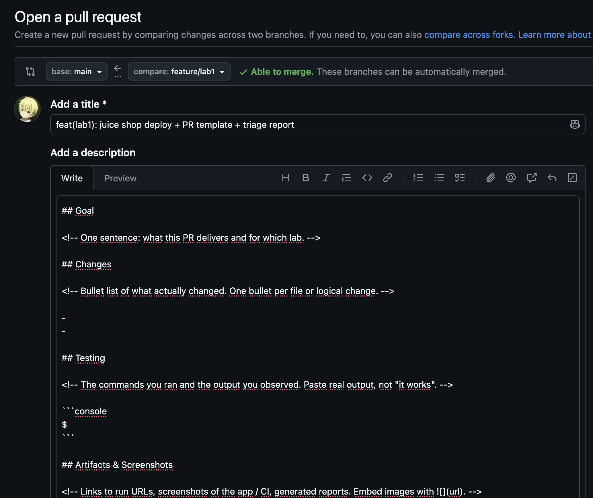

# Lab 1 — Deploy OWASP Juice Shop & Set Up the Course Workflow

## Triage report

### Asset

| Field | Value |
|---|---|
| Image tag | `bkimminich/juice-shop:v20.0.0` |
| Image digest | `bkimminich/juice-shop@sha256:fd58bdc9745416afce8184ee0666278a436574633ea7880365153a63bfd418b0` (from `RepoDigests`) |
| Local image ID | `sha256:fd58bdc9745416afce8184ee0666278a436574633ea7880365153a63bfd418b0` |
| Host OS | macOS 26.5.2 (build 25F84), Apple Silicon (`arm64`) |
| Docker version | `29.7.2, build a7dcaa6` — server `29.7.2`, Linux VM kernel `7.0.12-linuxkit` (Docker Desktop), engine arch `aarch64` |

### Deployment

- **Run command:**
  ```bash
  docker run -d --name juice-shop -p 127.0.0.1:3000:3000 bkimminich/juice-shop:v20.0.0
  ```
- **Access URL:** http://127.0.0.1:3000
- **Port binding:** `127.0.0.1:3000->3000/tcp` — published on the loopback interface only.
  `docker inspect` confirms `PortBindings` = `{"3000/tcp":[{"HostIp":"127.0.0.1","HostPort":"3000"}]}`.
  Why it matters: Juice Shop is vulnerable by design. A bare `-p 3000:3000` binds `0.0.0.0`
  and publishes the app to every device that can reach this machine — the campus/dorm Wi-Fi,
  the office LAN. Binding to `127.0.0.1` keeps it reachable only from this host.
- **Restart policy:** `no` (`docker inspect` → `RestartPolicy.Name=no`, `MaximumRetryCount=0`).
  The container does not come back after a daemon restart or `docker stop`; that is fine for a
  lab you start by hand.

### Health

| Check | Command | Output |
|---|---|---|
| HTTP on `/` | `curl -s -o /dev/null -w "HTTP %{http_code}" http://127.0.0.1:3000` | `HTTP 200` |
| Version | `curl -s http://127.0.0.1:3000/rest/admin/application-version` | `{"version":"20.0.0"}` |
| Product count | `curl -s http://127.0.0.1:3000/api/Products \| jq '.data \| length'` | `46` |

`docker ps` line:

```
NAMES        STATUS         PORTS
juice-shop   Up 2 minutes   127.0.0.1:3000->3000/tcp
```

### Surface (from 1.2)

1. **Login & registration.** Account menu (top-right) → *Login*; registration via "Not yet a
   customer?". The login form posts JSON to `POST /rest/user/login`. I sent `' OR 1=1--` as the
   email with an arbitrary password and got back a valid signed JWT for `admin@juice-sh.op`
   (`"role":"admin"`) — a textbook SQL-injection authentication bypass, with no rate limiting or
   lockout on repeated attempts.
2. **Products.** 46 items served by `GET /api/Products` (capital `P`, `{"data":[...]}` envelope).
   The SPA's own search call `GET /rest/products/search?q=` also goes out with **no
   `Authorization` header** and returns the full catalogue. Several product descriptions contain
   raw HTML (`<a href=...>` tags) stored verbatim.
3. **Admin / account area.** The Angular route `/#/administration` exists client-side. `GET
   /api/Users` is protected (`401`). But a lot is *not*: `GET /rest/admin/application-configuration`
   (`200`, dumps the entire app config), `GET /api/Feedbacks` (`200`), `GET /api/Challenges`
   (`200`, 112 CTF challenge definitions), `GET /metrics` (`200`, Prometheus metrics), and the
   FTP folder `GET /ftp` (`200`, full directory listing: `acquisitions.md`,
   `coupons_2013.md.bak`, `package.json.bak`, `package-lock.json.bak`, `incident-support.kdbx`,
   `encrypt.pyc`, `announcement_encrypted.md`, …) — all with no authentication.
4. **Console errors.** I loaded the landing page in a headless Chromium session with the
   DevTools `Runtime` and `Log` domains enabled *before* navigation. No uncaught exceptions and
   no error-level console entries surfaced on `/`, and none of the document's sub-resource
   requests returned 4xx/5xx. (Individual challenge routes do throw later, but the landing page
   is clean.)
5. **Local storage & cookies.** On a fresh load `localStorage` is **empty** and the only cookie
   is `language=en`. Dismissing the welcome and "fruit cookies" banners sets cookies
   `welcomebanner_status=dismiss` and `cookieconsent_status=dismiss`. After login the SPA writes
   the session JWT to `localStorage["token"]`, plus `bid` (basket id, `1`) and `email`
   (`admin@juice-sh.op`). The JWT lives in `localStorage` — readable by any script, so any XSS
   steals the session — not in an `HttpOnly` cookie. Every cookie is set **without `HttpOnly`,
   without `Secure`, and with `SameSite=None`**.

### Headers

`curl -sI http://127.0.0.1:3000 | head -20`:

```
HTTP/1.1 200 OK
Access-Control-Allow-Origin: *
X-Content-Type-Options: nosniff
X-Frame-Options: SAMEORIGIN
Feature-Policy: payment 'self'
X-Recruiting: /#/jobs
Accept-Ranges: bytes
Cache-Control: public, max-age=0
Last-Modified: Wed, 09 Sep 2026 12:57:55 GMT
ETag: W/"26af-1a0863f11c5"
Content-Type: text/html; charset=UTF-8
Content-Length: 9903
Vary: Accept-Encoding
Date: Wed, 09 Sep 2026 12:58:12 GMT
Connection: keep-alive
Keep-Alive: timeout=5
```

Classifying the four headers from the lab:

| Header | Status |
|---|---|
| `Content-Security-Policy` | **missing** |
| `Strict-Transport-Security` | **missing** (the app is served over plain HTTP, so HSTS would not even apply yet) |
| `X-Content-Type-Options` | present — `nosniff` |
| `X-Frame-Options` | present — `SAMEORIGIN` |

Two of four present, two missing. Also worth noting: `Access-Control-Allow-Origin: *` is a
wide-open CORS policy. Missing headers map to **OWASP Top 10:2025 A02 — Security
Misconfiguration**.

### Top 3 risks

1. **SQL injection → authentication bypass on the login form.**
   `POST /rest/user/login` builds its SQL query by string-concatenating the `email` field.
   Sending `' OR 1=1--` as the email returns a signed admin JWT with `"role":"admin"` and no
   password — verified live. The same injection point can be pivoted to read arbitrary tables.
   This is full account takeover reachable by anyone who can load the login page.
   → **A05:2025 — Injection**

2. **Broken access control on admin and file endpoints.**
   `/rest/admin/application-configuration`, `/api/Feedbacks`, `/api/Challenges`, `/metrics` and
   the `/ftp` file directory all return data to an unauthenticated caller. `/ftp` exposes backup
   files including `package.json.bak`, `coupons_2013.md.bak` and `incident-support.kdbx` (a
   KeePass database). Sensitive functionality and files sit behind no authorization check, so an
   anonymous visitor can enumerate configuration, internal metrics and leaked credentials.
   → **A01:2025 — Broken Access Control**

3. **Weak password hashing, and the hash is shipped to the browser.**
   The admin JWT I obtained decodes to
   `"password":"0192023a7bbd73250516f069df18b500"`, which is exactly `MD5("admin123")` —
   unsalted MD5, a hash any GPU cracks in milliseconds. Worse, that hash is embedded in the auth
   token sent to the client, over plain HTTP with no HSTS, so it is exposed to any script on the
   page and to anyone on the network path. Stored credentials and tokens in transit both fail
   basic cryptographic hygiene.
   → **A04:2025 — Cryptographic Failures**

---

## PR template

- **File path:** [`.github/PULL_REQUEST_TEMPLATE.md`](../.github/PULL_REQUEST_TEMPLATE.md)
- **Sections:** `Goal`, `Changes`, `Testing`, `Artifacts & Screenshots`, `Checklist`
- **Checklist items:**
  - PR title follows `feat(labN): <topic>`
  - No secrets, keys, or large temporary files committed
  - `submissions/labN.md` exists and every field holds an actual value (no placeholders)
- **Auto-fill proof:** 

---

## Bonus: CI smoke test

- **Workflow path:** [`.github/workflows/lab1-smoke.yml`](../.github/workflows/lab1-smoke.yml)
- **Trigger:** `pull_request` to `main`; `permissions: { contents: read }` at workflow level;
  `runs-on: ubuntu-latest`.
- **How it tests:** a `services:` container runs `bkimminich/juice-shop:v20.0.0` with port
  `3000:3000`; the single step polls `curl --silent --fail
  http://localhost:3000/rest/admin/application-version` every 2s for up to 60s and fails the job
  (`::error::` + `exit 1`) if it never gets a 200.
- **Run URL:** https://github.com/whynotgm/DevSecOps-Intro/actions/runs/34497391108/job/102939214191?pr=1
- **Run duration:** 16 seconds (job `smoke`, status success)
- **curl output excerpt from the job log:**
  ```
  $ curl --silent --fail http://localhost:3000/rest/admin/application-version
  {"version":"20.0.0"}
  Juice Shop is up after ~4s
  ```

