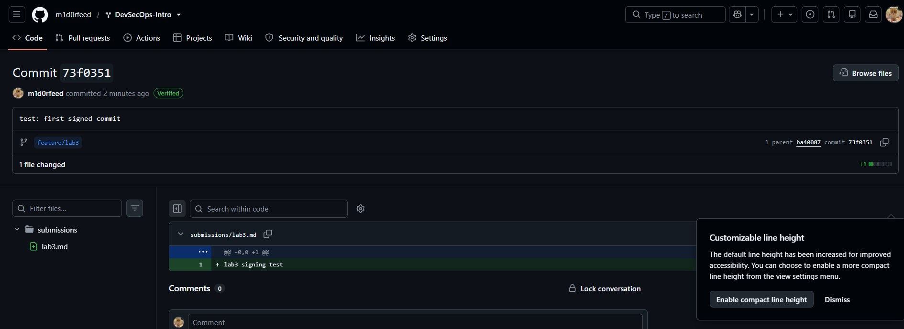

cat > submissions/lab3.md <<'EOF'

# Lab 3 - Submission

## Task 1: SSH Commit Signing

### Local configuration

* `git config --global gpg.format` → `ssh`
* `git config --global user.signingkey` → `C:/Users/user/.ssh/id_ed25519.pub`
* `git config --global commit.gpgsign` → `true`

### Local verification

Output of `git log --show-signature -1`:

```text
commit 73f0351f54f295ba120571c0e0af14aced73d464
Good "git" signature for kaluginadiana375@gmail.com
Author: m1d0rfeed <m1d0rfeed@users.noreply.github.com>
Date: Fri Jun 19 11:52:43 2026 +0300

    test: first signed commit
```

### GitHub verification

* Direct link to the signed commit:
  https://github.com/m1d0rfeed/DevSecOps-Intro/commit/73f0351f54f295ba120571c0e0af14aced73d464



### One-paragraph reflection

A forged-author commit could allow an attacker to introduce malicious or unauthorized changes while making them appear to originate from a trusted developer. Git author names and email addresses can be copied, but the Verified badge confirms that the commit was cryptographically signed with a key associated with the developer's GitHub account, making an unsigned impersonation visible during code review.

## Task 2: Pre-commit + gitleaks

### `.pre-commit-config.yaml`

```yaml
repos:
  - repo: https://github.com/gitleaks/gitleaks
    rev: v8.30.1
    hooks:
      - id: gitleaks

  - repo: https://github.com/pre-commit/pre-commit-hooks
    rev: v5.0.0
    hooks:
      - id: detect-private-key
        exclude: ^labs/lab6/vulnerable-iac/ansible/configure\.yml$

      - id: check-added-large-files

      - id: check-yaml
        args:
          - --allow-multiple-documents
```

The `detect-private-key` exclusion is limited to the intentionally vulnerable Lab 6 fixture. The `check-yaml` hook allows multiple YAML documents because the Kubernetes manifests contain valid `---` document separators.

### Pre-commit installation

```text
pre-commit installed at .git\hooks\pre-commit
```

### Full repository check

```text
Detect hardcoded secrets.................................................Passed
detect private key.......................................................Passed
check for added large files..............................................Passed
check yaml...............................................................Passed
```

### The blocked commit

Output produced when attempting to commit the deliberately planted fake GitHub token:

```text
Detect hardcoded secrets.................................................Failed
- hook id: gitleaks
- exit code: 1

Finding:     GH_PAT=REDACTED
Secret:      REDACTED
RuleID:      github-pat
Entropy:     4.143943
File:        submissions/leak-attempt.txt
Line:        2
Fingerprint: submissions/leak-attempt.txt:github-pat:2

INF 0 commits scanned.
INF scanned ~101 bytes (101 bytes)
WRN leaks found: 1

detect private key.......................................................Passed
check for added large files..............................................Passed
check yaml...........................................(no files to check)Skipped
```

The commit was rejected by the pre-commit hook. The test file was then unstaged and deleted, and the rejected commit does not exist in the repository history.

### Tune-out exercise

#### Inline allowlist

A narrow allowlist entry in `.gitleaks.toml` is acceptable when a known documentation example must remain in the repository and can be identified by an exact value, rule ID, or tightly scoped regular expression. The exception should be specific enough that unrelated secrets in the same file are still detected.

#### Path exclusion

A path exclusion such as ignoring everything under `docs/` may be convenient when that directory contains many synthetic examples. It is risky because a real credential accidentally committed anywhere under the excluded path would also be ignored, so broad path exclusions should only be used with additional controls or very careful review.
EOF
