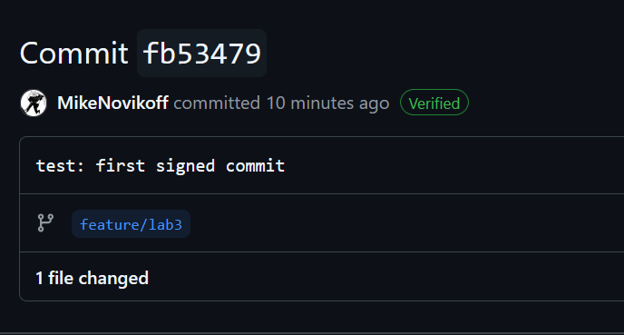

# Lab 3 — Submission

## Task 1: SSH Commit Signing

### Local configuration
- `git config --global gpg.format` → ssh
- `git config --global user.signingkey` → C:/Users/neoWiz/.ssh/id_ed25519.pub
- `git config --global commit.gpgsign` → true

### Local verification
Output of `git log --show-signature -1`:
```text
commit fb53479f000c4e2adaa2ce5c845a8dfcc9df8292 (HEAD -> feature/lab3, origin/feature/lab3)
Good "git" signature for m.novikov@innopolis.university with ED25519 key SHA256:5fyly6WuuxAsyfjQs3sU+uX07wD7lgcYlFYSdOYKif8
Author: MikeNovikoff <m.novikov@innopolis.university>
Date:   Fri Jun 19 16:38:49 2026 +0500

    test: first signed commit
```

### GitHub verification
- Direct link to your most recent commit on GitHub: [here](https://github.com/MikeNovikoff/DevSecOps-Intro-Mike/commit/fb53479f000c4e2adaa2ce5c845a8dfcc9df8292)
- Screenshot of the Verified badge: 

### One-paragraph reflection (2-3 sentences)
If an attacker forges my author identity (Repudiation), they could push malicious code disguised as my work, bypassing trust checks. The "Verified" badge mitigates this because GitHub cryptographically proves I hold the private key; a forged commit without my key will show as "Unverified", immediately flagging it as suspicious to the team.

---

## Task 2: Pre-commit + gitleaks

### `.pre-commit-config.yaml` 
```yaml
repos:
  - repo: https://github.com/gitleaks/gitleaks
    rev: v8.18.2
    hooks:
      - id: gitleaks
  - repo: https://github.com/pre-commit/pre-commit-hooks
    rev: v4.5.0
    hooks:
      - id: detect-private-key
      - id: check-added-large-files
```

### `pre-commit install` output
```text
pre-commit installed at .git/hooks/pre-commit
```

### The blocked commit
Output of the `git commit` that gitleaks blocked (the failing hook output):
```text
Detect hardcoded secrets.................................................Failed
- hook id: gitleaks
- exit code: 1

Finding:     GH_PAT=REDACTED
Secret:      REDACTED
RuleID:      github-pat
Entropy:     4.143943
File:        submissions/leak-attempt.txt
Line:        1
Fingerprint: submissions/leak-attempt.txt:github-pat:1
```

### Tune-out exercise
1. **Inline allowlist (# gitleaks:allow):** OK for isolated, obvious mock data in unit tests where the context is clear and doesn't affect the whole repo.
2. **Path exclusion (paths: [docs/]):** Risky because if someone accidentally dumps a real production .env file or stack trace containing real tokens into the docs/ folder, the scanner will completely ignore it and the secret will leak.

---

## Bonus: History Rewrite

### Before
```text
a7e2b79 (HEAD -> master) docs: add usage notes
667f4ac feat: empty log
c4daca1 feat: add config
d120eb2 init
```
Output of `git log -p | grep -c 'ghp_'`: **2**

### After
```text
3d40d00 (HEAD -> master) docs: add usage notes
38fe238 feat: empty log
52ab23d feat: add config
5075565 init
```
Output of `git log -p | grep -c 'ghp_'`: **0**
Output of `git log -p | grep -c 'REDACTED'`: **2**

### The two-step pattern in real life
1. `git filter-repo --replace-text replacements.txt` — rewrite locally
2. **Secret Rotation / Revocation.** If a token hit the remote repository even for a second, it is compromised. Rewriting history is just hygiene; the actual secret must be invalidated at the provider (e.g., GitHub, AWS) to prevent exploitation.

### Two real-world gotchas you discovered (2 sentences each)
1. `git filter-repo` refused to run and threw an error: "Refusing to destructively overwrite repo history since this does not look like a fresh clone". Even though it was a fresh git init, I had to explicitly bypass the safety mechanism using the `--force` flag.
2. Windows line endings (CRLF). When creating files with echo in Git Bash, Git threw warnings (LF will be replaced by CRLF). In a real scenario, mixing line endings could potentially mess up exact string matching for replacement if not handled carefully.


