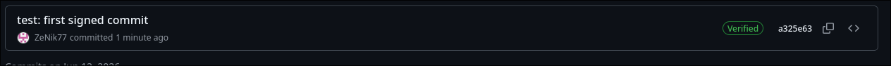

# Lab 3 — Submission

## Task 1: SSH Commit Signing

### Local configuration

- `git config --global gpg.format` → ssh
- `git config --global user.signingkey` → /home/niki/.ssh/id_ed25519.pub
- `git config --global commit.gpgs` → true

### Local verification

Output of `git log --show-signature -1`:

```
[niki@almostArch DevSecOps-Intro]$ git log --show-signature -1
commit 285e834d47f884678bb00cf52c10a2805736ab32 (HEAD -> feature/lab3)
Good "git" signature for ... with ED25519 key ...
Author: ZeNik77 <...>
Date:   Fri Jun 19 16:23:16 2026 +0300

    test: first signed commit

```

### GitHub verification

- Direct link to your most recent commit on GitHub: <https://github.com/ZeNik77/DevSecOps-Intro/commit/a325e6351bf07aaa1ee9f05012c46f66e0c7a6b0>
- Screenshot of the Verified badge: 

### One-paragraph reflection (2-3 sentences)

What STRIDE-R (Repudiation) scenario would a forged-author commit enable in a real
team's codebase? How does the Verified badge make that attack visible?

- Repudiation happens when an actor performs an action but can plausibly deny doing it, or conversely, when an action is falsely blamed on an innocent person
- The Verified badge introduces Non-Repudiation into the system by creating an explicit visual warning

## Task 2: Pre-commit + gitleaks

### `.pre-commit-config.yaml` (paste the full content)

```yaml
repos:
  - repo: https://github.com/gitleaks/gitleaks
    rev: v8.30.1
    hooks:
      - id: gitleaks

  - repo: https://github.com/pre-commit/pre-commit-hooks
    rev: v4.5.0
    hooks:
      - id: detect-private-key
      - id: check-added-large-files
```

### `pre-commit install` output

```
pre-commit installed at .git/hooks/pre-commit
```

### The blocked commit

Output of the `git commit` that gitleaks blocked (the failing hook output):

```
[niki@almostArch DevSecOps-Intro]$ git commit -m "test: should be blocked by gitleaks"
[WARNING] Unstaged files detected.
[INFO] Stashing unstaged files to /home/niki/.cache/pre-commit/patch1781880039-638735.
Detect hardcoded secrets.................................................Failed
- hook id: gitleaks
- exit code: 1

○
    │╲
    │ ○
    ○ ░
    ░    gitleaks

Finding:     GH_PAT=REDACTED
Secret:      REDACTED
RuleID:      github-pat
Entropy:     4.143943
File:        submissions/leak-attempt.txt
Line:        2
Fingerprint: submissions/leak-attempt.txt:github-pat:2

5:40PM INF 0 commits scanned.
5:40PM INF scanned ~101 bytes (101 bytes) in 22.9ms
5:40PM WRN leaks found: 1

detect private key.......................................................Passed
check for added large files..............................................Passed
[INFO] Restored changes from /home/niki/.cache/pre-commit/patch1781880039-638735.
```

### Tune-out exercise

Suppose a teammate insists they need to commit `AKIA*` strings because they're documentation examples in `docs/`. Briefly describe two approaches:

1. **Inline allowlist** — `[allowlist]` block in `.gitleaks.toml`. When is this OK?

- This approach works when you have a small, controlled set of specific example credentials that need to exist in your repository. This is appropriate for documentation with fake/example keys that are clearly marked as such and won't change frequently.

2. **Path exclusion** — `paths: [docs/]` in `.gitleaks.toml`. When is this risky?
   (2-3 sentences each. No correct answer; both have tradeoffs.)

- This is risky because it creates a complete blind spot where ANY secret committed to the docs/ directory will go undetected, including real credentials accidentally added later. This approach trades security for convenience and should only be used if you're absolutely certain docs/ will never contain real secrets.
