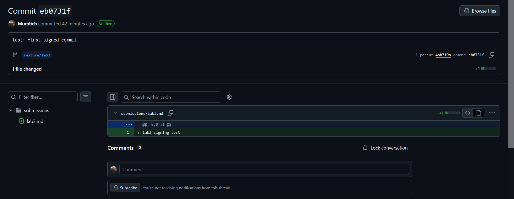

# Lab 3 — Submission

## Task 1: SSH Commit Signing

### Local configuration
- `git config --global gpg.format` → ssh
- `git config --global user.signingkey` → ~/.ssh/id_ed25519.pub
- `git config --global commit.gpgsign` → true

### Local verification
Output of `git log --show-signature -1`:
```
commit eb0731f24715341884245951d3e7cede0a0c77e7 (HEAD -> feature/lab3, origin/feature/lab3)
Good "git" signature for (signing key)
Author: Marat <139675556+Muratich@users.noreply.github.com>
Date:   Tue Jun 16 15:14:19 2026 +0300

    test: first signed commit
```

### GitHub verification
- Direct link to your most recent commit on GitHub: https://github.com/Muratich/DevSecOps-Intro/commit/eb0731f24715341884245951d3e7cede0a0c77e7
- Screenshot of the Verified badge: 

### One-paragraph reflection (2-3 sentences)
In a real development pipeline, a forged-author commit could be used to bypass social trust by attributing a sensitive infrastructure or security-related change to a senior engineer. During an audit, this weakens accountability because commit metadata alone can be modified easily. Verified signatures strengthen non-repudiation by binding the commit to a cryptographic key, allowing reviewers to distinguish between a genuine contribution and a commit that merely claims to come from a trusted developer.

## Task 2: Pre-commit + gitleaks

### `.pre-commit-config.yaml`:
```yaml
repos:
  - repo: https://github.com/gitleaks/gitleaks
    rev: v8.30.1
    hooks:
      - id: gitleaks

  - repo: https://github.com/pre-commit/pre-commit-hooks
    rev: v6.0.0
    hooks:
      - id: detect-private-key
      - id: check-added-large-files
```

### pre-commit install output:

```
pre-commit installed at .git\hooks\pre-commit
```

### pre-commit run --all-files output:

```
Detect hardcoded secrets.................................................Passed
detect private key.......................................................Failed
- hook id: detect-private-key
- exit code: 1
```

`pre-commit run --all-files` reported an existing training file (labs/lab6/vulnerable-iac/ansible/configure.yml) that matched the detect-private-key rule. Since this file was already present in the repository and unrelated to Lab 3, I kept the hook enabled and verified that gitleaks correctly blocked newly introduced secrets.

### Blocked commit output:

```
[WARNING] Unstaged files detected.
[INFO] Stashing unstaged files to C:\Users\Марат\.cache\pre-commit\patch1781623133-21016.
Detect hardcoded secrets.................................................Failed
- hook id: gitleaks
- exit code: 1

○
    │╲
    │ ○
    ○ ░
    ░    gitleaks

Finding:     ...ab 3 testing
GH_PAT=REDACTED
Secret:      REDACTED
RuleID:      github-pat
Entropy:     4.143943
File:        submissions/leak-attempt.txt
Line:        2
Fingerprint: submissions/leak-attempt.txt:github-pat:2

6:18PM INF 0 commits scanned.
6:18PM INF scanned ~100 bytes (100 bytes) in 92.5ms
6:18PM WRN leaks found: 1

detect private key.......................................................Passed
check for added large files..............................................Passed
[INFO] Restored changes from C:\Users\Марат\.cache\pre-commit\patch1781623133-21016.
```

### Inline allowlist

Using an inline allowlist is reasonable when a specific string is known to be a harmless example and has been reviewed by the team. This approach keeps secret scanning enabled everywhere else while documenting why that particular match should be ignored. The downside is that too many allowlist entries can hide real secrets if developers start using them as a shortcut to bypass security checks.

### Path exclusion

Excluding an entire path such as docs/ can reduce noise when documentation contains many example credentials or sample configurations. However, this is risky because any real secret accidentally committed to that directory will no longer be scanned or detected. Over time, broad exclusions can create blind spots that attackers or careless contributors may unintentionally exploit.

## Bonus: History Rewrite

### Before

```
4725d6d (HEAD -> master) docs: add usage notes
e4df32b feat: empty log
a686a58 feat: add config
0829590 init
```

Output of `git log -p | grep -c 'ghp_'`: **2**

### After

```
e7c0b11 (HEAD -> master) docs: add usage notes
e3cb4ae feat: empty log
450f57d feat: add config
5e4aa8e init
```

Output of `git log -p | grep -c 'ghp_'`: **0**
Output of `git log -p | grep -c 'REDACTED'`: **2**

### The two-step pattern in real life
1. `git filter-repo --replace-text replacements.txt` — rewrite locally
2. Rotate and revoke the exposed credential, then force-push the rewritten history. Rewriting history removes the secret from Git, but it does not make the leaked credential safe again because it may already have been copied or abused.

### Two real-world gotchas you discovered (2 sentences each)
1. git-filter-repo refused to run on my repository because it did not look like a fresh clone. I had to use the --force flag after confirming that the repository was only a temporary sandbox created for the lab.

2. Several commands in the lab instructions were written for Linux and did not work as expected in PowerShell. I had to replace commands such as grep with PowerShell alternatives like Select-String to verify that the secret existed in the commit history.