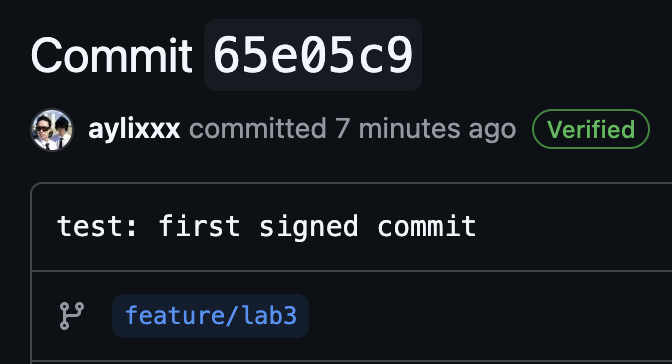

# Lab 3 — Submission

## Task 1: SSH Commit Signing

### Local configuration

* `git config --global gpg.format` → `ssh`
* `git config --global user.signingkey` → `/Users/ilyapush/.ssh/id_ed25519.pub`
* `git config --global commit.gpgsign` → `true`

### Local verification

Output of `git log --show-signature -1`:

commit 65e05c9564a2b75ba8330a9bacb730b98a82aa2d (HEAD -> feature/lab3, origin/feature/lab3)
Good "git" signature for ilyapushka4@gmail.com with ED25519 key SHA256:fsuIRoifXBKOrorVGI2V8IcGN71Yg2k57U8QM5Aelww
/Users/ilyapush/.config/git/allowed_signers:1: missing key^M
Author: Ilya <ilyapushka4@gmail.com>
Date:   Fri Jun 19 15:51:32 2026 +0300

    test: first signed commit

### GitHub verification

* Direct link to your most recent commit on GitHub: https://github.com/aylixxx/DevSecOps-Intro/commit/65e05c9564a2b75ba8330a9bacb730b98a82aa2d
* Screenshot of the Verified badge: attached in PR

### One-paragraph reflection

A forged-author commit could allow an attacker or malicious insider to introduce unauthorized code changes while pretending to be another developer. This creates a repudiation problem because it becomes difficult to prove who actually made the change, especially during incident investigations or code reviews. The GitHub Verified badge helps mitigate this risk by cryptographically proving that the commit was signed using a key associated with the author's account, making impersonation attempts much more visible.

## Task 2: Pre-commit + gitleaks

### `.pre-commit-config.yaml`
repos:

- repo: https://github.com/gitleaks/gitleaks
  rev: v8.30.1
  hooks:

  - id: gitleaks

- repo: https://github.com/pre-commit/pre-commit-hooks
  rev: v5.0.0
  hooks:

  - id: detect-private-key
  - id: check-added-large-files

### pre-commit install output
pre-commit installed at .git/hooks/pre-commit

### The blocked commit
Detect hardcoded secrets.................................................Failed
- hook id: gitleaks
- exit code: 1

Finding:     GH_PAT=REDACTED
Secret:      REDACTED
RuleID:      github-pat
Entropy:     4.143943
File:        submissions/leak-attempt.txt
Line:        2
Fingerprint: submissions/leak-attempt.txt:github-pat:2

4:21PM INF 0 commits scanned.
4:21PM INF scanned ~101 bytes (101 bytes) in 25.9ms
4:21PM WRN leaks found: 1

### Tune-out exercise
### Inline allowlist

Inline allowlist is configured in .gitleaks.toml using an [allowlist] block. It allows specific patterns (e.g. AKIA*) or exact matches to be ignored by the scanner.

This approach is useful when you have false positives or when a secret-like string is safely used in documentation or test fixtures. It is relatively precise because you can tightly control what is ignored.

However, it can be risky if overused, since attackers may mimic allowlisted patterns to bypass detection.

### Path exclusion

Path exclusion is configured in .gitleaks.toml using paths = ["docs/"], which skips scanning entire directories.

This is useful when you have large documentation folders or generated files where secret scanning is unnecessary.

The risk is that real secrets can accidentally be committed into excluded paths, and they will never be detected by gitleaks, creating blind spots in security scanning.