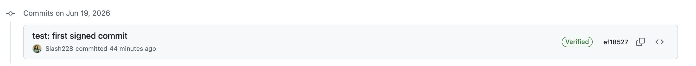

# Lab 3 — Submission

## Task 1: SSH Commit Signing

### Local configuration
- `git config --global gpg.format` → ssh
- `git config --global user.signingkey` → ~/.ssh/id_ed25519.pub
- `git config --global commit.gpgsign` → true

### Local verification
Output of `git log --show-signature -1`:
```
commit ef18527a9592348cb53e6e7f95200528b32b6497 (HEAD -> feature/lab3)
Good "git" signature for lawlliieett@gmail.com with ED25519 key SHA256:<redacted public key fingerprint>
Author: Slash <lawlliieett@gmail.com>
Date:   Fri Jun 19 19:20:56 2026 +0300

    test: first signed commit
```

### GitHub verification
- Direct link to your most recent commit on GitHub: https://github.com/Slash228/DevSecOps-Intro/commit/ef18527a9592348cb53e6e7f95200528b32b6497
- Screenshot of the Verified badge: 

### One-paragraph reflection
Without signing, the commit author name and email are plain config fields anyone can set, so an attacker who can push (or who opens a PR) can author a malicious change — a backdoor, a swapped dependency pin — under a trusted maintainer's identity. That is the Repudiation case: the named maintainer can credibly deny they wrote it, and post-incident blame and forensics point at the wrong person, slowing remediation. The Verified badge cryptographically binds the commit to a key GitHub knows belongs to that author, so a forged-author commit renders as "Unverified" and stands out immediately in review and audit logs, turning a silent repudiation into a visible anomaly.

---

## Task 2: Pre-commit + gitleaks

### `.pre-commit-config.yaml` (full content)
```yaml
repos:
  - repo: https://github.com/gitleaks/gitleaks
    rev: v8.30.1
    hooks:
      - id: gitleaks
  - repo: https://github.com/pre-commit/pre-commit-hooks
    rev: v6.0.0
    hooks:
      - id: detect-private-key
      - id: check-added-large-files
        args: ["--maxkb=1024"]
```

### `pre-commit install` output
```
pre-commit installed at .git/hooks/pre-commit
```

### The blocked commit
Output of the `git commit` that gitleaks blocked:
```
Detect hardcoded secrets.................................................Failed
- hook id: gitleaks
- exit code: 1

○
    │╲
    │ ○
    ○ ░
    ░    gitleaks

Finding:     GH_PAT=REDACTED
Secret:      REDACTED
RuleID:      github-pat
Entropy:     4.143943
File:        submissions/leak-attempt.txt
Line:        1
Fingerprint: submissions/leak-attempt.txt:github-pat:1

7:47PM INF 0 commits scanned.
7:47PM INF scanned ~48 bytes (48 bytes) in 28.6ms
7:47PM WRN leaks found: 1
```

### Tune-out exercise
1. **Inline allowlist** (`[allowlist]` block with `regexes`/`stopwords` in `.gitleaks.toml`) — this is acceptable when the false positive is narrow and stable: a specific documented constant (e.g. the canonical AWS example key) or a regex that precisely matches only that one safe pattern. It is a surgical suppression of a single pattern across the whole repo, but the regex must be kept as tight as possible, otherwise you blind the scanner to real secrets that share the same shape.
2. **Path exclusion** (`paths` in `.gitleaks.toml`, or `exclude` in pre-commit) — this is risky because it turns scanning off for an entire directory: a real secret committed to `docs/` later will pass straight through unscanned. It is acceptable only for paths that physically cannot hold live credentials (generated fixtures, vendored documentation), and even then per-finding `.gitleaksignore` fingerprints are safer than a blanket path exclusion.

---

## Bonus: History Rewrite

### Before
```
d0b3880 (HEAD -> main) docs: add usage notes
a4600a5 feat: empty log
252b123 feat: add config
39b78c4 init
```
Output of `git log -p | grep -c 'ghp_'`: **2**

### After
```
3087adb (HEAD -> main) docs: add usage notes
64112d3 feat: empty log
cb47bfc feat: add config
8b9b206 init
```
Output of `git log -p | grep -c 'ghp_'`: **0**
Output of `git log -p | grep -c 'REDACTED'`: **2**

### The two-step pattern in real life
1. `git filter-repo --replace-text replacements.txt` — rewrite locally
2. **Rotate the secret** — revoke/regenerate the leaked credential at the provider, then force-push the rewritten history. The moment a secret hits a remote it must be treated as compromised: clones, forks, CI caches, and scraping bots already have it, and GitHub keeps unreferenced objects reachable for a while. Rewriting only erases it from the visible tree (cleanup); rotation invalidates the credential itself (remediation).

### Two real-world gotchas you discovered
1. `git filter-repo` refused to run, aborting with `Refusing to destructively overwrite repo history since this does not look like a fresh clone` — because the HEAD reflog had more than one entry. I had to consciously add `--force`. On a real repository this is a signal that you should operate on a fresh clone rather than your working copy.
2. After the rewrite, filter-repo **removes the `origin` remote** by design (so you can't accidentally push a half-rewritten history), so you have to re-add it with `git remote add origin <url>` before `git push --force`. On top of that, every commit SHA from the first touched commit onward changed (`d0b3880 → 3087adb`, etc.), so collaborators must re-clone the repository instead of `git pull`, otherwise they reintroduce the old history with the secret.
